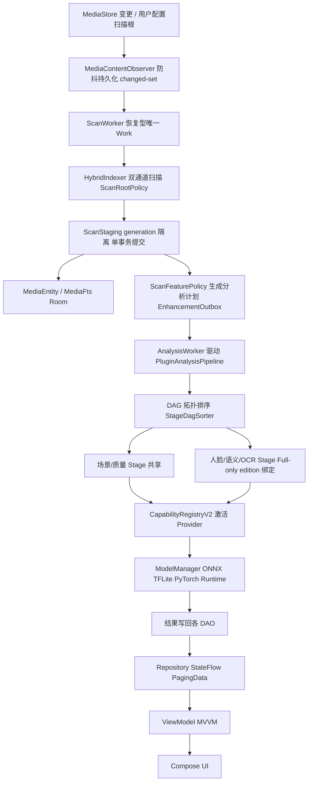

# LocalAlbum 架构文档（ARCHITECTURE）

> 面向开发者的技术架构说明。用户功能、构建步骤与模型下载见 [README.md](README.md)；
> 安全与质量审查结论见 [plans/code-review-report.md](plans/code-review-report.md)。
>
> 本文档为 Phase 1 摸底草稿：结论来自静态阅读与结构扫描；构建/测试基线以最近一次审查记录为准。

## 1. 仓库与模块划分

| 模块      | 路径           | 职责                                                                                                                                     |
| --------- | -------------- | ---------------------------------------------------------------------------------------------------------------------------------------- |
| `:app`    | `app/`         | 应用本体。Kotlin + Compose，`full` / `lite` 双 product flavor（同模块双 edition）                                                        |
| `:opencv` | `opencv/java/` | OpenCV 5.0 上游 Java 绑定 + native `jniLibs`。生成代码不改动，仅替换了构建脚本（上游原始脚本保留在 `opencv/java/build.gradle.orig.bak`） |

`app` 内部按 Gradle source set 划分：

| Source set     | 内容                                                                                                             |
| -------------- | ---------------------------------------------------------------------------------------------------------------- |
| `app/src/main` | 共享代码：媒体索引、分析管道、能力槽位、UI 骨架、共享模型资产（MobileNet 场景模型、InsightFace、InSwapper/emap） |
| `app/src/full` | Full-only：语义/OCR/人脸分析阶段、人物/语义维护 Worker、EVA02-CLIP 与 PaddleOCR 模型资产、人物/语义/AI 偏好页面  |
| `app/src/lite` | Lite 的 edition 贡献实现（空实现 / 降级策略），仅 4 个 edition 文件                                              |

根目录 `scripts/`（模型下载、发布证据生成等）、`plans/`（历次迭代规划与审查报告）、`Renderings/`（截图）不参与构建。

## 2. 技术栈

### 2.1 构建工具链

| 组件        | 版本 / 配置                              |
| ----------- | ---------------------------------------- |
| Gradle      | 8.13（wrapper）                          |
| AGP         | 8.13.2                                   |
| Kotlin      | 1.9.24（JVM target 17）                  |
| KSP         | 1.9.24-1.0.20（Room 编译）               |
| NDK / CMake | 27.0.12077973 / 3.22.1                   |
| SDK         | compileSdk 35 · targetSdk 35 · minSdk 29 |
| ABI         | `arm64-v8a`（真机）+ `x86_64`（模拟器）  |

> 注意：根 `build.gradle.kts` 使用 `buildscript classpath` 而非 `plugins {}` DSL 声明插件。
> 这是为规避该环境下 Gradle 8.12/8.13 的 kotlin-stdlib 严格约束被过滤导致 stage2 脚本编译失败的
> 已知问题（原因记录在根脚本注释中），属**环境性 workaround**，Phase 2 评估是否可回归标准 DSL。

### 2.2 UI 与架构

| 库                                                | 版本                              | 用途                                 |
| ------------------------------------------------- | --------------------------------- | ------------------------------------ |
| Jetpack Compose                                   | BOM 2024.09.02（compiler 1.5.14） | 全部 UI                              |
| Material 3 / View Material                        | 1.3.0 / 1.14.0                    | 组件体系（View Material 仅个别组件） |
| material-icons-extended                           | BOM 管理                          | 图标                                 |
| lifecycle-runtime / -viewmodel / -runtime-compose | 2.8.5                             | ViewModel、生命周期感知收集          |
| activity-compose                                  | 1.9.2                             | Compose Activity                     |
| kotlinx-coroutines-android                        | 1.8.1                             | 异步与并发                           |
| DataStore preferences                             | 1.1.1                             | 设置持久化（`SettingsStore`）        |
| Coil（+coil-video）                               | 2.6.0                             | 图片加载与视频帧解码                 |
| Media3（exoplayer/ui/common）                     | 1.4.1                             | 视频播放                             |
| exifinterface                                     | 1.3.7                             | EXIF 读取                            |

### 2.3 数据层

| 库                                                                    | 版本            | 用途                                                             |
| --------------------------------------------------------------------- | --------------- | ---------------------------------------------------------------- |
| Room（runtime/ktx/paging/compiler）                                   | 2.6.1           | 主数据库（schema v32，KSP 编译，schema 已导出到 `app/schemas/`） |
| Paging 3（runtime/compose）                                           | 3.3.2           | 时间线、相册详情、回收站分页                                     |
| WorkManager                                                           | 2.9.1           | 持久化后台任务队列                                               |
| ML Kit（text-recognition + chinese：Full-only；face-detection：共享） | 16.0.1 / 16.1.7 | OCR 与备选人脸检测                                               |

### 2.4 端侧推理运行时（三套并存）

| 运行时                 | 版本   | 用途                                          |
| ---------------------- | ------ | --------------------------------------------- |
| TensorFlow Lite        | 2.14.0 | MobileNet 场景分类等 TFLite 模型              |
| ONNX Runtime           | 1.19.2 | EVA02-CLIP、PaddleOCR、InsightFace、InSwapper |
| PyTorch Mobile（lite） | 1.13.1 | `.ptl` 插件模型                               |
| OpenCV（:opencv 模块） | 5.0.0  | 仿射变换 + 泊松融合（换脸流水线）             |

三套原生运行时与 OpenCV 存在 `emutls` 符号冲突风险，项目通过自研 **emutls shim**（`app/src/main/cpp/emutls_shim.c`，产物 `libemutls_shim.so`）统一 `__emutls_get_address` 实现；`NativeAiRuntime` 保证任何 native AI 对象创建前 shim 先加载。

## 3. 分层架构与数据流

项目为 **MVVM + Repository + 手写 DI**（无 Hilt/Koin，装配集中在 `AppContainer`）。

```text
┌── UI 层 ────────────────────────────────────────────────┐
│ LocalAlbumApp（自管理返回栈导航） · ui/screens · ui/components │
└───────────────┬─────────────────────────────────────────┘
                │ StateFlow / PagingData（collectAsStateWithLifecycle）
┌───────────────▼─────────────────────────────────────────┐
│ ViewModel 层：Album / Settings / Plugin / FaceSwap（4 个）│
└───────────────┬─────────────────────────────────────────┘
                │
┌───────────────▼─────────────────────────────────────────┐
│ AppContainer（手写 DI 装配） · EditionConfiguration        │
│  AlbumRepository · SettingsRepository                    │
│  MediaDeletionCoordinator · PersistentDeletionService    │
├──────────────────────────────────────────────────────────┤
│ HybridIndexer（扫描/索引）   PluginAnalysisPipeline（DAG） │
│ RecommendationEngine        CapabilityRegistryV2（槽位）   │
│ FaceClusterer/DuplicateAnalyzer  ModelManager(Impl)      │
│ SemanticSearcher/VectorIndex  ExtensionPluginRegistry     │
└───┬───────────┬──────────────┬─────────────┬─────────────┘
    │           │              │             │
  Room        MediaStore     WorkManager   ONNX/TFLite/
  DataStore   文件系统        （持久任务）   PyTorch/OpenCV
```

### 3.1 媒体生命周期（写入路径）

1. **触发**：`MediaContentObserver` 监听媒体库变更（防抖）→ 先将变更持久化到 Room 变更日志（`MediaChangeEventEntity`）→ 调度 `ScanWorker`（唯一 Work，电池不低约束）。`ScanWorker` 是**持久化 changed-set 恢复 Worker**：正常前台路径在进程内即时消费，Worker 兜底处理进程死亡、租约过期与重试延迟（最多 3 次，未到租期的任务返回 RETRY 而不消耗失败预算，见 `ScanWorker.scanWorkDecision`）；App 回前台时以 30s 节流做补偿扫描（后台期间 Observer 已注销）。
2. **索引**：`HybridIndexer` 走 MediaStore + 文件系统双通道；扫描根经 `ScanRootPolicy` 规范化去重（嵌套根保留语义、共享 visited 只访问一次；目录符号链接不跟随，阻断循环），忽略规则由 `IgnorePatternMatcher` 处理。扫描结果先写入 `ScanStagingEntity`（generation 隔离），完成后单事务提交到 `MediaEntity` / `MediaFts`。
3. **增强**：扫描落库后按 `ScanFeaturePolicy` 生成分析计划（CORE/ENHANCEMENT/MANUAL 三类）→ `AnalysisStageFactory` 经 `EditionAnalysisStageBindings` 解析阶段实现（场景/质量共享绑定；人脸/语义/OCR 由编译期 edition 绑定，Lite 对这三个 stageId 直接 fail-fast）→ `EnhancementOutbox` → `AnalysisWorker` 驱动 `PluginAnalysisPipeline` 按 DAG 顺序执行阶段。管道持久任务身份（pipeline/stage task scope）包含策略、Provider 与模型版本，保证模型升级或策略变更后旧任务不会被错误认领。
4. **消费**：各阶段结果写回 DAO，UI 通过 Repository 暴露的 `StateFlow`/`PagingData` 观察更新。

### 3.1.1 设置存取链

```text
SettingsStore（DataStore preferences）
        ↓ Flow（14 个独立键流）
SettingsRepository（combine 合并为 SettingsState；AiAnalysisPreferences 归一化）
        ↓ Flow<SettingsState>
SettingsViewModel（stateIn → StateFlow；写操作经 viewModelScope.launch 委托回 Repository）
        ↓ collectAsStateWithLifecycle
Compose 设置页 / 主题 / 扫描根管理
```

运行时旁路：`SettingsViewModel.setAiAnalysisPreferences` 同时更新 `AiAnalysisPreferencesRuntime`（进程内即时生效），无需等待 DataStore 回流。

### 3.2 读取路径

- 时间线/相册/回收站：Room + Paging 3 分页；
- 关键词检索：`MediaFts`（FTS4）+ `FtsQueryBuilder`（按 `KeywordSearchProfile` 选择索引列）；
- 语义检索：`SemanticSearcher` + `VectorIndex`（向量空间分页、Top-K 最小堆控内存），Full-only；
- 推荐：`RecommendationEngine`（场景主题 + 语义聚类双通道，去重与轮换）。

### 3.3 核心数据流总览



## 4. 包结构地图

| 包                                              | 职责                                                                                                                                                                             |
| ----------------------------------------------- | -------------------------------------------------------------------------------------------------------------------------------------------------------------------------------- |
| `com.renyxin.localalbum`（根）                  | 入口三件套：`MainActivity`、`LocalAlbumApplication`、`AppContainer`（DI）                                                                                                        |
| `core/index/`                                   | MediaStore+FS 混合索引、扫描世代、增量检测、`ContentObserver`、忽略规则、扫描基准                                                                                                |
| `core/pipeline/`                                | 分阶段 AI 管道：`PluginAnalysisPipeline`、`AnalysisStage(Factory)`、`StageDagSorter`、`StageInclusionPolicy`、`ProgressManager`、并行文件处理器                                  |
| `core/pipeline/stages/`                         | Provider 驱动的具体阶段：SceneStage、QualityStage（main）+ FaceStage、OcrStage、SemanticStage（full）。旧版 `Builtin*Stage` 五件套已于治理阶段删除（架构守卫测试保留防回归断言） |
| `core/plugin/capability/`                       | 能力槽位系统：`CapabilityRegistry(V2)`、`CapabilitySlot`、5 个 Provider 接口、适配器                                                                                             |
| `core/plugin/capability/builtin/`               | 内置 Provider 实现（InsightFace、EVA02-CLIP、PaddleOCR、ML Kit、启发式场景/质量等）                                                                                              |
| `core/plugin/model/`                            | 模型目录/下载/加载/对象池/版本追踪、`ModelManager(Impl)`、三运行时 Provider                                                                                                      |
| `core/plugin/runtime/`                          | 运行时抽象：`ModelRuntime` + ONNX/TFLite/PyTorch 实现                                                                                                                            |
| `core/plugin/extension/`                        | 交互式扩展插件：`ExtensionPluginRegistry`、`InSwapperPlugin`（换脸）、执行策略                                                                                                   |
| `core/plugin/demo/`                             | Demo 插件（能力 Provider 与扩展插件的演示实现）                                                                                                                                  |
| `core/plugin/`（顶层）                          | 插件通用模型：`AiPlugin`、`PluginManifest`、`PluginLoader`、编解码                                                                                                               |
| `core/analysis/`                                | 分析域算法：人脸聚类、完全重复检测（SHA-256）、场景分类、质量评估、语义嵌入、AI 偏好                                                                                             |
| `core/recommendation/`                          | 推荐引擎、类别、多样化、轮换、场景/语义推荐器                                                                                                                                    |
| `core/search/`                                  | FTS 查询构建、语义搜索、向量索引、嵌入编解码                                                                                                                                     |
| `core/concurrent/`                              | 推理调度器、内存池门控、加速策略、推理指标                                                                                                                                       |
| `core/saf/`                                     | 安全文件操作与 MediaStore 删除请求                                                                                                                                               |
| `core/{exif,thumbnail,timeline,album,runtime}/` | EXIF 提取、缩略图策略、时间线分组、相册构建、原生运行时入口                                                                                                                      |
| `core/model/`                                   | 纯领域模型：`MediaItem`、`Album`、目录树、媒体类型等                                                                                                                             |
| `data/db/`                                      | `AppDatabase`（v32）+ 20 个 DAO 源文件                                                                                                                                           |
| `data/db/entity/`                               | 30 余个 Room 实体（22 个源文件，部分文件含多实体）                                                                                                                               |
| `data/repo/`                                    | `AlbumRepository`、`SettingsRepository`、删除协调器/持久化删除服务、缩略图调度/裁剪                                                                                              |
| `data/worker/`                                  | WorkManager Worker + `ScanForegroundService`（dataSync 前台服务）                                                                                                                |
| `data/{prefs,source,backup}/`                   | DataStore 设置、MediaStore 源、JSON 备份导入导出                                                                                                                                 |
| `edition/`                                      | `EditionFeatures` + 每 flavor 的 4 个贡献接口实现（见 §6）                                                                                                                       |
| `ui/`                                           | `LocalAlbumApp`（导航）、`ui/screens`（13 页面 + Timeline）、`ui/components`、`ui/theme`、`ui/vm`（4 个 ViewModel）                                                              |

## 5. 核心子系统

### 5.1 依赖装配（`AppContainer`）

- Application `onCreate` 中构造，持有进程级单例：数据库、`ModelManager(Impl)`、`ModelStorageManager`、`CompositeModelCatalog`（本地 + HuggingFace）、`CapabilityRegistryV2`、`ExtensionPluginRegistry`、`PluginAnalysisPipeline`（`by lazy` 单例，保证进度 UI 与执行管线共享同一 `ProgressManager`）、`HybridIndexer`、两个 Repository 与删除链路。
- 生命周期：Activity 计数为 0 时只注销 `ContentObserver`，**不** shutdown 容器（历史 bug：shutdown 导致回前台后加载链路永久断裂）。
- 启动序：通知渠道 → 回收站/删除重试 Worker → 注册 Observer → 恢复中断扫描变更 → 加载插件 → 续跑中断分析。

### 5.2 索引与扫描（`core/index`）

- `HybridIndexer`：MediaStore 与文件系统双通道扫描，generation 标记区分全量/增量；staging 表隔离 + 事务提交；删除通过 `MediaDeletionCoordinator`/tombstone 保证失败可重试。
- `ScanRootPolicy`/`IgnorePatternMatcher`：扫描根与忽略规则。
- `MediaContentObserver` + 前台补偿（30s 节流）保证前台期间媒体变更及时入索引。

### 5.3 分析管道（`core/pipeline`）

- `PluginAnalysisPipeline`：`StageDagSorter` 拓扑排序 → 顺序/并行执行阶段；全量（`runFullScan`）与增量（`runIncremental`）两种模式；阶段进度经 `ProgressManager` 全局汇聚（通知与 UI 共享同一实例，避免多阶段局部计数互相覆盖）。
- 计划装配：`AnalysisStageFactory.createPlan` 按 `StageInclusionPolicy`（包装 `ScanFeaturePolicy`）解析 stageId → 绑定（场景/质量共享绑定、Full-only 阶段经 `EditionAnalysisStageBindings`）；持久任务 scope 由策略 id/版本 + Provider id + stageId@modelVersion 组成，含旧聚合 scope 兼容认领（仅 Full 开启 `claimLegacyFullAnalysisTasks`）。
- `ScanFeaturePolicy`：`FullScanFeaturePolicy` 五阶段（face/scene/semantic/quality/ocr）；`LiteScanFeaturePolicy`（policyVersion=2）自动增强计划为空（fail-closed，绑定 phase7 准入证据哈希），仅 MANUAL 计划允许 scene/quality。
- 断点续跑：`AnalysisResumePrefs` 持久化中断标志 + `AnalysisStateEntity`/`AnalysisTaskEntity` 任务租约；进程重启后 `maybeResumeAnalysis` 恢复。
- 阶段资源释放：每个模型阶段结束后释放 session 并 `evictUnusedModels()`，避免多模型权重峰值叠加。
- 扩展插件（换脸、风格迁移）**不参与**批处理管道，仅交互式调用。

### 5.4 能力槽位（`core/plugin/capability`）

- `CapabilityRegistryV2` 管理 5 个槽位：`face` / `scene` / `semantic` / `quality` / `ocr`（Lite 仅注册 `face/scene/quality`）。
- 每个槽位可注册多个 Provider，按 `MODEL` / `BUILTIN` / `DEMO` 分型；`ModelManager` 状态（下载中/已下载/已加载/错误）经 200ms 防抖聚合同步到 Provider 的 `ModelReadiness`。
- `AnalysisStageFactory` 从注册表取当前激活 Provider 构造阶段；运行时切换 Provider 需重建管道（当前实现为启动期快照）。
- `core/plugin/capability/adapters/` 提供分类器↔场景 Provider 双向适配。

### 5.5 模型管理（`core/plugin/model`）

- `ModelManager(Impl)`：模型注册 → 下载（`ModelDownloadManagerV2`）→ 加载 → 推理 → 卸载 全生命周期；`InferenceMemoryPool`/`InferenceScheduler` 控制推理资源。
- `ModelCatalog`：`CompositeModelCatalog` 合并本地资产目录与 HuggingFace 远程源；`ModelStorageManager` 统计占用与清理；`ModelVersionTracker` 版本追踪。
- 三运行时（ONNX/TFLite/PyTorch）经 `ModelRuntime` 抽象接入；模型资产 825MB+，大二进制不入库（`scripts/download_models.sh` 下载，Full/Lite 按 source set 隔离）。

### 5.6 扩展插件（`core/plugin/extension`）

- `ExtensionPluginRegistry` + `PluginLoader`：动态加载外部 APK/Dex 插件（**实验性、隐藏能力**，见安全审查 P0）。
- 内置扩展：`InSwapperPlugin`（inswapper_128 + emap 换脸），在用户交互且取得共享推理 lane 后才按需加载 shim/OpenCV/ORT。
- `FaceSwapExecutionPolicy` 控制换脸执行边界；`OnDemandGenerativePlugin` 为按需生成型插件基类。

### 5.7 检索（`core/search`）

- 关键词：`MediaFts`（FTS4）+ `FtsQueryBuilder`（安全前缀查询）+ `KeywordSearchProfile`（Full/Lite 索引列差异）。
- 语义：`SemanticSearcher` 余弦相似度 + `SemanticVectorSpace` 分页检索 + `VectorIndex` + `EmbeddingCodec`（向量压缩存储）。

### 5.8 分析域（`core/analysis`）

- 人脸：`FaceDetector`/`FaceClusterer`/`IncrementalFaceClusterAssigner`/`FacePrototypePolicy`（聚类原型与增量分配）。
- 重复：`ExactFileHasher`（SHA-256，大文件分段预筛）+ `DuplicateAnalyzer`——严格字节级完全重复，不做感知相似。
- 场景/质量：`SceneClassifier`/`QualityAnalyzer`；语义：`SemanticEmbedder`；偏好：`AiAnalysisPreferences`。

### 5.9 数据持久化（`data/db`）

- `AppDatabase`：schema v32，迁移链 8→32（README 声明；仓库含 21→32 迁移单测），schema 导出至 `app/schemas/`。
- 关键机制：扫描/导入 staging 隔离、单事务提交、deletion tombstone、增强 outbox（`EnhancementOutboxEntity`）、缩略图任务/缓存双表。

### 5.10 后台任务（`data/worker`）

| Worker                                                                                                       | 职责                                     |
| ------------------------------------------------------------------------------------------------------------ | ---------------------------------------- |
| `ScanWorker` + `ScanForegroundService`                                                                       | 扫描（dataSync 前台服务 + 引用计数启停） |
| `AnalysisWorker`                                                                                             | 分阶段 AI 分析（租约 + 心跳）            |
| `EnhancementHandoffWorker`                                                                                   | 扫描 → 增强任务交接/结算                 |
| `ThumbnailWorker`                                                                                            | 缩略图生成（自动/交互两种入队）          |
| `DuplicateMaintenanceWorker`                                                                                 | 重复分组维护                             |
| `DeletionRetryWorker` / `TrashCleanupWorker`                                                                 | 删除重试 / 回收站过期清理                |
| `RecommendationRefreshWorker`                                                                                | 推荐刷新                                 |
| Full-only：`FaceClusterMaintenanceWorker` / `SemanticClusterMaintenanceWorker` / `SemanticMaintenanceWorker` | 人物/语义簇维护                          |

### 5.11 删除链路（`data/repo`）

`MediaDeletionCoordinator`（策略 + tombstone）→ `PersistentDeletionService`（持久化重试）→ `PhysicalFileDeletion`（MediaStore/文件系统删除）→ `DeletionFailurePolicy` 收敛失败。

### 5.12 备份恢复（`data/backup`）

`DatabaseExporter` 导出索引/FTS/人脸/语义嵌入为 JSON；`DatabaseImporter` 以 staging + 单事务覆盖式导入（失败不提交部分数据）；`PostRestoreTaskSeeder` 恢复后重建分析/缩略图任务。

## 6. Full / Lite Edition 机制

同一 `:app` 模块通过 product flavor（`full`/`lite`）+ 每 flavor 4 个贡献类实现编译期裁剪：

| 接口（每 flavor 各一实现）     | 职责                                                                                      |
| ------------------------------ | ----------------------------------------------------------------------------------------- |
| `EditionConfiguration`         | 提供 `EditionFeatures`（能力槽位、搜索 profile、功能开关）与 edition 级能力 Provider 注册 |
| `EditionAnalysisStageBindings` | 该 edition 的分析阶段绑定                                                                 |
| `EditionSearchContribution`    | 搜索模式贡献（Full：语义搜索；Lite：无）                                                  |
| `EditionUiContribution`        | 页面/入口贡献（Full：人物、AI 偏好页；Lite：空）                                          |

`EditionFeatures` 汇总功能开关：`showPeopleAlbums` / `enableSemanticSearch` / `showAiAnalysisPreferences` / `showPluginManager` / `showFaceSwap` / `allowFaceClusterMaintenance` 与 `keywordSearchProfile`。共享能力（手动场景/质量增强、换脸）两边保留；Lite 不编译人物/语义/OCR 分析阶段与对应 Worker，且 `EditionAnalysisStageBindings`（lite）对这三个 stageId 以 `check` + `error` 双重 fail-fast 防止 Full-only 阶段被误准入。

版本风味构建差异：Lite 追加 `applicationIdSuffix = ".lite"` 与 `versionNameSuffix = "-lite"`（资源覆盖 app 名为 "LocalAlbum Lite"）；两 flavor 同一 `edition` 维度，构建变体如 `fullDebug` / `liteRelease`。

## 7. 构建与发布

- 签名：`keystore.properties` 注入（不入库）；release 未提供密钥时产出未签名 APK（CI 兼容）；V1/V2/V3 全开。
- 产物命名：`LocalAlbum-v{versionName}-c{versionCode}-{variant}.apk`（**依赖 AGP 内部 API** `ApkVariantOutputImpl`/`AppExtension`，Phase 2 评估替代方案）。
- BuildConfig 注入 `BUILD_TIME` 与 `GIT_HASH`（当前经 `Runtime.exec("git")`，Windows 环境有脆弱性）。
- R8：release 开启 minify + shrinkResources；`noCompress "onnx"` 支持 mmap 加载；abiFilters 限两 ABI；core library desugaring 2.0.4。
- 资源：无 layout XML（纯 Compose），res 仅 mipmap 图标、values、night 主题与 `file_provider_paths`。
- Lint：`NewApi` 全局禁用；`opencv` 模块关闭 deprecation/removal 告警（上游生成代码）。

## 8. 关键不变量（改动前必读）

1. `PluginAnalysisPipeline` 必须单例（进度 UI 与执行管线共享 `ProgressManager`）。
2. 原生加载顺序：emutls shim 必须先于 ONNX/OpenCV/TFLite/PyTorch session 创建（`NativeAiRuntime` 保证）。
3. 扫描与导入必须走 staging 隔离 + 单事务提交；删除失败不得清除媒体记录（tombstone）。
4. 进程级资源（`AppContainer`）与进程同生命周期，不得随 Activity 停止 shutdown。
5. 大模型二进制不入 Git；Full-only 模型不得放入 `src/main` 资产。
6. 换脸/插件加载必须在取得交互推理 lane 后按需执行，不参与批处理管道。

## 9. 已知技术债（Phase 2–4 处理候选）

来源：`plans/code-review-report.md`（3×P0 / 5×P1 / 7×P2）与本轮摸底。处理前将逐项列出调用链并确认。

| 编号               | 类别       | 摘要                                                                                                                                                                                                                                                                                                                       |
| ------------------ | ---------- | -------------------------------------------------------------------------------------------------------------------------------------------------------------------------------------------------------------------------------------------------------------------------------------------------------------------------- |
| SEC-01~03 / SEC-04 | 安全 P0/P1 | 插件 APK/Dex 宿主进程执行与自声明指纹；模型/插件文件名目录穿越；FileProvider 根目录暴露；Zip Slip                                                                                                                                                                                                                          |
| PRIV-01/02         | 隐私 P1    | 自动备份范围过宽；Release 保留敏感日志                                                                                                                                                                                                                                                                                     |
| BUILD-01~04        | 构建       | Lint 门禁失败；16KB 页对齐；R8 keep 过宽；Debug APK 约 1.64GiB                                                                                                                                                                                                                                                             |
| ~~MAINT-01~~       | 冗余       | **已解决（2026-08 治理）**：V1（`ModelDownloadManager`/`CapabilityRegistry`）已删除；`ModelDownloadManagerV2` 收敛为 `AppContainer` 单例注入（`ModelManagerImpl` 构造注入、`MainActivity` 取容器实例），并增加 per-file Mutex 加固并发下载                                                                                 |
| 构建脚本           | 维护性     | 无 Version Catalog（迁移草案见 `plans/phase2-dependency-audit.md`）；`apply(plugin)`/`add("implementation")` 旧式 DSL；AGP 内部 API 依赖；root `buildscript` workaround（迁移有 KGP 约束过滤 bug 复现风险，需独立试验）。~~`opencv/java/build.gradle.orig.bak`~~ 已 `git rm` 并补 `*.bak` 忽略规则；4 条无用依赖已删除     |
| 大文件             | 可维护性   | `PluginViewModel.kt`（1200+ 行）、`AppDatabase.kt`（1000+ 行迁移链）、`AppContainer.kt`（750+ 行）、`LocalAlbumApp.kt`（2781 行）待拆分评估                                                                                                                                                                                |
| ~~死代码-1~~       | 冗余       | **已解决（2026-08 治理）**：`Builtin*Stage` 五件套、`PluginAnalysisStage`、`MobileSAMPlugin`、`SafeFileOperator`、两个 capability 适配器、`BatchedModelLoader`、`InferenceMemoryPool` 等共 14 文件约 2300 行已删除；`BuiltinFaceStage` 的 2 个 scope 常量迁移至 `FaceClusterMaintenanceWorker`；架构守卫测试保留防回归断言 |
| ~~死代码-2~~       | 冗余       | **已解决（2026-08 治理）**：`core/plugin/ProgressManager` 类主体已删，`TaskProgress` 迁至独立文件；`FaceDetector`/`FaceClusterer` 经核实被 `MlKitFaceDetector`/`MlKitFaceEmbedder`/`IncrementalFaceClusterAssigner` 生产引用，保留                                                                                         |
| ~~仓库卫生~~       | 安全       | **已核实（2026-08 治理）**：`git ls-files` 确认 `release.jks`/`keystore.properties` 未被 Git 跟踪（仅本地存在），无泄露风险；`.gitignore` 已补 `*.bak` 规则                                                                                                                                                                |
| 目录不一致         | 文档       | 原 ARCHITECTURE.md 提及的 `dist/`（历史 APK 产物）目录已不存在，已修正                                                                                                                                                                                                                                                     |

## 10. 测试

- 单元测试：`app/src/test` 63 个文件（管线、搜索、聚类、哈希、编解码、备份等纯逻辑）。
- Instrumentation：`app/src/androidTest` 24 个文件，集中在 Room DAO、迁移（21→32）、FTS 与备份往返。
- 已知缺口：真机 MediaStore/权限/WorkManager/原生库与进程恢复验证（见审查报告）。

## 11. 演进记录

| 阶段           | 内容                                                                                                                                                                                                                             |
| -------------- | -------------------------------------------------------------------------------------------------------------------------------------------------------------------------------------------------------------------------------- |
| Phase 0–1      | 前台服务扫描、进度通知、断点续跑、统一模型管理                                                                                                                                                                                   |
| Phase 2        | 泛型化能力槽位 `CapabilityRegistryV2`、分析管道 DAG 重构                                                                                                                                                                         |
| Phase 2.3/2.5  | PyTorch `.ptl` 插件运行时；so 架构裁剪；emutls shim                                                                                                                                                                              |
| Phase 3        | 扩展插件系统（换脸等交互式插件）                                                                                                                                                                                                 |
| Phase 4/5      | 模型存储管理、多源模型目录（HuggingFace）                                                                                                                                                                                        |
| Lite edition   | full/lite flavor + edition 贡献接口 + CI matrix                                                                                                                                                                                  |
| Lite phase 7   | 自动增强 fail-closed 策略（policyVersion=2，准入证据哈希绑定）                                                                                                                                                                   |
| Lite phase 9   | 宿主 Release 证据链（`plans/evidence/`、CI release-evidence 任务）                                                                                                                                                               |
| Schema v31→v32 | `MediaChangeEventEntity` 持久化变更日志支持 ScanWorker 恢复语义；`app/schemas/` 仅保留 31/32 两个导出版本                                                                                                                        |
| 2026-08 治理   | 依赖精简（删 4 条无用依赖）、死代码清理（14 文件约 2300 行 + 50 个未引用 string）、`ModelDownloadManagerV2` 单例收敛、`SettingsRepository` combine 类型安全化、`ScanBenchmarkConfig` 拆分；审计/清单报告见 `plans/phase2~4` 系列 |
