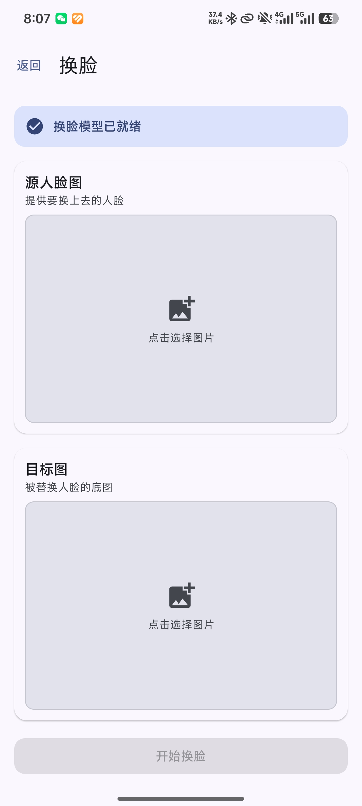

# LocalAlbum

<p align="center">
  
</p>

<p align="center">
  <a href="LICENSE"></a>
  <a href="https://android-arsenal.com/api?level=29"></a>
  <a href="https://kotlinlang.org"></a>
</p>

> Android 10+ 的本地智能相册。媒体索引、AI 分析、搜索和特征数据均在设备端完成。

[English](#english) · [中文](#中文) · [开发贡献](CONTRIBUTING.md) · [变更记录](CHANGELOG.md) · [安全策略](SECURITY.md)

## 效果预览 / Screenshots


|                                    照片主页                                    |                                     精选推荐                                     |                                       重复照片检测                                       |                                 人脸聚类                                 |
| :-----------------------------------------------------------------------------: | :-------------------------------------------------------------------------------: | :---------------------------------------------------------------------------------------: | :-----------------------------------------------------------------------: |
|            |  |  |  |
|                              **语义搜索（结果）**                              |                               **语义搜索（输入）**                               |                                    **换脸（实验性）**                                    |                               **设置页面**                               |
|  |    |                      |    |

---

## 中文

### 当前功能

- **本地媒体库**：在设置中配置扫描根目录后，使用 MediaStore 与文件系统双通道索引图片和视频；支持全量/增量扫描、目录相册、分页时间线、收藏、回收站与媒体查看/播放。应用在前台时通过 ContentObserver 监听媒体库变更并防抖触发增量扫描。
- **检索与整理**：支持文件名、相机信息、场景和 OCR 文本的全文检索（FTS4），以及端侧语义搜索与混合检索；可按人物浏览、查看字节级完全重复文件分组、浏览推荐内容。
- **端侧 AI 分析**：对图片执行人脸检测/聚类、场景分类、质量评分、OCR 与语义嵌入，分析以持久化任务队列在后台分阶段运行，支持断点续跑。视频会参与媒体索引和播放，但当前不会进入图片 AI 分析流程。
- **模型与后端**：内置 TFLite、ONNX Runtime、PyTorch Mobile 运行时，以及可切换的能力 Provider（人脸、场景、质量、OCR、语义等能力槽位）。已对部分模型提供 CPU 回退和可观测性；不同设备、模型和 NNAPI 驱动的实际加速效果不同。
- **数据维护**：支持将媒体索引、FTS、人脸与语义嵌入等数据导出为 JSON 备份，并可覆盖式导入恢复。导入写入使用 staging 隔离 + 单个 Room 事务提交，失败时不会提交部分数据。
- **后台与进度**：扫描、分析、缩略图、重复检测、删除重试等任务由 WorkManager 驱动的持久任务队列执行，前台扫描通过前台服务保活；全局进度指示器展示各阶段进度与 ETA。

### Full / Lite 版本边界

项目通过同一应用模块中的 `full` / `lite` product flavor 维护两个编译期版本：

- **Full**：保留人物相册、语义搜索、语义聚类维护、自动人脸/语义/OCR 分析及对应设置入口。
- **Lite**：以媒体索引和扫描完成时延为优先，只提供关键词/文件名/目录/基础元数据搜索；不编译人物相册、语义搜索、AI 识别偏好页、人物/语义维护 Worker 或自动 Face/Semantic/OCR Stage。
- **两者共享**：基础相册、时间线、查看器、收藏、回收站、备份恢复、场景/质量增强，以及实验性的真实换脸。Lite 的换脸仍保留 FaceProvider、InSwapper、ONNX Runtime、OpenCV、emutls shim 和必需模型，但仅在用户交互时按需加载，不会创建人脸批处理任务。

### 页面结构

应用底部为 4 个主 Tab（平板为侧边导航栏）。下表描述 Full 版本；Lite 会隐藏人物、语义搜索和 AI 识别偏好入口：


| Tab  | 内容                                                                                               |
| ---- | -------------------------------------------------------------------------------------------------- |
| 照片 | 分页时间线 + 快捷入口（收藏、精选推荐、重复照片、人物、搜索）                                      |
| 搜索 | 关键词搜索与语义搜索模式切换                                                                       |
| 相册 | 目录相册网格，进入相册详情（Room Paging 分页加载）                                                 |
| 设置 | 扫描目录、忽略规则、主题、AI 偏好等；含“更多功能”入口（插件管理、分析性能、AI 识别偏好、回收站） |

二级页面还包括：媒体查看器、人物详情、换脸（实验性）、模型导入向导等。

### 当前边界与注意事项

- 应用的核心价值是**本地媒体管理和端侧分析**，不包含云端同步、账户系统或远程相册备份。
- AI 结果依赖模型文件、设备内存、图片质量与模型版本；首次全量分析可能耗时较长，并会增加发热和耗电。
- “重复照片”检测严格限定为**字节级完全重复**（SHA-256，大文件先分段预筛），不做感知相似判定；数据库虽保留 `perceptualHash` 字段，但当前未参与重复检测。
- 语义搜索当前使用精确余弦相似度计算；媒体库很大时，搜索时间和内存占用会随嵌入数量增长。
- 导出文件含媒体路径、OCR 文本、人脸与语义特征等敏感索引数据。请仅保存到可信位置；跨设备导入后，若目录结构不同或原媒体不存在，记录可能指向无效路径。
- 外部 APK/Dex 动态插件加载代码仅保留为**隐藏的实验性能力**，不是面向普通用户的正式扩展接口。请勿导入来源不明的插件 APK；后续扩展方向见 [`plans/code-review-report.md`](plans/code-review-report.md)。
- 换脸（inswapper_128 + emap 矩阵）为实验性娱乐功能，输出效果取决于模型与人脸角度，请勿用于侵犯他人权益的用途。

### 系统要求与权限


| 项目     | 要求                                                                                                                              |
| -------- | --------------------------------------------------------------------------------------------------------------------------------- |
| Android  | Android 10（API 29）及以上（compileSdk/targetSdk 35）                                                                             |
| ABI      | `arm64-v8a` 真机；`x86_64` 模拟器                                                                                                 |
| 媒体权限 | Android 13+ 需要“照片和视频”权限（READ_MEDIA_IMAGES/VIDEO）；Android 10–12 使用“所有文件访问权限”（MANAGE_EXTERNAL_STORAGE） |
| 通知权限 | 可选；用于显示长时间扫描/分析的前台服务通知                                                                                       |
| 网络     | 仅模型下载和远程模型目录使用；本地扫描与 AI 推理不需要网络                                                                        |

### 快速开始

1. 安装 Debug APK 或自行构建应用。
2. 首次启动时授予媒体访问权限，完成引导（含主题选择）。
3. 在设置中添加需要扫描的根目录，例如 `DCIM`、`Pictures` 或 `Download`；可按目录名配置忽略规则。
4. 等待媒体索引完成。图片 AI 分析会在后台以持久任务队列继续运行，可通过全局进度查看阶段状态。
5. 在“搜索”中使用关键词或语义模式；在“照片”页快捷入口查看收藏、精选、重复照片和人物；在“相册”中按目录浏览，在“设置”中管理回收站与备份。

### 构建

#### 前置条件

- JDK 17 或更高版本
- Android SDK 35
- Android NDK `27.0.12077973`
- CMake `3.22.1`
- 已连接设备或启动中的模拟器（仅安装步骤需要）

#### 下载模型

模型按 edition 放置：

- [`app/src/main/assets/models/`](app/src/main/assets/models/)：Full/Lite 共享的 MobileNet 场景模型、InsightFace `buffalo_l`、InSwapper 与 emap 换脸资源。
- [`app/src/full/assets/models/`](app/src/full/assets/models/)：仅 Full 打包的 EVA02-CLIP 与 PaddleOCR 模型；OCR 字典位于 [`app/src/full/assets/ppocrv5_dict.txt`](app/src/full/assets/ppocrv5_dict.txt)。

仓库只提交小型配置文件和 [`MobileNet-v3-Large.tflite`](app/src/main/assets/models/MobileNet-v3-Large.tflite)；大型 ONNX、人脸与换脸模型通过脚本下载。

```bash
chmod +x scripts/download_models.sh
./scripts/download_models.sh
```

脚本从项目 Release（v0.1.0）下载以下模型，已存在的非空文件会被跳过：


| 模型                  | 文件                                                                                  | Source set | 用途                  |
| --------------------- | ------------------------------------------------------------------------------------- | ---------- | --------------------- |
| EVA02-CLIP（int8）    | `eva02_clip/eva02_text_int8.onnx`、`eva02_visual_336_int8.onnx`                       | Full-only  | 语义搜索文本/图片编码 |
| InsightFace buffalo_l | `buffalo_l.zip`（内含 SCRFD `det_10g` + ArcFace `w600k_r50`）                         | 共享       | 默认人脸检测与换脸特征 |
| inswapper_128         | `inswapper_128.onnx` + `emap_512.bin`                                                 | 共享       | 换脸（实验性）        |
| PaddleOCR             | `PP-OCRv5_mobile_rec_infer/inference.onnx`、`PP-OCRv6_small_det_infer/inference.onnx` | Full-only  | 文字识别/检测         |

模型下载失败时可重新执行脚本；emap 矩阵也可通过 `python scripts/extract_emap.py` 从 `inswapper_128.onnx` 重新提取。请不要将大型二进制模型提交到 Git。

#### Debug 构建、测试与安装

```bash
./gradlew assembleFullDebug assembleLiteDebug
./gradlew testFullDebugUnitTest testLiteDebugUnitTest
./gradlew installFullDebug   # 或 installLiteDebug
```

正式包使用项目根目录的 `keystore.properties` 注入签名信息（`storeFile`/`storePassword`/`keyAlias`/`keyPassword` 四个键，格式见 `app/build.gradle.kts`）。该文件和密钥库均不应提交到版本控制；未提供签名文件时，`assembleRelease` 仍可用于编译验证，但输出 APK 未签名。

### 架构概览

```text
Compose UI / ViewModels
        ↓
AlbumRepository / SettingsRepository
        ↓
HybridIndexer ─── PluginAnalysisPipeline ─── CapabilityRegistryV2
        ↓                    ↓
Room / DataStore       Provider + ModelManager
```


| 模块                                                                                          | 责任                                                                   |
| --------------------------------------------------------------------------------------------- | ---------------------------------------------------------------------- |
| [`core/index/`](app/src/main/java/com/renyxin/localalbum/core/index/)                         | MediaStore + 文件系统混合索引、扫描世代标记、增量检测、ContentObserver |
| [`core/pipeline/`](app/src/main/java/com/renyxin/localalbum/core/pipeline/)                   | 分阶段 AI 管道、DAG 调度、断点续跑和进度                               |
| [`core/plugin/capability/`](app/src/main/java/com/renyxin/localalbum/core/plugin/capability/) | 人脸、场景、语义、质量、OCR Provider 能力槽位                          |
| [`core/plugin/model/`](app/src/main/java/com/renyxin/localalbum/core/plugin/model/)           | 模型下载、加载、对象池与后端策略                                       |
| [`core/search/`](app/src/main/java/com/renyxin/localalbum/core/search/)                       | 关键词、语义和混合检索                                                 |
| [`core/analysis/`](app/src/main/java/com/renyxin/localalbum/core/analysis/)                   | 人脸聚类、完全重复检测（SHA-256）、AI 偏好                             |
| [`data/db/`](app/src/main/java/com/renyxin/localalbum/data/db/)                               | Room 实体、DAO 与非破坏数据库迁移（当前 v32，迁移链 8→32）             |
| [`data/worker/`](app/src/main/java/com/renyxin/localalbum/data/worker/)                       | 共享扫描、分析、缩略图、重复检测、删除重试等 WorkManager 任务          |
| [`full/`](app/src/full/)                                                                       | Full-only Stage、人物/语义维护 Worker、人物/语义 UI 与模型资产          |
| [`lite/`](app/src/lite/)                                                                       | Lite policy、禁用的可选搜索模式及空 UI/Stage/Worker contribution       |
| [`data/backup/`](app/src/main/java/com/renyxin/localalbum/data/backup/)                       | JSON 索引导入与导出（staging + 单事务提交）                            |
| [`ui/`](app/src/main/java/com/renyxin/localalbum/ui/)                                         | Compose 页面、组件、主题与自管理返回栈导航                             |

### AI 能力与默认实现


| 能力 | 默认实现                                                          | 结果                            |
| ---- | ----------------------------------------------------------------- | ------------------------------- |
| 人脸 | InsightFace buffalo_l（SCRFD 检测 + ArcFace 特征，ML Kit 为备选） | 人脸框、特征向量与人物聚类      |
| 场景 | MobileNetV3-Large TFLite                                          | 场景标签                        |
| 质量 | 启发式质量分析                                                    | 质量分数                        |
| OCR  | PaddleOCR（PP-OCRv5 识别 + PP-OCRv6 检测，ML Kit 中英文为备选）   | 图片文字与全文索引              |
| 语义 | EVA02-CLIP int8 ONNX（MobileCLIP/概念向量为备选）                 | 图片/文本语义向量与自然语言搜索 |

可在插件管理页面查看模型状态并切换已注册的 Provider。模型不可用时，相应能力会跳过或根据 Provider 实现回退；不会阻止基础媒体浏览。

### 数据与隐私

- 媒体内容和索引默认保留在设备上；应用不提供云端上传流程。
- Room 数据库可能保存文件路径、拍摄时间、EXIF/GPS、OCR、人脸和语义特征。
- 删除操作采用墓碑（tombstone）机制：先标记、物理删除成功后清理关联的人脸、嵌入、分析与缩略图记录，失败由删除重试 Worker 兜底。
- Android 系统备份行为由设备和系统设置决定。若需迁移索引，请优先使用应用提供的导出/导入流程，并妥善保护备份文件。
- 发现安全问题请参阅 [SECURITY.md](SECURITY.md)。

---

## English

### What it does

LocalAlbum is an Android 10+ local media manager. It indexes user-selected folders, organizes photos and videos, and runs supported AI analysis on images entirely on-device.

- Hybrid MediaStore and file-system indexing with full/incremental scans and scan-generation bookkeeping.
- Four main tabs: Photos (paged timeline with quick-access cards), Search, Albums, Settings.
- Directory albums, favorites, trash, media viewing, and video playback.
- On-device face detection and clustering, scene classification, quality scoring, OCR, and semantic embeddings for images, executed as persistent, resumable background task queues.
- Keyword search over filenames, metadata, scene labels, and OCR text (FTS4); semantic and hybrid search are also available.
- Exact-duplicate detection based on byte-level SHA-256 grouping (with segmented pre-screening for large files); no perceptual-similarity claims.
- JSON index export/import (staging + single-transaction commit) for media records, FTS entries, faces, and embeddings.
- Provider-based model management for TFLite, ONNX Runtime, and PyTorch Mobile, with swappable capability providers.

### Important limitations

- Videos are indexed and playable but are not processed by the image AI pipeline.
- AI results, throughput, memory use, and hardware acceleration depend on models and device/ROM capabilities; the first full analysis can be slow and power-hungry.
- Semantic search uses exact cosine similarity; cost grows with the number of embeddings.
- "Duplicate photos" means byte-identical files only; the stored `perceptualHash` field is currently unused.
- Index exports contain sensitive metadata such as paths, OCR text, face data, and embeddings. Treat them as private. Import replaces the current index transactionally, but restored absolute paths can be invalid on another device.
- Loading external APK/Dex plugins is hidden and experimental, **not** a supported end-user extension mechanism. Do not load untrusted plugin APKs.
- The face-swap feature is experimental; use it responsibly.

### Editions and build

The same app module provides compile-time `full` and `lite` product flavors. Full includes people albums, semantic search, and automatic face/semantic/OCR analysis. Lite excludes those batch stages, maintenance workers, and UI entries while retaining keyword/metadata search and interactive face swap with its shared ONNX/OpenCV runtime and models.

Requirements: JDK 17+, Android SDK 35, NDK `27.0.12077973`, and CMake `3.22.1`.

```bash
chmod +x scripts/download_models.sh
./scripts/download_models.sh   # EVA02-CLIP, buffalo_l, inswapper+emap, PaddleOCR

./gradlew assembleFullDebug assembleLiteDebug
./gradlew testFullDebugUnitTest testLiteDebugUnitTest
./gradlew installFullDebug   # or installLiteDebug
```

The model-download script places shared face-swap/scene models under `app/src/main/assets/models/` and Full-only semantic/OCR models under `app/src/full/assets/models/`. Release builds read signing config from `keystore.properties` (not committed); without it, the release tasks still compile but produce unsigned APKs. See the Chinese sections above for the detailed architecture, permission matrix, privacy notes, and setup flow.

### Documentation

- [Contributing guide](CONTRIBUTING.md)
- [Changelog](CHANGELOG.md)
- [Security policy](SECURITY.md)
- [Code review and planned improvements](plans/code-review-report.md)

## License

Licensed under the [Apache License 2.0](LICENSE).
