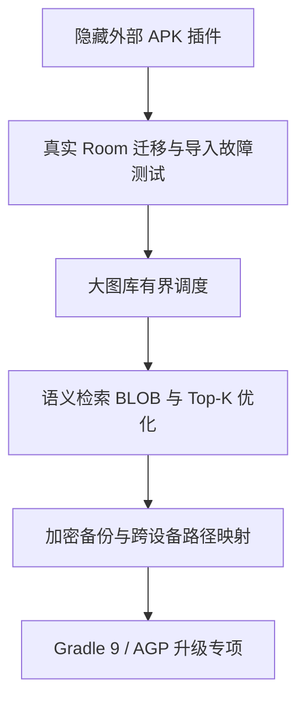

# LocalAlbum 代码审查与整改状态报告

> **更新时间**：2026-07-29
>
> **审查范围**：Android 构建、媒体索引、Room 数据、备份恢复、AI 推理、搜索、并发、插件边界、文档与发布流程。
>
> **验证状态**：已完成真机 release 构建、签名、R8 压缩与安装；未完成真实 Room 迁移测试、超大媒体库压测和跨设备恢复验证。

---

## 1. 当前结论

项目已具备可发布验证的本地相册主链路：目录媒体扫描、时间线/相册/回收站、图片端侧 AI 分析、关键词与语义搜索、模型管理、前台进度通知，以及 JSON 索引导入导出。

本轮已完成先前高优先级的数据一致性与构建告警整改：

- 覆盖式索引导入已由单一 Room 事务保护，并改为批量恢复 FTS。
- 全量扫描会保留内容未变化媒体的派生 AI 字段；内容变化时会失效分析断点。
- 语义向量序列化已固定 Locale，并拒绝损坏或非有限数值。
- PaddleOCR 与 InsightFace 的 ONNX 输出已改为运行时结构校验，移除了未检查的多维数组强制转换。
- release 构建中原有的 Room、未使用变量、Flow Preview、Compose 动画弃用等 Kotlin 警告已清除。

当前不建议把外部 APK/Dex 动态插件作为正式用户能力开放。该路径仍应保持隐藏，优先完成声明式模型包方案设计与安全边界建设。

---

## 2. 已验证的构建结果

在连接的 OnePlus PLC110（Android 16）设备上，已执行：

```bash
./gradlew installRelease --warning-mode all
```

结果：**构建、R8、签名、APK 安装均成功**。

当前构建输出仅剩一项 Gradle 9 兼容性告警：

> `Configuration.fileCollection(Spec)` 已弃用，将在 Gradle 9 移除。

该告警来自构建依赖或插件调用链，不影响当前 APK 的生成、签名和安装；应作为 AGP/第三方构建插件升级专项处理，不能通过盲目替换业务代码消除。

---

## 3. 已完成整改

### 3.1 P0：覆盖式备份导入改为原子恢复

**状态：已完成，待真实数据库故障注入测试。**

[`DatabaseImporter`](../app/src/main/java/com/renyxin/localalbum/data/backup/DatabaseImporter.kt:37) 现在接收真实 [`AppDatabase`](../app/src/main/java/com/renyxin/localalbum/data/db/AppDatabase.kt:36)，并在 [`DatabaseImporter.importFromJson()`](../app/src/main/java/com/renyxin/localalbum/data/backup/DatabaseImporter.kt:86) 中使用 [`withTransaction()`](../app/src/main/java/com/renyxin/localalbum/data/backup/DatabaseImporter.kt:121) 将清理与恢复放在同一事务中。

改进内容：

1. 清理媒体、FTS、人脸和嵌入数据与写入数据在同一事务内完成。
2. FTS 恢复使用 [`MediaDao.insertFtsAll()`](../app/src/main/java/com/renyxin/localalbum/data/db/dao/MediaDao.kt:188) 按 500 条分块写入，替代逐行提交。
3. [`CancellationException`](../app/src/main/java/com/renyxin/localalbum/data/backup/DatabaseImporter.kt:73) 不再被转换为普通导入失败，避免协程取消语义丢失。
4. [`AlbumRepository`](../app/src/main/java/com/renyxin/localalbum/data/repo/AlbumRepository.kt:131) 与 [`AppContainer`](../app/src/main/java/com/renyxin/localalbum/AppContainer.kt:511) 已传递真实数据库实例。

**仍需补齐**：真实 SQLite 下的写入失败、进程终止、磁盘空间不足、超大备份与重复主键集成测试。现有 [`DatabaseExporterTest`](../app/src/test/java/com/renyxin/localalbum/data/backup/DatabaseExporterTest.kt:28) 主要使用 Fake DAO，不能证明 SQLite 回滚行为。

### 3.2 P1：全量扫描与 AI 断点状态一致性

**状态：已完成核心修复，待全链路回归。**

[`HybridIndexer.fullScan()`](../app/src/main/java/com/renyxin/localalbum/core/index/HybridIndexer.kt:177) 在写入前读取现有媒体记录。对内容未变化的文件，会保留收藏、缩略图、OCR、场景、质量、感知哈希、损坏标记与人脸聚类等派生字段，见 [`HybridIndexer`](../app/src/main/java/com/renyxin/localalbum/core/index/HybridIndexer.kt:215)。

当修改时间或文件头指纹变化时，代码会删除对应 [`AnalysisStateEntity`](../app/src/main/java/com/renyxin/localalbum/data/db/entity/AnalysisStateEntity.kt) 记录，迫使管道重新分析，见 [`HybridIndexer`](../app/src/main/java/com/renyxin/localalbum/core/index/HybridIndexer.kt:240)。全量 FTS 重建也会保留已有 OCR 文本，见 [`HybridIndexer`](../app/src/main/java/com/renyxin/localalbum/core/index/HybridIndexer.kt:268)。

**仍需补齐**：针对“未变更保留”“变更重跑”“模型版本升级重跑”“Provider 切换重跑”“删除关联数据清理”的自动化回归矩阵。

### 3.3 P1：语义向量的区域化与损坏数据保护

**状态：已完成正确性修复，性能扩展性未完成。**

[`SemanticSearcher.serialize()`](../app/src/main/java/com/renyxin/localalbum/core/search/SemanticSearcher.kt:259) 使用 [`Locale.US`](../app/src/main/java/com/renyxin/localalbum/core/search/SemanticSearcher.kt:263) 固化持久化格式，并拒绝 NaN/Infinity。[`SemanticSearcher.deserialize()`](../app/src/main/java/com/renyxin/localalbum/core/search/SemanticSearcher.kt:272) 会显式拒绝空值、非法浮点数和非有限数值，不再通过静默过滤缩短向量。

回归测试已加入 [`SemanticSearcherTest`](../app/src/test/java/com/renyxin/localalbum/core/search/SemanticSearcherTest.kt:16)，覆盖逗号小数分隔 Locale、非法向量项和非有限数值。

### 3.4 P1：ONNX 输出契约校验

**状态：已完成，建议随模型升级补充 golden sample。**

- [`PaddleOCRProvider`](../app/src/main/java/com/renyxin/localalbum/core/plugin/capability/builtin/PaddleOCRProvider.kt:28) 现在分别校验检测输出 `[1, 1, H, W]` 与识别输出 `[1, W, C]` 的数组层级和元素类型，见 [`PaddleOCRProvider`](../app/src/main/java/com/renyxin/localalbum/core/plugin/capability/builtin/PaddleOCRProvider.kt:172) 与 [`PaddleOCRProvider`](../app/src/main/java/com/renyxin/localalbum/core/plugin/capability/builtin/PaddleOCRProvider.kt:290)。
- [`InsightFaceProvider`](../app/src/main/java/com/renyxin/localalbum/core/plugin/capability/builtin/InsightFaceProvider.kt:23) 会校验 ArcFace 输出维度与 SCRFD 的 `[N,C]` 或 `[1,N,C]` 输出，见 [`InsightFaceProvider`](../app/src/main/java/com/renyxin/localalbum/core/plugin/capability/builtin/InsightFaceProvider.kt:343)。

不符合预期的模型输出会安全降级为空结果并记录失败，不会因未检查的数组转换直接触发 Kotlin 类型转换异常。

### 3.5 P2：构建与代码质量告警治理

**状态：已完成低风险清理；AGP/Gradle 升级待专项处理。**

已完成：

- [`MediaDao.getModifiedTimeForPath()`](../app/src/main/java/com/renyxin/localalbum/data/db/dao/MediaDao.kt:113) 已查询 `fingerprintHead`，消除 Room Cursor 投影与 [`PathModifiedTime`](../app/src/main/java/com/renyxin/localalbum/data/db/dao/MediaDao.kt:309) 不一致问题。
- [`AppContainer.startModelStatusSync()`](../app/src/main/java/com/renyxin/localalbum/AppContainer.kt:357) 已显式标注 [`FlowPreview`](../app/src/main/java/com/renyxin/localalbum/AppContainer.kt:358)，并移除未参与结果计算的状态变量。
- [`ThumbnailWorker`](../app/src/main/java/com/renyxin/localalbum/data/worker/ThumbnailWorker.kt:52)、[`PluginAnalysisStage`](../app/src/main/java/com/renyxin/localalbum/core/pipeline/PluginAnalysisStage.kt:66)、[`TimelineGrouper`](../app/src/main/java/com/renyxin/localalbum/core/timeline/TimelineGrouper.kt:170) 与各分析 Stage 已清理明确无效的局部变量与参数。
- [`LocalAlbumApp`](../app/src/main/java/com/renyxin/localalbum/ui/LocalAlbumApp.kt:1378) 已将弃用动画 API 替换为 [`animateItem()`](../app/src/main/java/com/renyxin/localalbum/ui/LocalAlbumApp.kt:1378)。

---

## 4. 当前未解决问题与优先级

### P0-1：外部 APK/Dex 插件仍是高风险代码执行边界

**状态：未修复；当前已隐藏，不应对普通用户开放。**

[`PluginLoader.loadInternal()`](../app/src/main/java/com/renyxin/localalbum/core/plugin/PluginLoader.kt:135) 可通过 [`DexClassLoader`](../app/src/main/java/com/renyxin/localalbum/core/plugin/PluginLoader.kt:245) 和反射加载外部 APK。[`PluginLoader.verifySignature()`](../app/src/main/java/com/renyxin/localalbum/core/plugin/PluginLoader.kt:323) 在 manifest 未声明指纹时会通过验证，因此插件自身的 manifest 不是可信根。

**风险**：不可信 APK 可在宿主 UID 和进程内执行，访问应用有权访问的媒体索引、模型和私有数据。

**决策**：继续保持隐藏；禁止在 README、正式 UI 或发布说明中宣传为可用扩展能力。若未来恢复，应先采用签名声明式模型包或独立进程隔离，详见第 7 节。

### P1-1：语义搜索仍全量加载与解析字符串嵌入

[`SemanticSearcher.search()`](../app/src/main/java/com/renyxin/localalbum/core/search/SemanticSearcher.kt:95) 和 [`SemanticSearcher.findSimilar()`](../app/src/main/java/com/renyxin/localalbum/core/search/SemanticSearcher.kt:213) 仍通过 [`EmbeddingDao.getAll()`](../app/src/main/java/com/renyxin/localalbum/data/db/dao/EmbeddingDao.kt:30) 一次加载全部嵌入，并逐条 `split` 和排序。

**影响**：图库数量与向量维度增长时，延迟、内存与 GC 压力线性上升。

**建议**：短期采用分批查询与 Top-K 最小堆；中期转为 BLOB 向量；长期按数据规模引入 ANN 索引，并记录模型版本与归一化契约。

### P1-2：文件并行器对超大图库的协程创建数无上限

[`ParallelFileProcessor.mapParallel()`](../app/src/main/java/com/renyxin/localalbum/core/pipeline/ParallelFileProcessor.kt:63) 对所有路径创建 [`async`](../app/src/main/java/com/renyxin/localalbum/core/pipeline/ParallelFileProcessor.kt:77)，Semaphore 仅限制实际推理数量。

**影响**：数万媒体时会积累等待协程、闭包和结果对象；与 Bitmap 和 ONNX 内存占用叠加时可能放大 OOM 风险。

**建议**：改用固定 worker 加 Channel，或 100–500 条分块调度；不需要完整结果的 Stage 应采用流式统计。

### P1-3：运行时推理并发配置没有真正动态生效

[`InferenceDispatchers.configureConcurrency()`](../app/src/main/java/com/renyxin/localalbum/core/concurrent/InferenceDispatchers.kt:85) 更新变量，但 [`InferenceDispatchers.cpuBound`](../app/src/main/java/com/renyxin/localalbum/core/concurrent/InferenceDispatchers.kt:57) 是首次访问后固定的 lazy dispatcher。

**影响**：内存降级、热保护和用户配置可能只改变表面值，未改变实际并行度。

**建议**：以可重设 Semaphore 或 dispatcher 工厂实现真正的运行时控制，或者将 API 明确限制为首次推理前配置。

### P2-1：跨设备恢复仍依赖绝对路径且导出包含敏感特征

[`DatabaseExporter`](../app/src/main/java/com/renyxin/localalbum/data/backup/DatabaseExporter.kt:47) 会导出路径、OCR、人脸与语义数据；[`DatabaseImporter`](../app/src/main/java/com/renyxin/localalbum/data/backup/DatabaseImporter.kt:152) 不做根目录映射或文件存在性重关联。

**建议**：增加根目录映射、内容指纹关联、导入后失效记录隔离、加密容器与人脸/语义特征的显式导出开关。

### P2-2：自动备份与敏感索引的产品策略尚未收敛

[`AndroidManifest.xml`](../app/src/main/AndroidManifest.xml:26) 仍启用 `allowBackup=true`，而数据库可包含位置、OCR、人脸与语义数据。

**建议**：明确产品是否允许系统迁移；若允许，使用数据提取规则排除数据库、缩略图、模型、插件和日志；若不允许，关闭自动备份并仅提供可控的加密手动导出。

### P2-3：Room schema 与迁移测试仍不足

[`AppDatabase`](../app/src/main/java/com/renyxin/localalbum/data/db/AppDatabase.kt:23) 版本为 13 且 `exportSchema=false`。尤其 [`MIGRATION_12_13`](../app/src/main/java/com/renyxin/localalbum/data/db/AppDatabase.kt:179) 会重建 `media_items` 表。

**建议**：开启 schema 导出、提交历史 schema，并使用 `MigrationTestHelper` 覆盖每个升级路径、索引与数据保留。

### P2-4：Gradle 9 与构建 API 迁移待专项治理

[`app/build.gradle.kts`](../app/build.gradle.kts:143) 使用 [`AppExtension`](../app/build.gradle.kts:2) 和内部 APK 输出实现类命名产物。最新构建还显示第三方依赖/插件调用 [`Configuration.fileCollection(Spec)`](../build.gradle.kts:7)，该 API 将在 Gradle 9 移除。

**建议**：将 APK 输出命名迁移到 Android Components 公共 Variant API；建立 AGP、Kotlin、Gradle 和第三方插件升级矩阵后再升级到 Gradle 9。不要在发布窗口直接替换构建插件。

---

## 5. 当前积极实践

- [`PluginAnalysisPipeline`](../app/src/main/java/com/renyxin/localalbum/core/pipeline/PluginAnalysisPipeline.kt:397) 使用分层 DAG 与 [`supervisorScope`](../app/src/main/java/com/renyxin/localalbum/core/pipeline/PluginAnalysisPipeline.kt:404)，避免独立 Stage 失败级联取消。
- [`ParallelFileProcessor`](../app/src/main/java/com/renyxin/localalbum/core/pipeline/ParallelFileProcessor.kt:99) 会重新抛出取消异常，避免将用户取消误报为文件失败。
- [`HybridIndexer`](../app/src/main/java/com/renyxin/localalbum/core/index/HybridIndexer.kt:255) 对 SQLite `IN` 查询分块，并同步清理 FTS、人脸、嵌入与分析状态孤儿数据。
- [`LocalAlbumApplication`](../app/src/main/java/com/renyxin/localalbum/LocalAlbumApplication.kt:77) 不会在所有 Activity 停止时销毁进程级容器，避免回前台后后台链路永久失效。
- [`ScanWorker`](../app/src/main/java/com/renyxin/localalbum/data/worker/ScanWorker.kt:44) 正确区分协程取消与可重试错误。
- [`README.md`](../README.md) 、[`CONTRIBUTING.md`](../CONTRIBUTING.md) 和 [`SECURITY.md`](../SECURITY.md) 已更新为当前实现边界，并明确隐藏实验插件不是正式用户功能。

---

## 6. 后续实施顺序与发布门禁



### 近期

1. 为导入事务、扫描状态失效和 ONNX 输出契约加入真实数据库及 golden sample 测试。
2. 使用 1 万、5 万媒体样本测试 [`ParallelFileProcessor`](../app/src/main/java/com/renyxin/localalbum/core/pipeline/ParallelFileProcessor.kt:63) 的峰值内存、取消延迟和吞吐。
3. 明确自动备份与手动导出的隐私策略。

### 中期

1. 重构语义向量存储与 Top-K 计算，控制大图库检索内存。
2. 建立跨设备导入映射、失效路径隔离和可选加密备份。
3. 导出 Room schema 并添加迁移 instrumentation 测试。

### 发布门禁

- [`./gradlew installRelease --warning-mode all`](../gradlew) 通过，且目标真机完成安装与基础启动验证。
- 全量扫描、增量扫描、模型升级、Provider 切换后，AI 字段与分析状态一致。
- 导入发生解析失败、写入失败或协程取消时，原数据库保持可用。
- OCR、人脸和语义模型以固定 golden sample 验证输出结构与结果容差。
- 插件路径保持隐藏；在安全架构获批前，不接受外部 APK/Dex 作为正式扩展输入。

---

## 7. 动态插件可行性分析与保留建议

### 7.1 结论

**不同模型的参数差异完全可以支持，但不应以“外部 APK 在宿主进程执行代码”作为主要实现方式。**

更合适的演进路线是**受宿主控制的声明式模型包**：用户导入模型、标签、tokenizer、manifest 和校验信息；宿主根据白名单 `adapterId` 执行固定的预处理、推理和后处理。模型包不包含 dex、native so 或可执行脚本。

现有基础可复用：[`PluginManifest`](../app/src/main/java/com/renyxin/localalbum/core/plugin/PluginManifest.kt:31)、[`PluginJsonCodec`](../app/src/main/java/com/renyxin/localalbum/core/plugin/PluginJsonCodec.kt:17)、[`TensorMetadataParser`](../app/src/main/java/com/renyxin/localalbum/core/plugin/TensorMetadataParser.kt)、[`ModelManagerImpl`](../app/src/main/java/com/renyxin/localalbum/core/plugin/model/ModelManagerImpl.kt:44)、[`CapabilityRegistryV2`](../app/src/main/java/com/renyxin/localalbum/core/plugin/capability/CapabilityRegistryV2.kt:1) 和 [`FeatureSchema`](../app/src/main/java/com/renyxin/localalbum/core/plugin/FeatureSchema.kt:17)。

### 7.2 建议的模型包契约

| 配置域     | 关键字段                                                                                | 用途                                          |
| ---------- | --------------------------------------------------------------------------------------- | --------------------------------------------- |
| 身份与安全 | packageId、version、publisher、sha256、signature、minimumAppVersion                     | 可信来源、升级与回滚控制                      |
| 运行时     | format、runtime、inputBindings、outputBindings、delegatePolicy                          | 选择 ONNX/TFLite 与回退策略                   |
| 适配器     | adapterId、adapterVersion                                                               | 仅选择宿主内置的分类、CLIP、检测或 OCR 解码器 |
| 预处理     | resizeMode、interpolation、cropMode、colorOrder、layout、dtype、quantization、normalize | 完整描述输入变换                              |
| 后处理     | decoderId、activation、labelOffset、threshold、nms、boxFormat                           | 复用经过测试的宿主解析器                      |
| 资源       | labels、vocabulary、merges、tokenizer、auxiliaryModels                                  | 绑定附属文件及其哈希                          |
| 输出       | featureSchema、resultType、modelVersion                                                 | 持久化与缓存失效                              |

### 7.3 决策建议

| 方案                        | 参数灵活性 | 安全性 | 建议                   |
| --------------------------- | ---------- | ------ | ---------------------- |
| 保持隐藏或删除 APK/Dex 加载 | 低         | 高     | 适合只维护内置模型     |
| 恢复 APK/Dex 动态插件       | 最高       | 低     | 不建议面向普通用户开放 |
| 声明式模型包 + 内置适配器   | 高         | 高     | **推荐**               |
| 仅允许替换既有模型族权重    | 中等       | 很高   | 适合作为第一阶段       |

在完成签名来源、哈希校验、导入事务、兼容矩阵、golden sample、内存上限、取消回退和多设备性能验证之前，继续保持 [`PluginLoader`](../app/src/main/java/com/renyxin/localalbum/core/plugin/PluginLoader.kt:40) 的 APK/Dex 路径隐藏。
