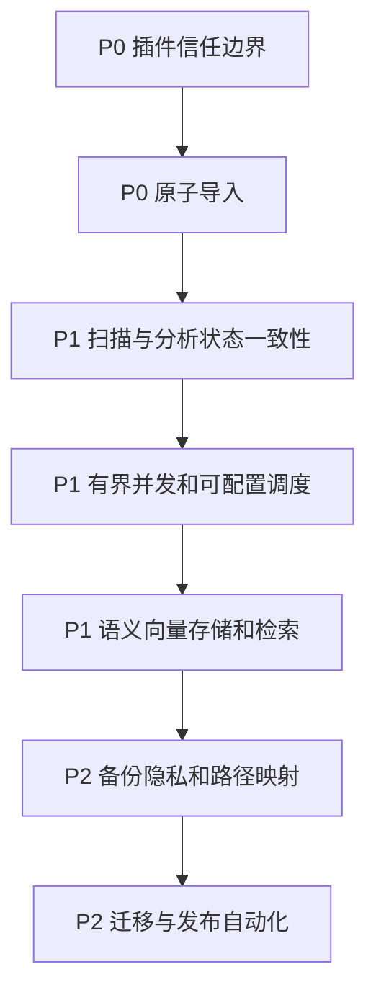
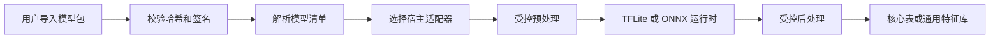

# LocalAlbum 代码审查报告

> 审查日期：2026-07-29  
> 审查范围：Android 配置、媒体索引、Room 数据层、AI 分析调度、插件加载、备份恢复、搜索与后台任务。  
> 审查方式：静态代码审阅；**未执行构建、单元测试、迁移测试或真机验证**。

## 1. 结论摘要

项目已经具备较完整的本地相册能力：MediaStore 与文件系统混合扫描、分阶段 AI 分析、模型后端回退、Room 持久化、前台服务保活以及插件机制。现有性能报告也表明团队已关注端侧推理稳定性，见 [`plans/optimization-plan.md`](optimization-plan.md)。

建议暂缓将动态插件与备份恢复能力作为默认对外功能，优先处理以下问题：

1. 外部 APK 插件默认可不验签并在宿主进程执行，属于高风险任意代码执行入口。
2. 全量扫描以 REPLACE 重写媒体行，却没有同步失效分析断点，可能出现数据库 AI 字段已清空、管道却跳过重算的不一致状态。
3. 覆盖式导入跨多个 DAO 逐步清库和写库，没有全局事务，失败会留下部分恢复或空库。
4. 语义搜索每次加载并解析全部字符串向量，规模增长后会显著拖慢搜索并造成 GC 和内存压力；向量序列化还依赖默认 Locale，存在部分地区的格式错误。

## 2. 优先级定义

| 级别 | 含义                                                             |
| ---- | ---------------------------------------------------------------- |
| P0   | 安全边界、隐私泄露或不可逆数据损失，应在公开发布前修复           |
| P1   | 常规使用中可见的数据一致性、稳定性或可扩展性问题，应排入近期迭代 |
| P2   | 性能、可维护性、兼容性和测试完善项，可按产品节奏推进             |

## 3. 发现与整改建议

### P0-1：动态插件的验签是可选的，宿主进程会执行任意导入 APK 的代码

**证据**

- [`PluginLoader.loadInternal()`](../app/src/main/java/com/renyxin/localalbum/core/plugin/PluginLoader.kt:135) 会从应用私有目录枚举 APK，随后通过 [`DexClassLoader`](../app/src/main/java/com/renyxin/localalbum/core/plugin/PluginLoader.kt:245) 和 [`Class.forName()`](../app/src/main/java/com/renyxin/localalbum/core/plugin/PluginLoader.kt:195) 加载并实例化入口类。
- [`PluginLoader.verifySignature()`](../app/src/main/java/com/renyxin/localalbum/core/plugin/PluginLoader.kt:323) 在 manifest 没有 `authorizedCertificateFingerprint` 时直接返回通过，见 [`PluginLoader.kt`](../app/src/main/java/com/renyxin/localalbum/core/plugin/PluginLoader.kt:324)。
- 已加载插件可获得宿主 [`AiPlugin`](../app/src/main/java/com/renyxin/localalbum/core/plugin/AiPlugin.kt) API，并与相册数据、模型和进程处于同一信任边界。

**影响**

用户从不可信来源导入 APK 时，攻击者可在宿主应用 UID 内执行代码，读取应用可访问的照片元数据、网络数据和私有文件。manifest 自我声明的指纹不是可信根，不能作为授权依据。

**建议方案**

1. 将生产环境改为**默认拒绝未签名插件**，使用内置信任列表或由服务端签名的插件目录，而不是由插件自身声明允许证书。
2. 校验签名方案、证书轮换链、插件包哈希、插件 ID 与版本单调性；安装前完成校验，加载前再次校验。
3. 将实验插件入口只保留在 debug 或明确的开发者模式，UI 显示不可绕过的风险确认。
4. 长期将第三方推理能力转为受限的模型配置或独立进程/独立应用 IPC，避免加载第三方 dex 到主进程。
5. 新增篡改 APK、缺失签名、错误签名、旧版本回滚和重复插件 ID 的自动化测试。

---

### P0-2：备份导入不是原子操作，错误或中断可破坏现有索引

**证据**

- [`DatabaseImporter.importFromJson()`](../app/src/main/java/com/renyxin/localalbum/data/backup/DatabaseImporter.kt:77) 在解析完成后先调用 [`MediaDao.clearAll()`](../app/src/main/java/com/renyxin/localalbum/data/db/dao/MediaDao.kt:105)、FTS 清理、人脸清理和嵌入清理，见 [`DatabaseImporter.kt`](../app/src/main/java/com/renyxin/localalbum/data/backup/DatabaseImporter.kt:96)。
- 后续媒体、FTS、人脸、嵌入按 DAO 分批写入；尤其 FTS 逐条调用 [`MediaDao.insertFtsEntry()`](../app/src/main/java/com/renyxin/localalbum/data/db/dao/MediaDao.kt:184)，见 [`DatabaseImporter.kt`](../app/src/main/java/com/renyxin/localalbum/data/backup/DatabaseImporter.kt:106)。
- DAO 方法的 [`@Transaction`](../app/src/main/java/com/renyxin/localalbum/data/db/dao/MediaDao.kt:93) 仅覆盖单一 DAO 方法，不覆盖上述整个跨表恢复流程。

**影响**

磁盘满、进程被杀、SQLite 异常或某条脏记录导致后半段失败时，用户原有数据已经被删除，恢复结果可能只包含部分表。逐条 FTS 写入也会使大型备份恢复时间显著增加。

**建议方案**

1. 在 [`AppDatabase`](../app/src/main/java/com/renyxin/localalbum/data/db/AppDatabase.kt:36) 暴露仓储级恢复入口，并用 Room [`withTransaction`](../app/src/main/java/com/renyxin/localalbum/data/db/AppDatabase.kt:255) 包住清理与所有插入。
2. 导入前做完整预检：格式版本、最大文件大小、数组上限、必填字段、枚举值、重复主键、引用完整性和向量维度。
3. 使用 [`MediaDao.insertFtsAll()`](../app/src/main/java/com/renyxin/localalbum/data/db/dao/MediaDao.kt:188) 分块批量写入，统一采用 500 或受 SQLite 变量限制保护的批次。
4. 事务提交成功后才更新 UI/进度；失败时保留原库，返回可读的失败原因。
5. 为异常注入、重复项、磁盘写失败和大备份建立真实 Room 集成测试，而非仅 Fake DAO 往返测试。

---

### P1-1：全量扫描可能清空 AI 字段，但断点状态使分析阶段跳过重算

**证据**

- [`HybridIndexer.fullScan()`](../app/src/main/java/com/renyxin/localalbum/core/index/HybridIndexer.kt:177) 将新枚举实体通过 [`MediaDao.insertAll()`](../app/src/main/java/com/renyxin/localalbum/data/db/dao/MediaDao.kt:93) 写入；该方法采用 `OnConflictStrategy.REPLACE`，见 [`HybridIndexer.kt`](../app/src/main/java/com/renyxin/localalbum/core/index/HybridIndexer.kt:213)。新实体的 OCR、质量、场景和聚类等字段通常是默认值，实体字段见 [`MediaEntity`](../app/src/main/java/com/renyxin/localalbum/data/db/entity/MediaEntity.kt:23)。
- 管道会按 [`AnalysisStateDao.getDonePaths()`](../app/src/main/java/com/renyxin/localalbum/core/pipeline/PluginAnalysisPipeline.kt:260) 跳过已完成媒体；但全量扫描路径未调用 [`HybridIndexer.clearAnalysisState()`](../app/src/main/java/com/renyxin/localalbum/core/index/HybridIndexer.kt:59)。

**影响**

用户重新执行全量扫描时，REPLACE 有机会覆盖已有分析结果；之后各阶段命中旧的 DONE 状态而不再处理，从而长期显示空 OCR、无场景、无质量分和不完整的人物数据。

**建议方案**

1. 明确全量扫描语义：若为重建索引，则在写入前清理相关分析状态和关联的特征表；若为刷新元数据，则改为字段级 UPSERT，保留分析字段。
2. 为每个分析状态增加输入版本，例如 `modifiedAtMs`、`fileSize`、指纹、Provider ID、模型版本和预处理版本；状态匹配才允许跳过。
3. 对删除、更新、Provider 切换、模型升级、全量重建分别定义失效矩阵，并在单元测试中覆盖。
4. 在 UI 显示全量扫描是仅索引还是索引加重分析，避免用户误判完成度。

---

### P1-2：语义搜索采用全量字符串向量扫描，存在规模、内存和区域化正确性问题

**证据**

- [`SemanticSearcher.search()`](../app/src/main/java/com/renyxin/localalbum/core/search/SemanticSearcher.kt:95) 与 [`SemanticSearcher.findSimilar()`](../app/src/main/java/com/renyxin/localalbum/core/search/SemanticSearcher.kt:213) 都通过 [`EmbeddingDao.getAll()`](../app/src/main/java/com/renyxin/localalbum/data/db/dao/EmbeddingDao.kt) 将全部嵌入读入内存。
- 每个向量再经 [`SemanticSearcher.deserialize()`](../app/src/main/java/com/renyxin/localalbum/core/search/SemanticSearcher.kt:265) 使用 `split`、字符串转换和 `FloatArray` 重建，之后进行全量排序。
- [`SemanticSearcher.serialize()`](../app/src/main/java/com/renyxin/localalbum/core/search/SemanticSearcher.kt:258) 使用默认 Locale 的 `format`，在小数分隔符为逗号的地区可产生与逗号分隔协议冲突的内容。

**影响**

媒体规模和嵌入维度提高后，搜索延迟与峰值内存线性增长，并触发大量字符串分配与 GC。某些系统语言环境下，保存的向量可能无法按预期解析，导致结果丢失或向量维度错误。

**建议方案**

1. 短期将格式化固定为 `Locale.US`，为序列化/反序列化增加严格维度校验和损坏向量隔离。
2. 将向量存为 BLOB 或定长二进制格式，避免文本体积和解析开销；迁移时保留格式版本。
3. 中期以批量/分页遍历替代一次性加载，并在计算 Top-K 时使用最小堆，避免对全部命中排序。
4. 长期在端侧引入 ANN 索引或按数据规模设定精确搜索与 ANN 的切换阈值；索引必须和模型版本、归一化规则绑定。
5. 使用 1 万、5 万、10 万媒体的基准测试记录 P50/P95、峰值内存、耗电和召回一致性。

---

### P1-3：文件并行器为每个文件创建协程，超大图库下调度开销不受限

**证据**

[`ParallelFileProcessor.mapParallel()`](../app/src/main/java/com/renyxin/localalbum/core/pipeline/ParallelFileProcessor.kt:63) 对整个 `filePaths` 调用 [`async()`](../app/src/main/java/com/renyxin/localalbum/core/pipeline/ParallelFileProcessor.kt:77)，Semaphore 仅在协程内部限制实际处理数，见 [`ParallelFileProcessor.kt`](../app/src/main/java/com/renyxin/localalbum/core/pipeline/ParallelFileProcessor.kt:73)。

**影响**

数万张照片会产生数万个等待协程、结果对象和闭包。即使实际推理并发受限，内存、调度和取消响应仍会恶化；与 Bitmap、ONNX 和 OCR 并存时提升 OOM 风险。

**建议方案**

1. 用固定数量 worker 加 `Channel`，或按 100 至 500 个路径分块处理并增量汇总结果。
2. 不需要保留全部结果的 Stage 改为流式处理，仅维护成功/失败计数与必要输出。
3. 并发度改为按模型内存、图片尺寸、热状态和后端能力配置，而不是默认等于 CPU 核数。
4. 对 5 万路径验证取消延迟、峰值 RSS、失败重试及结果顺序约束。

---

### P1-4：推理并发配置在调度器初始化后不会生效，配置 API 容易误导调用方

**证据**

[`InferenceDispatchers.configureConcurrency()`](../app/src/main/java/com/renyxin/localalbum/core/concurrent/InferenceDispatchers.kt:85) 更新 `inferenceConcurrency`，但 [`InferenceDispatchers.cpuBound`](../app/src/main/java/com/renyxin/localalbum/core/concurrent/InferenceDispatchers.kt:57) 是 lazy 创建的固定 `limitedParallelism` dispatcher；源码注释也确认首次访问后不会重建，见 [`InferenceDispatchers.kt`](../app/src/main/java/com/renyxin/localalbum/core/concurrent/InferenceDispatchers.kt:77)。

**影响**

低内存降级、热保护或用户性能设置即使成功保存，也可能不改变真实并发数。

**建议方案**

- 将并发控制从固定 dispatcher 移到可更新 Semaphore/调度器工厂，或把 API 限定为启动前配置且返回失败状态。
- 在诊断页记录请求并发和实际 worker 数，加入初始化前后配置的测试。

---

### P2-1：备份承诺跨设备恢复，但备份内容主要是绝对路径且包含高敏感数据

**证据**

- [`DatabaseExporter`](../app/src/main/java/com/renyxin/localalbum/data/backup/DatabaseExporter.kt:20) 的说明将 JSON 用于换设备恢复。
- 实际导出包含 [`MediaEntity.filePath`](../app/src/main/java/com/renyxin/localalbum/data/backup/DatabaseExporter.kt:140)、OCR 文本、人脸 embedding 和语义 embedding，见 [`DatabaseExporter.kt`](../app/src/main/java/com/renyxin/localalbum/data/backup/DatabaseExporter.kt:180)。
- 导入会不加路径映射地恢复该字段，见 [`DatabaseImporter.parseMediaItems()`](../app/src/main/java/com/renyxin/localalbum/data/backup/DatabaseImporter.kt:152)。

**影响**

新设备目录不同或媒体未迁移时，导入后会产生大量失效记录；未加密 JSON 泄露照片目录、拍摄位置、OCR 内容、人脸向量及语义特征。

**建议方案**

1. 定义导入策略：仅导入索引、选择源根目录到目标根目录映射、按内容指纹重新关联，并向用户报告匹配/失效数量。
2. 默认不导出人脸和语义向量，或提供单独的显式隐私选项。
3. 使用 SAF 输出和加密容器，密钥由用户口令或 Android Keystore 派生；提供完整性校验和恢复前摘要预览。
4. 在导入后验证媒体存在性，将失效记录隔离而非直接展示为正常媒体。

---

### P2-2：Android 自动备份与敏感本地索引的隐私策略未定义

**证据**

[`AndroidManifest.xml`](../app/src/main/AndroidManifest.xml:26) 将 `android:allowBackup` 设为 `true`。数据库包含位置、OCR、人脸与语义特征，字段定义见 [`MediaEntity`](../app/src/main/java/com/renyxin/localalbum/data/db/entity/MediaEntity.kt:23) 及导出字段见 [`DatabaseExporter`](../app/src/main/java/com/renyxin/localalbum/data/backup/DatabaseExporter.kt:136)。

**影响**

在不同 OEM、系统备份或设备传输流程中，敏感索引可能被自动复制。即使系统传输受保护，产品仍应明确用户授权范围和数据最小化策略。

**建议方案**

- 产品若不需要自动迁移，设置 `allowBackup=false`。
- 若需要迁移，增加 Android 数据提取规则，只允许必要的设置，排除数据库、缩略图、模型、插件和日志；在隐私声明及 UI 中解释。
- 将手动加密备份作为唯一可控的数据迁移路径。

---

### P2-3：数据库迁移未导出 schema，且现有测试未覆盖真实迁移

**证据**

[`AppDatabase`](../app/src/main/java/com/renyxin/localalbum/data/db/AppDatabase.kt:23) 当前版本为 13，且 `exportSchema = false`，见 [`AppDatabase.kt`](../app/src/main/java/com/renyxin/localalbum/data/db/AppDatabase.kt:33)。迁移 12 到 13 会重建 `media_items`，见 [`AppDatabase.kt`](../app/src/main/java/com/renyxin/localalbum/data/db/AppDatabase.kt:179)。当前备份测试采用 Fake DAO，见 [`DatabaseExporterTest`](../app/src/test/java/com/renyxin/localalbum/data/backup/DatabaseExporterTest.kt:32)，不能验证 SQLite schema、索引或迁移数据保留。

**建议方案**

1. 开启 schema 导出并提交历史 schema JSON。
2. 为每条迁移建立 `MigrationTestHelper` Android instrumentation 测试，校验表结构、索引、历史数据、FTS 和关联特征数据。
3. 对重建表迁移加入升级前后行数、关键字段和索引存在性的断言。

---

### P2-4：构建脚本依赖 Android Gradle Plugin 内部 API，影响升级稳定性

**证据**

[`app/build.gradle.kts`](../app/build.gradle.kts:1) 导入 [`AppExtension`](../app/build.gradle.kts:2)，APK 命名通过内部类型 `ApkVariantOutputImpl` 强制转换，见 [`app/build.gradle.kts`](../app/build.gradle.kts:143)。

**建议方案**

迁移到 Android Components 公共 Variant API 完成输出命名，并在 CI 固定执行 debug/release 构建、lint 与单元测试。该项应与 AGP/Kotlin 升级单独提交，避免和业务改动耦合。

## 4. 已观察到的积极实践

- [`PluginAnalysisPipeline`](../app/src/main/java/com/renyxin/localalbum/core/pipeline/PluginAnalysisPipeline.kt:397) 使用分层 DAG 和 [`supervisorScope`](../app/src/main/java/com/renyxin/localalbum/core/pipeline/PluginAnalysisPipeline.kt:404)，避免同层独立 Stage 的失败级联。
- [`ParallelFileProcessor`](../app/src/main/java/com/renyxin/localalbum/core/pipeline/ParallelFileProcessor.kt:99) 会重新抛出取消异常，避免把用户取消误报为任务失败。
- [`HybridIndexer`](../app/src/main/java/com/renyxin/localalbum/core/index/HybridIndexer.kt:217) 对 SQLite `IN` 参数按批次处理，并同步清理 FTS、人脸和嵌入孤儿记录。
- [`LocalAlbumApplication`](../app/src/main/java/com/renyxin/localalbum/LocalAlbumApplication.kt:77) 已纠正所有 Activity 停止时错误关闭整个容器的问题，保留进程级资源生命周期。
- [`ScanWorker`](../app/src/main/java/com/renyxin/localalbum/data/worker/ScanWorker.kt:44) 正确区分 `CancellationException` 与可重试错误。

## 5. 建议实施顺序与验收



1. **安全和数据安全**：收紧插件信任策略；实现事务化导入及导入前预检；为原库保留、失败回滚和恶意插件建立回归测试。
2. **一致性**：定义扫描重建与增量刷新语义，修复分析状态失效；以真实 Room 数据库验证全量扫描后各 AI 字段和状态一致。
3. **性能与稳定性**：将文件调度改为有界 worker；修复并发配置语义；测量大图库扫描内存、取消和热稳定性。
4. **搜索可扩展性**：先修 Locale/向量格式和 Top-K 算法，再设计 BLOB 与 ANN 迁移方案；保留旧数据兼容与可回滚路径。
5. **发布工程化**：限制自动备份，补充加密备份设计、真实迁移测试和 CI 发布门禁。

## 6. 建议的发布门禁

- Debug 与 release 构建、lint、单元测试、Room 迁移 instrumentation 测试全部通过。
- 插件：无签名、篡改、错误证书和回滚插件全部被拒绝。
- 导入：解析失败、写入失败和进程中断后，原数据库可完整读取；成功导入后各表计数和引用一致。
- 扫描：全量、增量、模型升级和 Provider 切换后，分析状态与媒体 AI 字段一致。
- 性能：以目标设备和大图库样本记录扫描/搜索 P50、P95、峰值内存、温度和失败率。
- 隐私：自动备份规则、手动备份加密、导入权限和用户告知均经过产品及安全评审。

## 7. 动态插件可行性分析与保留建议

### 7.1 结论

**可以实现，但不建议保留当前的外部 APK 动态代码插件方案作为面向普通用户的产品能力。**

你的真实需求是让不同模型以不同参数运行，而不是让第三方在宿主进程执行任意 Kotlin/Java 代码。对这一需求，更合适、风险显著更低的实现是：**受宿主控制的声明式模型包**。

也就是说，保留模型导入、模型参数配置、运行时选择和结果持久化；移除或持续隐藏 [`PluginLoader`](../app/src/main/java/com/renyxin/localalbum/core/plugin/PluginLoader.kt:40) 的 APK/Dex 动态加载路径。模型包只包含模型、标签、tokenizer、manifest 和可校验的资源，所有预处理、推理和后处理均由宿主的受限适配器执行。

现有代码已经具备可复用基础：

- [`PluginManifest`](../app/src/main/java/com/renyxin/localalbum/core/plugin/PluginManifest.kt:31) 已描述模型格式、张量、预处理及后处理。
- [`PluginJsonCodec`](../app/src/main/java/com/renyxin/localalbum/core/plugin/PluginJsonCodec.kt:17) 已提供 JSON 编解码和基础校验。
- [`TensorMetadataParser`](../app/src/main/java/com/renyxin/localalbum/core/plugin/TensorMetadataParser.kt) 可用于自动探测部分模型张量元信息。
- [`ModelManagerImpl`](../app/src/main/java/com/renyxin/localalbum/core/plugin/model/ModelManagerImpl.kt:44) 已集中管理部分模型加载与对象池。
- [`CapabilityRegistryV2`](../app/src/main/java/com/renyxin/localalbum/core/plugin/capability/CapabilityRegistryV2.kt:1) 及 [`PluginAnalysisPipeline.create()`](../app/src/main/java/com/renyxin/localalbum/core/pipeline/PluginAnalysisPipeline.kt:69) 已支持由能力槽位组装分析阶段。
- [`FeatureSchema`](../app/src/main/java/com/renyxin/localalbum/core/plugin/FeatureSchema.kt:17) 和 [`FeatureStoreEntity`](../app/src/main/java/com/renyxin/localalbum/data/db/entity/FeatureStoreEntity.kt) 可承接未被核心业务消费的通用输出。

因此，这不是从零设计，而是一次将 API 从代码扩展插件收敛为数据驱动模型适配器的架构调整。

### 7.2 当前方案为何难以解决参数差异

[`PluginManifest.PreprocessingConfig`](../app/src/main/java/com/renyxin/localalbum/core/plugin/PluginManifest.kt:127) 当前只覆盖 resize、均值/方差、颜色通道和正方形裁剪；[`PluginManifest.PostprocessingConfig`](../app/src/main/java/com/renyxin/localalbum/core/plugin/PluginManifest.kt:144) 只覆盖阈值、NMS、标签和 Top-K。这些字段不足以准确表达真实模型的全部契约，例如：

| 模型类别     | 常见额外差异                                                         | 仅靠现有 manifest 是否足够 |
| ------------ | -------------------------------------------------------------------- | -------------------------- |
| 图像分类     | resize 算法、中心裁剪、通道顺序、量化、输出激活、label 偏移          | 部分不足                   |
| 图像语义向量 | 图像归一化、tokenizer、文本 prompt 模板、L2 归一化、图文双编码器配对 | 不足                       |
| 人脸检测     | anchor、stride、decode 公式、landmark 顺序、多输出张量和 NMS 规则    | 不足                       |
| OCR          | 检测框解码、旋转校正、候选框限流、字符字典、CTC/attention 解码       | 不足                       |
| 分割或生成   | 多输入、mask 后处理、调度器、随机种子、输出合成方式                  | 明显不足                   |

直接允许每个模型提供 APK 代码，确实能覆盖这些差异，但同时把模型兼容问题转化为安全、崩溃隔离、ABI、依赖冲突、版本兼容和审计问题。这也是当前方案被隐藏后仍不宜直接恢复的根因。

### 7.3 推荐目标架构：声明式模型包加有限适配器



模型包建议为 ZIP 或应用私有目录中的受控文件集合，不包含 dex、native so 或可执行脚本：

```text
package.json
model.onnx 或 model.tflite
labels.txt
vocab.json 或 tokenizer.json
checksums.json
```

其中 `package.json` 不应再使用含有 `entryClass` 的 [`PluginManifest`](../app/src/main/java/com/renyxin/localalbum/core/plugin/PluginManifest.kt:39) 原样结构，而应新增或演进为 `ModelPackageManifest`：

| 配置域     | 建议字段                                                                                | 目的                                                                                                           |
| ---------- | --------------------------------------------------------------------------------------- | -------------------------------------------------------------------------------------------------------------- |
| 身份与安全 | packageId、version、publisher、sha256、signature、minimumAppVersion                     | 建立可信模型来源与升级/回滚策略                                                                                |
| 运行时     | format、runtime、inputBindings、outputBindings、delegatePolicy                          | 让宿主可选择 ONNX 或 TFLite 和回退策略                                                                         |
| 适配器     | adapterId、adapterVersion                                                               | 限定为宿主内置白名单，例如 image_classification_v1、clip_embedding_v1、yolo_detection_v1、paddle_ocr_v1        |
| 预处理     | resizeMode、interpolation、cropMode、colorOrder、layout、dtype、quantization、normalize | 完整描述通用输入变换                                                                                           |
| 后处理     | decoderId、activation、labelOffset、threshold、nms、boxFormat、normalization            | 复用可测试的宿主解码器                                                                                         |
| 资源绑定   | labels、vocabulary、merges、tokenizer、auxiliaryModels                                  | 明确附属文件及校验                                                                                             |
| 输出契约   | featureSchema、resultType、modelVersion                                                 | 驱动 [`FeatureSchema`](../app/src/main/java/com/renyxin/localalbum/core/plugin/FeatureSchema.kt:17) 和缓存失效 |
| 能力声明   | capabilitySlot、batchSupport、maxInputPixels、estimatedMemory                           | 防止不兼容模型进入错误的管道槽位                                                                               |

关键原则是：模型包只能选择经过应用发布和测试的 `adapterId` 与 `decoderId`，不能注入表达式、反射类名、脚本或任意类名。这样仍可通过版本化适配器覆盖新的模型家族，同时保持推理路径可审计。

### 7.4 产品选择对比

| 方案                            | 模型参数灵活性       | 安全性               | 维护成本 | 推荐程度             |
| ------------------------------- | -------------------- | -------------------- | -------- | -------------------- |
| 继续隐藏并最终删除 APK 动态插件 | 无新增能力           | 高                   | 低       | 适合只维护内置模型   |
| 恢复 APK/Dex 动态插件           | 最高                 | 很低，需要高成本隔离 | 很高     | 不建议面向用户开放   |
| 声明式模型包加内置适配器        | 高，覆盖主流模型家族 | 高                   | 中等     | **推荐**             |
| 仅允许用户替换同一模型族的权重  | 中等                 | 很高                 | 低       | 适合第一阶段快速落地 |

### 7.5 分阶段可行路径

1. **第一阶段：模型替换，不开放任意任务**
   - 仅允许在现有 `scene`、`semantic`、`ocr`、`face` 槽位中替换预定义模型族的权重。
   - 以 [`CapabilityRegistryV2`](../app/src/main/java/com/renyxin/localalbum/core/plugin/capability/CapabilityRegistryV2.kt:1) 的 Provider 为宿主适配器，导入的仅是受校验的模型资源和参数。
   - UI 复用 [`ModelImportWizardScreen`](../app/src/main/java/com/renyxin/localalbum/ui/screens/ModelImportWizardScreen.kt) 与 [`ModelJsonEditorScreen`](../app/src/main/java/com/renyxin/localalbum/ui/screens/ModelJsonEditorScreen.kt:61)，但编辑器只暴露白名单字段和枚举选项。

2. **第二阶段：通用视觉模型包**
   - 增加分类、单向 embedding 和标准检测三个稳定适配器。
   - 通过模型探测预填张量 shape，再以测试图片验证输入输出和后处理；不允许只凭 JSON 校验即启用。
   - 非核心能力的输出写入 [`FeatureStoreDao`](../app/src/main/java/com/renyxin/localalbum/data/db/dao/FeatureStoreDao.kt)，核心能力必须通过专属适配器和质量门禁才可接入主界面。

3. **第三阶段：受控发行与兼容矩阵**
   - 建立签名模型源、兼容设备、模型哈希、适配器版本和基准结果的目录。
   - 对每个模型包完成正确性样本、内存上限、取消、异常回退和端侧性能测试后才可推荐给用户。

4. **不建议纳入近期范围**
   - 任意 APK/Dex、原生库、Python 脚本、可执行图后处理。
   - 任意未知 OCR、人脸检测、生成式工作流直接接入批量扫描。这些工作负载需要专用解码器和更严格的资源隔离。

### 7.6 保留或移除的决策建议

- 如果目标是个人本地相册、主要服务内置模型：**移除 APK 动态加载代码，保留模型包导入能力**。这会明显减少攻击面和维护成本。
- 如果目标是可扩展的模型实验平台：**保留插件领域模型、清单、通用特征库和能力槽位；弃用 APK 插件加载器，转向签名声明式模型包**。
- 只有在你愿意维护第三方开发者生态、插件签名基础设施、进程隔离、兼容性测试矩阵和安全响应机制时，才考虑恢复 APK 级动态插件；即使如此，也应以独立进程服务为前提，而不是 [`DexClassLoader`](../app/src/main/java/com/renyxin/localalbum/core/plugin/PluginLoader.kt:253) 直接加载到主进程。

### 7.7 决策前验证清单

1. 选定首批明确支持的模型族和用户场景，不以所有 ONNX/TFLite 模型可导入作为承诺。
2. 为每个模型族完成一份 manifest 示例、输入输出 golden sample 和错误提示规范。
3. 制定模型包安全策略：来源、哈希、签名、最大文件大小、最大张量维度和最大内存。
4. 定义导入失败后无副作用的事务语义，避免覆盖当前已可用 Provider。
5. 在至少一台中端和一台目标高端设备验证加载、推理、热稳定性、取消和 CPU 回退。
6. 在完成上述验证前，继续保持 APK 动态插件入口隐藏或移除。
