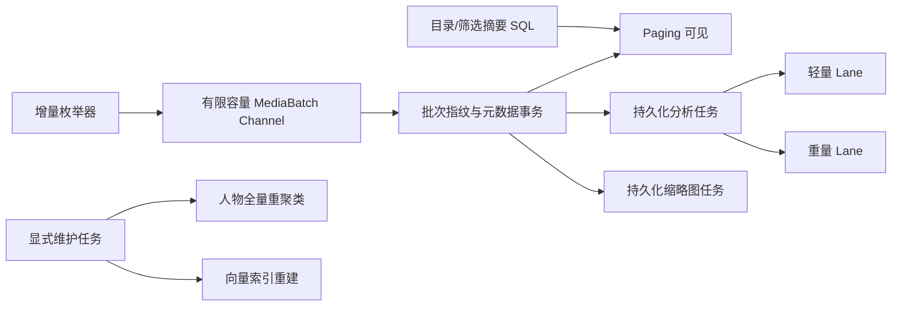

# 大图库稳定性与性能优化实施计划

> **代码审计基线与实现复核：2026-07-30。** P0-C1～C3、P1-A、P1-B、P2-A、离线完全重复检测、N2 人物原型持久化、N3 缩略图缓存治理、N4 语义生命周期及 N5 删除失败治理代码已落地。N6 备份契约收口代码完成：备份格式独立升级为 streaming v3，Room 升至 v27 增加通用 generation staging；manifest 显式声明 capabilities、正式表与可再生排除表，新增重要状态流式导出、全量预检后 staging、最终事务切换、瞬态清理/任务 seed、semantic 激活向量门禁和结构化脱敏错误。真机大备份、磁盘不足及杀进程验收仍待完成；不得据此宣称 N1-F 已完成。

## 1. 目标、范围与明确边界

- 近期目标：解决约 3 万媒体时的进程崩溃、扫描长时间不可用和后台任务无法收敛。当前扫描已按有限批次提交正式表，首批数据可由 Paging 读取；下一步重点从“消除已知无界主路径”转为真机量化、异常恢复验收和剩余维护能力持久化。
- 长期目标：架构可扩展至 10 万媒体；除明确的离线维护任务外，不允许完整实体集合、路径集合、协程数或事务工作集随媒体总量无界增长。
- 兼容目标：Room 升级不清空用户索引；默认使用 ZIP + NDJSON 备份，同时继续支持历史单文件 JSON 导入。
- **本轮不做**：暂停、恢复、仅充电/Wi-Fi、低功耗等任务控制面 UI。底层任务状态、领取租约和调度接口需要为未来控制面保留扩展边界。
- **本轮不做**：阶段 0 的统一性能指标、1 万/3 万/10 万合成夹具、查询计划测试和真机性能基线。功能测试和迁移正确性测试仍属于各阶段交付要求。

## 2. 当前完成度总览

| 领域         | 状态             | 已落地                                                                                                                                             | 当前主要缺陷                                                                                      |
| ------------ | ---------------- | -------------------------------------------------------------------------------------------------------------------------------------------------- | ------------------------------------------------------------------------------------------------- |
| 前台数据访问 | N1 代码收口完成  | 时间线、收藏、目录详情、搜索、回收站、人物详情 Paging；无调用全量接口已删除；源码架构守卫禁止 UI/ViewModel/Repository/Worker 重新接入              | 历史单 JSON 导出仍有明确标记的 legacy-only 全量边界；connected instrumentation 待真机执行         |
| 扫描与 AI    | N1 代码收口完成  | 有界 staging 扫描、批次正式表提交、scoped 分析任务、唯一 AnalysisWorker；旧 List/DirectoryNode/全量 Map 私有路径与不可达旧 AnalysisPipeline 已删除 | 真机 3 万媒体、连续杀进程和租约恢复验收待执行                                                     |
| 人脸         | N2 代码完成      | v23 多代表原型、active generation、provider/model scope、在线有界更新、唯一可恢复维护 Worker、人工名称 metadata 双写；人物摘要和详情已分页         | connected instrumentation、3 万图库、杀进程 cursor 恢复及 Provider/模型切换待真机验证             |
| 缩略图       | N3 代码完成      | Room v24 缓存元数据；grid/preview；可视/预取优先级；唯一任务提升；节流 touch；metadata keyset LRU；视频目标尺寸取帧；preview 不覆盖 grid 路径      | v23→v24、3 万图库滚动、视频格式/API 回退、磁盘预算和删除失败重试待真机验收                        |
| 语义搜索     | 精确检索基线完成 | Float32 BLOB、keyset 分页、固定 Top-K、向量索引接口；推荐不再调用整库嵌入接口                                                                      | 精确检索 CPU 仍为线性；旧 CSV 未回填；向量空间元数据和 ANN 生命周期未持久化                       |
| 推荐         | P1-B 有界化完成  | keyset 遍历、确定性 bottom-k 样本、默认 2048 工作集上限、样本媒体分块加载、确定性 K-Means                                                          | 每次刷新仍遍历全部嵌入 keyset 页；尚无持久化增量质心/主题簇                                       |
| 备份         | P2-A 已完成      | ZIP + NDJSON 一致快照、严格清单校验、v21 generation staging 分批导入、失败隔离、历史 JSON 兼容                                                     | 最终 `INSERT ... SELECT` 随数据量增长；错误报告缺少脱敏行/主键上下文；十万级真机写锁与 WAL 未量化 |
| 完全重复检测 | 离线维护已完成   | v22 generation 任务、fileSize SQL 预筛、64 项 keyset 批次、完整 SHA-256、持久结果原子发布、进程中断恢复                                            | 当前只定义字节级完全重复，不提供感知相似照片语义；connected instrumentation 尚需真机执行          |
| 清理与删除   | P0-C1 已完成     | 仅 purge 物理删除成功/已不存在路径；回收站 keyset 分批；关联数据按块事务清理                                                                       | 物理删除失败缺少持久错误记录；关联一致性 Room 测试仍需补齐                                        |

## 3. 已确认缺陷与风险分级

### P0：当前仍可能导致崩溃、数据不一致或任务不可恢复

1. **当前 P0 扫描与分析主路径未发现仍开放的无界或不可恢复缺陷。** 全量与增量入口已共用 staging、扫描代次和有限 Channel；分析消费已统一到唯一 WorkManager Worker。剩余风险转入真机 3 万媒体验收、杀进程恢复验证及旧私有兼容代码删除。

### 已关闭或已显著缓解的原 P0 风险

- Builtin 与 Provider 人脸路径均复用 [`IncrementalFaceClusterAssigner`](../app/src/main/java/com/renyxin/localalbum/core/analysis/IncrementalFaceClusterAssigner.kt:14)，常规扫描不再调用全库 DBSCAN。
- [`ThumbnailWorker`](../app/src/main/java/com/renyxin/localalbum/data/worker/ThumbnailWorker.kt:24) 已使用持久任务、唯一 Work、原子租约、指数退避和失败封顶。
- [`AlbumRepository.loadFromDb()`](../app/src/main/java/com/renyxin/localalbum/data/repo/AlbumRepository.kt:263) 与启动恢复使用目录摘要；相册详情使用目录 Paging。
- [`TrashCleanupWorker.doWork()`](../app/src/main/java/com/renyxin/localalbum/data/worker/TrashCleanupWorker.kt:16) 已按批复用 repository 清理入口；该结论仅适用于自动清理，不代表前台永久删除已一致。

### P1：会造成明显内存、CPU、I/O 放大或功能退化

1. **语义推荐虽已设置严格工作集上限，但尚非增量持久簇。** [`SemanticClusterRecommender.generate()`](../app/src/main/java/com/renyxin/localalbum/core/recommendation/SemanticClusterRecommender.kt:62) 使用 keyset 与确定性 bottom-k 样本，不再加载整库嵌入；后续仍应将主题质心和每簇 Top-N 持久化，避免每次刷新扫描全部 keyset 页。
2. **缩略图缓存治理代码已完成，真机验收尚未完成。** [`ThumbnailScheduler`](../app/src/main/java/com/renyxin/localalbum/data/repo/ThumbnailScheduler.kt:1) 将可视/预取窗口映射为 grid/preview 优先级并节流重复请求；[`ThumbnailCacheTrimmer`](../app/src/main/java/com/renyxin/localalbum/data/repo/ThumbnailCacheTrimmer.kt:1) 使用 metadata keyset LRU。剩余风险转为 v23→v24 真机迁移、滚动重组、视频解码兼容及实际磁盘回落验证。

### P2：正确性、扩展性和维护性风险

1. **staging 最终切换仍有与数据量相关的数据库内工作。** [`DatabaseImporter.switchFromStaging()`](../app/src/main/java/com/renyxin/localalbum/data/backup/DatabaseImporter.kt:280) 已将解析、ZIP IO 和分批写 staging 移出最终事务；最终事务仍需清空并通过 `INSERT ... SELECT` 复制四张正式表，需在 3 万级发布门槛与 10 万级架构目标设备上分别量化写锁和 WAL 峰值。
2. **历史 JSON 兼容路径仍为全量内存。** [`DatabaseExporter.exportToJson()`](../app/src/main/java/com/renyxin/localalbum/data/backup/DatabaseExporter.kt:246) 和 [`DatabaseImporter.importFromJson()`](../app/src/main/java/com/renyxin/localalbum/data/backup/DatabaseImporter.kt) 会构造完整 JSON DOM；它们只能作为小型历史兼容入口，UI 不应默认调用。
3. **精确语义检索仍为 O(N)。** [`ExactPagedVectorIndex.search()`](../app/src/main/java/com/renyxin/localalbum/core/search/VectorIndex.kt:49) 已将内存控制为 O(page + Top-K)，但每次查询仍需扫描全部嵌入并解码旧 CSV/BLOB。

## 4. 目标架构

关键约束：

- **优先采用扫描 staging 表，而不是强求双来源有序归并。** 当前 MediaStore 按拍摄时间返回，File API 递归遍历也无路径序；为了归并而在内存排序仍是 O(N)。staging 表以 `(scanId, filePath, source)` 建唯一/覆盖规则，可直接承担跨来源去重、进度计数和中断清理。
- 扫描生产、写库和任务投递之间使用有限容量队列，任何阶段变慢都必须形成背压；媒体 upsert、FTS、扫描代次、分析任务和缩略图任务应在同一批次事务提交。
- 常规扫描只处理新增或变更文件；全库人脸聚类、推荐重建和 ANN 压缩只能作为显式维护任务。
- UI 数据源只持有当前页、聚合摘要和稳定查询上下文，不持有整库实体树。
- 持久任务具有 `PENDING/RUNNING/DONE/FAILED` 状态、优先级、尝试次数、下次重试时间和领取租约；任务身份必须包含 sourceVersion + pipeline/model scope。Worker 只在确认各阶段结果后完成任务，唯一 Work 负责进程退出后的续跑。
- 备份导出使用稳定 keyset 和一致快照；导入按可恢复批次提交，并用导入代次隔离半成品。

## 5. 分阶段实施

### 阶段 0：量化基线与防回归门槛（本轮不做）

保留原目标：统一性能采样、合成大图库夹具、查询计划与真机验收。该阶段不阻塞以下稳定性改造，但后续正式宣称支持 10 万媒体前必须完成。

### 阶段 1：消除前台全量内存镜像（P1-A 主路径已完成）

**已完成**

1. 时间线使用 [`MediaDao.pagingSource()`](../app/src/main/java/com/renyxin/localalbum/data/db/dao/MediaDao.kt:27)，收藏页使用 [`MediaDao.favoritesPagingSource()`](../app/src/main/java/com/renyxin/localalbum/data/db/dao/MediaDao.kt:89)。
2. 已有 [`MediaDao.getDirectorySummaries()`](../app/src/main/java/com/renyxin/localalbum/data/db/dao/MediaDao.kt:49) 和 [`MediaDao.directoryPagingSource()`](../app/src/main/java/com/renyxin/localalbum/data/db/dao/MediaDao.kt:31) 作为目录摘要与详情分页基础。
3. 总数、收藏数改为聚合 Flow；13→14 迁移已增加时间线、收藏、目录、类型和场景复合索引。
4. [`AlbumBuilder.buildFromDirectorySummaries()`](../app/src/main/java/com/renyxin/localalbum/core/album/AlbumBuilder.kt:90) 从目录聚合摘要构建轻量树；[`AlbumRepository.loadFromDb()`](../app/src/main/java/com/renyxin/localalbum/data/repo/AlbumRepository.kt:262) 和启动恢复不再调用 `MediaDao.getAll()`。
5. 相册详情接入 [`AlbumRepository.pagedMediaForDirectory()`](../app/src/main/java/com/renyxin/localalbum/data/repo/AlbumRepository.kt)，目录树节点不再常驻完整媒体列表。
6. HybridIndexer 缺失时扫描显式失败，不再静默回退到旧的全量 MediaSource 映射路径。
7. 搜索、回收站和人物详情已接入 Paging；关键词的类型、日期和机型筛选下推 Room，机型选项使用独立 DISTINCT 查询。
8. [`Screen.MediaViewer`](../app/src/main/java/com/renyxin/localalbum/ui/LocalAlbumApp.kt:179) 只保存 `initialPath + MediaQueryContext + returnTo`；时间线、目录、搜索、人物和收藏均可按稳定上下文重建分页，推荐等有界来源限制为最多 500 个稳定路径。

**本批新增完成**

1. [`DirectoryMediaQuery`](../app/src/main/java/com/renyxin/localalbum/core/model/DirectoryMediaQuery.kt) 将目录、图片/视频类型和八种有限排序组成稳定查询身份；Room 使用受 `MediaEntity` 观察的 RawQuery PagingSource，所有排序以 `filePath` 决胜。
2. [`AlbumDetailScreen()`](../app/src/main/java/com/renyxin/localalbum/ui/screens/AlbumDetailScreen.kt:107) 不再对 Paging 当前窗口执行筛选或排序；查询变化重建 Pager，查看器 `MediaQueryContext.Directory` 携带同一完整查询及匹配偏移算法。
3. 搜索、回收站、收藏和人物详情主路径不再暴露旧完整实体状态/加载方法；备份导出、重复检测等非 UI 业务接口未被误删。
4. 增加查询映射/上下文 JVM 测试及目录 Room PagingSource instrumentation 测试，覆盖日期升降序、名称、大小、图片与视频筛选核心组合。

**待完成**

1. 评估并限制仍用于非 UI 业务的 [`MediaDao.getAllFlow()`](../app/src/main/java/com/renyxin/localalbum/data/db/dao/MediaDao.kt:16)，不能破坏备份或离线维护。
2. 将非语义推荐策略进一步与完整相册媒体解耦，在后台按时间窗口、场景摘要和候选 Top-N 查询生成。

**完成标准**

- 冷启动、扫描结束、切换相册 Tab、打开搜索或回收站均不调用 `MediaDao.getAll()`。
- 导航栈中不保存超过 Paging 当前窗口的媒体实体。
- 目录数量增长时内存与目录数相关，但不与媒体实体总数线性相关。

### 阶段 2：扫描与 AI 改造成有界、可恢复流水线（部分完成，P0）

**已完成**

1. [`HybridIndexer.fullScan()`](../app/src/main/java/com/renyxin/localalbum/core/index/HybridIndexer.kt:184) 按 500 条生成和写入实体，不再构造全量实体副本与全量既有实体映射。
2. 首次扫描入库后即返回，后台 AI 以 250 条批次执行；视频不进入图片 AI 管道。
3. 文件变更和删除会失效对应分析状态。
4. [`AnalysisStateDao.getDonePathsInBatch()`](../app/src/main/java/com/renyxin/localalbum/data/db/dao/AnalysisStateDao.kt:37) 只读取当前批次已完成路径；增量分析已移除全库 `allPathsSnapshot`。
5. Repository 旧 MediaSource 全量兜底已禁用；HybridIndexer 注入失败会显式报告扫描失败。
6. v17 新增 `scanGeneration` 和 [`AnalysisTaskEntity`](../app/src/main/java/com/renyxin/localalbum/data/db/entity/AnalysisTaskEntity.kt:17)；全量扫描使用代次 SQL 分批清理孤儿，扫描入库后立即持久化图片分析任务。
7. [`AnalysisTaskDao.claimBatch()`](../app/src/main/java/com/renyxin/localalbum/data/db/dao/AnalysisTaskDao.kt:47) 支持原子领取、过期租约恢复、失败退避和尝试封顶；全量重分析与启动续跑不再读取全部图片路径。
8. v20 任务身份增加运行时 pipeline scope，包含激活 Provider、阶段集合及模型版本；enqueue 按每个 `(filePath, sourceVersion)` 成对淘汰旧版本，并可显式重新激活同源 DONE/FAILED 任务。
9. [`AnalysisWorker.doWork()`](../app/src/main/java/com/renyxin/localalbum/data/worker/AnalysisWorker.kt:21) 使用唯一 Work、有限批次和周期租约心跳；缺失必需阶段或任一阶段失败均不会 `markDone`。

**待完成**

1. 删除 [`HybridIndexer`](../app/src/main/java/com/renyxin/localalbum/core/index/HybridIndexer.kt) 中已不再由入口调用的旧全量私有兼容函数，降低未来误接回无界路径的风险。
2. ~~重复照片检测降级为显式离线维护任务，使用 keyset 游标和持久结果，禁止普通 UI 路径调用整库 `getAllPaths()`。~~ **已完成（P2-B，Room v22）。**
3. 完成真机 3 万媒体、连续杀进程、租约过期及 Worker 最终收敛验收。

**完成标准**

- 扫描期间同时存活的媒体实体不超过“生产批次 + Channel 容量 × 批次大小 + 消费批次”；不再存在包含全部媒体的 DirectoryNode、来源 List 或去重 Map。
- 增量扫描不调用 `getModifiedTimeMap()`、`getAllPaths()` 或 `getImagePaths()` 获取整库快照。
- 扫描取消、根目录不可读或 MediaStore/File 任一来源异常时不执行孤儿删除；已提交批次可见，未完成 scan_run 可安全清理或续跑。
- 同一路径、同一 sourceVersion、同一 pipeline/model scope 最多有一个有效任务；旧版本任务不会被全量重分析复活，阶段失败不会被标记 DONE。

### 阶段 3：统一人脸增量路径，隔离全量维护（N2 代码完成）

**已完成**

1. Room v23 独立新增 `face_cluster_meta` 与 `face_cluster_prototypes`，按 generation 隔离，每簇最多三个代表；原型记录 sampleCount、provider/model scope 和更新时间，人工名称/状态归属 metadata。22→23 不改写 faces、personName 或 media_items.faceClusterId。
2. [`IncrementalFaceClusterAssigner`](../app/src/main/java/com/renyxin/localalbum/core/analysis/IncrementalFaceClusterAssigner.kt:17) 只按 keyset 页读取 active generation 原型；当前批最多 500 faces、每页 512 prototypes，并仅保留每张脸最近候选，内存不随历史 faces 或总簇数增长。
3. [`FacePrototypePolicy`](../app/src/main/java/com/renyxin/localalbum/core/analysis/FacePrototypePolicy.kt:12) 提供最多三个代表、最近原型匹配、在线归一化均值更新和满槽拒绝污染语义；新增样本不会无限创建原型。
4. [`FaceClusterMaintenanceWorker`](../app/src/main/java/com/renyxin/localalbum/data/worker/FaceClusterMaintenanceWorker.kt:32) 使用唯一 Work、128-face keyset 批次、持久 faceId cursor、每次最多八批及 generation 短事务发布；首次无原型时从已有非 pending 聚类有界 bootstrap，旧 generation 不混入。
5. 维护语义明确不是精确全局 DBSCAN：它保留既有 clusterId，在簇内压缩多代表，不利用跨批密度可达性合并/拆分；因此不会全库向量常驻，也不会改写现有 faces/media 聚类引用。
6. 人工命名同步所有已知 generation metadata 与旧 faces.personName；新 generation bootstrap 按 clusterId 继承最近人工名称。人物页普通刷新只刷新列表，显式“维护人物原型（不重新分析照片）”入口与强制重分析分离。
7. 聚类摘要只返回计数与代表图，人物详情旧完整媒体列表兼容接口已清理。

**待真机验证**

1. 在目标设备执行 v22→v23 migration 与 active generation、旧 generation 隔离、名称保留和 cursor 恢复 instrumentation。
2. 以 3 万真实媒体执行首次 bootstrap、维护中多次杀进程、WorkManager 最终收敛、模型/Provider scope 切换与常规扫描峰值内存测试。

**完成标准**

- 无论当前 Provider 是否可用，常规扫描都不会调用 `FaceDao.getAll()` 或 `clearAllClusterIds()`。
- 单批人脸归类内存受 500 faces + 512 prototypes/page + 500 最近候选约束，不与历史人脸总数或总原型数线性相关。

### 阶段 4：缩略图任务化与缓存治理（N3 代码完成）

**已完成**

1. 扫描不再同步生成新缩略图；图片按目标尺寸读取边界并计算采样率。
2. Room v24 独立新增 [`ThumbnailCacheEntryEntity`](../app/src/main/java/com/renyxin/localalbum/data/db/entity/ThumbnailCacheEntryEntity.kt:16)，主键为 `(filePath,sizeClass,sourceVersion)`，记录 path、byteSize、lastAccessAt、createdAt、state、leaseUntil 和删除重试次数；23→24 保留现有 `thumbnail_tasks` 与 `media.thumbnailPath`。
3. `grid=256px`、`preview=1280px`；可视项优先级 100、Paging 后续 20 项预取优先级 50、后台任务优先级 0。[`ThumbnailTaskDao.enqueueOrPromote()`](../app/src/main/java/com/renyxin/localalbum/data/db/dao/ThumbnailTaskDao.kt:39) 复用唯一任务并提升优先级，Compose 重组不会无限插入。
4. [`PagedTimelineScreen()`](../app/src/main/java/com/renyxin/localalbum/ui/screen/TimelineScreen.kt:429) 集中观察可视索引并提交 grid 可视/预取窗口；查看器请求并使用 preview 命中路径。调度器同时使用进程内冷却和 DAO touch 阈值，避免重组写放大。
5. [`ThumbnailWorker`](../app/src/main/java/com/renyxin/localalbum/data/worker/ThumbnailWorker.kt:27) 按 sizeClass 生成，文件原子发布后在 Room 事务内写 metadata；仅 grid 兼容更新 `media.thumbnailPath`，preview 不覆盖该字段。源版本变化后旧记录不命中。
6. [`ThumbnailCacheTrimmer.trim()`](../app/src/main/java/com/renyxin/localalbum/data/repo/ThumbnailCacheTrimmer.kt:10) 按 lastAccessAt 完整 keyset/limit 淘汰到预算内，保护租约与最近 touch；文件删除成功/已不存在才删 metadata，失败保留并标记重试。架构守卫禁止恢复基于缓存文件 `lastModified()` 的 LRU。
7. 视频在 minSdk 29 下优先 `MediaMetadataRetriever.getScaledFrameAtTime`，回退 `ThumbnailUtils.createVideoThumbnail(File,Size,...)`，最后才使用普通帧，避免主路径解码无界原始大帧。
8. 已增加纯 JVM cache policy/Fake DAO trimmer、Room migration/DAO 与源码架构测试；JVM、AndroidTest 源码编译、assembleDebug、diff check 已通过。

**待真机验证**

1. 在目标设备执行 v23→v24 migration，确认旧 `thumbnail_tasks`、`media.thumbnailPath`、收藏/回收站与现有索引不丢失。
2. 在 3 万真实图库持续快速滚动时间线/收藏并跨页进入查看器，验证可视优先于预取、无重复任务风暴、无原图级网格解码及内存/卡顿可接受。
3. 覆盖常见与损坏视频、不同 Android/API/编码格式，验证目标尺寸 API 和两级回退无黑屏、ANR 或无界大帧。
4. 以接近/超过 512MB 的真实缓存验证预算稳定回落、最近 touch/租约保护、源版本旧缓存回收、文件删除失败 metadata 保留与后续重试。

**完成标准**

- 连续 50 个损坏文件不会造成 Worker 无限循环。
- 同一缓存键任意时刻最多由一个 Worker 领取。
- 网格滚动不触发原图级解码，缓存超过预算后可稳定回落。

### 阶段 5：语义检索、推荐与 ANN（N4 代码完成，真机待验收）

**已完成**

1. [`MediaEmbedding.embeddingBlob`](../app/src/main/java/com/renyxin/localalbum/data/db/entity/MediaEmbedding.kt:34) 和 [`EmbeddingCodec`](../app/src/main/java/com/renyxin/localalbum/core/search/EmbeddingCodec.kt:1) 支持 Float32 BLOB；14→15 迁移保留 CSV 回退。
2. [`EmbeddingDao.getPagedAfter()`](../app/src/main/java/com/renyxin/localalbum/data/db/dao/EmbeddingDao.kt:41) 提供稳定 keyset 分页。
3. [`VectorIndex`](../app/src/main/java/com/renyxin/localalbum/core/search/VectorIndex.kt:13) 与 [`ExactPagedVectorIndex`](../app/src/main/java/com/renyxin/localalbum/core/search/VectorIndex.kt:38) 已接入 [`SemanticSearcher`](../app/src/main/java/com/renyxin/localalbum/core/search/SemanticSearcher.kt:30)，查询内存为 O(page + Top-K)。
4. [`SemanticClusterRecommender.generate()`](../app/src/main/java/com/renyxin/localalbum/core/recommendation/SemanticClusterRecommender.kt:62) 使用稳定 keyset 扫描与确定性 bottom-k，默认总工作集上限 2048；只分块加载样本路径对应媒体，K-Means 初始化也为确定性实现。

**N4 已完成代码边界**

1. Room v25 为每条向量持久化 providerId、modelId/modelVersion、dimension、spaceId、generation、codecId/formatVersion；v24 source/CSV/BLOB 原样保留，旧行统一进入不可激活的 legacy space。
2. 稳定 spaceId 由 provider + model + version + dimension + codec/version 计算；pipelineScope 仍描述整条分析管道，不复用为向量空间身份。
3. 唯一 SemanticMaintenanceWorker 使用 64 条 keyset 批次、每次最多 8 批，持久 cursor/覆盖/失败；坏 CSV 计失败并前进，短事务只提交 BLOB/metadata 与计数。
4. ExactPagedVectorIndex 与 SemanticSearcher 强制显式 spaceId；诊断区分 NOT_BUILT 与 SPACE_MISMATCH，不回退混扫 legacy。
5. semantic_cluster generation/meta/member 持久化 centroid 与 Top-N；唯一 Worker 保持 2048 样本上限并原子发布，前台推荐只读 active generation。
6. ANN 仅定义 indexKind、generation、deletedCount、builtAt 等 metadata 生命周期与 Exact 默认实现，本阶段未引入 HNSW。
7. 备份导出包含新增空间字段；旧备份导入为 legacy，导入后不激活空间/主题簇，避免混用。

**待真机验证**

1. v24→v25 真实迁移不丢 CSV/BLOB、legacy 隔离、Worker 多次杀进程后的 cursor/坏向量最终收敛。
2. 3 万图库 Exact 查询延迟、CPU/电量与扫描中并发写入；只有实测不达标才进入 ANN 实现。
3. 主题簇 generation 原子发布、Top-N 上限、前台刷新不扫描 embedding 页及 Provider/模型切换隔离。

**完成标准**

- 用户搜索和推荐生成均不调用 `EmbeddingDao.getAll()`。
- 切换 Provider 或模型维度时不会混用不同向量空间。
- ANN 缺失、损坏或版本不匹配时自动回退精确分页检索。

### 阶段 6：流式备份与安全恢复（P2-A 已完成）

**已完成**

1. 默认 ZIP 包含 `manifest.json`、`media.ndjson`、`faces.ndjson`、`embeddings.ndjson` 和 `fts.ndjson`。
2. [`DatabaseExporter.exportToZip()`](../app/src/main/java/com/renyxin/localalbum/data/backup/DatabaseExporter.kt:112) 在 Room 读事务快照内使用主键 keyset，每页最多读取 500 条，并通过临时条目文件避免把完整备份常驻内存。
3. 清单为每个 NDJSON 条目记录行数、未压缩字节和 SHA-256；导入和预检在覆盖数据库前验证必需条目、单条/总解压上限、单行上限及清单一致性。
4. embeddingBlob 使用 Base64 传输；设置页默认创建 ZIP，并继续接受历史 JSON。
5. 已有 ZIP + NDJSON 往返、清单字段和条目篡改拒绝单元测试。
6. v21 新增四类 generation staging 表；ZIP 与真实数据库路径的历史 JSON 均先分批短事务写 staging，完成计数复核后才在不含解析/IO 的最终事务中 `INSERT ... SELECT` 切换正式表。
7. 导入按 generation 隔离并在进程内互斥；失败或取消以不可取消清理边界删除当前 staging，现有正式数据保持不变，另提供异常退出残留清理。

**待完成**

1. 导入错误报告包含 entry、行号、实体主键和错误类型，不输出完整隐私路径。
2. 历史 JSON 明确标记为“小型兼容格式”；UI 不提供默认 JSON 导出入口。
3. 在十万级真机上量化最终 `INSERT ... SELECT` 事务的写锁时长、WAL 峰值和磁盘余量。

**完成标准**

- 导出期间并发 AI 写库不会造成重复、漏项或清单计数不一致。
- 十万条恢复不会形成与备份总量等比例增长的单事务 WAL。
- 任意条目损坏时不会覆盖当前可用数据库。

### 阶段 7：清理任务与关联数据一致性（部分完成）

**已完成**

1. 回收站增加 [`MediaDao.getExpiredTrashPaths()`](../app/src/main/java/com/renyxin/localalbum/data/db/dao/MediaDao.kt:113)，Worker 每批只读取有限路径。
2. 自动清理复用 [`AlbumRepository.purgeExpiredTrashBatch()`](../app/src/main/java/com/renyxin/localalbum/data/repo/AlbumRepository.kt:490)，分块清理 media、FTS、faces、embeddings、analysis_state、feature_store、thumbnail_tasks 和 analysis_tasks。
3. 自动清理的物理删除失败路径不清数据库，保留在回收站等待后续重试；前台永久删除和清空回收站尚未满足该语义。

**已完成**

1. `permanentlyDelete()`/`clearTrash()` 仅将物理删除成功或文件已不存在的路径传给 purge；失败项保留回收站状态。
2. `clearTrash()` 使用路径 keyset 有界批次，游标跨过失败项，避免完整列表和首批失败死循环。
3. 扫描孤儿 purge 已补齐 feature_store 与 thumbnail_tasks；真实数据库路径按块事务清理全部关联表。

**待完成**

1. 为物理删除失败增加持久错误记录，并与扫描复活策略联动。
2. 补充 Room 级关联表一致性仪器测试；当前已增加物理删除成功、失败、缺失和异常的 JVM 测试。

## 6. 数据库迁移策略

1. 已完成 13→14 媒体复合索引至 23→24 `thumbnail_cache_entries`，以及 24→25 语义向量空间、回填维护与主题簇 generation；[`AppDatabase`](../app/src/main/java/com/renyxin/localalbum/data/db/AppDatabase.kt:46) 当前版本为 25，升级未使用静默清库。
2. v25 独立承载语义生命周期；保留 v24 CSV/BLOB/source 并隔离 legacy。ANN 只有 metadata/触发边界，没有引入 HNSW；N5 未开始。
3. 新旧字段先双写或兼容读取；旧数据通过有游标的后台批次惰性迁移。
4. 删除旧 CSV 或旧任务状态必须独立版本发布，并在前一版本确认迁移覆盖率后执行。
5. 每个迁移准备旧版本数据库快照，验证实体数、索引、人工人物名称、收藏、回收站、向量和备份均不丢失。

## 7. 测试与验收矩阵

### 已覆盖

- 语义搜索分页 Top-K、BLOB/CSV 兼容和诊断状态。
- ZIP + NDJSON 各条目存在性、导出计数、完整往返恢复与篡改拒绝。
- import staging 写入失败不破坏正式数据、成功切换四表及残留 staging 清理的 Room instrumentation 测试。
- 轻量目录摘要树的层级、十万级计数、封面和“不持有媒体实体”行为。
- 查看器稳定路径上下文去重、保序和 500 条上限；推荐超限 keyset 遍历、工作集上限与确定性结果。
- 目录查询映射与查看器上下文 JVM 测试；Room PagingSource 日期升降序、名称、大小、图片/视频筛选测试。
- 完全重复检测的哈希语义、批次上界、禁止 `getAllPaths()`、generation 隔离、游标恢复、结果切换、组失效及 21→22 migration 已有 JVM/Room 测试。
- N2 已增加纯 JVM 原型匹配、上限、更新和拒绝污染测试；Room instrumentation 覆盖 22→23 数据保留、active/旧 generation 隔离、人工名称与 cursor 恢复；源码架构守卫禁止常规分配器调用 FaceDao 全量/维护接口。
- N3 已增加纯 JVM 预算/LRU/保护窗/sourceVersion/尺寸策略与 Fake DAO 删除成功/失败测试；Room instrumentation 覆盖 23→24、唯一任务、优先级、touch、版本隔离和淘汰候选；架构守卫禁止旧文件 mtime LRU。
- 当前全部 JVM 调试单元测试、Android 测试源码编译、调试构建与 `git diff --check` 通过；instrumentation 仅完成编译，仍需连接设备执行。

### 必须补充

- **扫描**：有限队列背压、生产者取消、扫描代次孤儿清理、跨来源去重、进程中断后续跑。
- **人脸真机**：Provider 与 Builtin scope 行为、v22→v23 真实升级、常规扫描峰值、首次 bootstrap、维护中杀进程、WorkManager 收敛和模型切换；算法与 Room 编译覆盖已完成。
- **缩略图真机**：v23→v24 真实升级、3 万图库滚动/查看器、视频目标尺寸与回退、512MB 预算回落、删除失败重试及 Worker 杀进程恢复；策略与 Room 编译覆盖已完成。
- **Paging**：目录、搜索、人物、回收站的 Room 分页不重不漏；查看器跨页前后导航；数据库失效后锚点恢复。
- **推荐**：离线簇增量更新、模型版本切换和跨簇结果去重；候选工作集上限与确定性采样已覆盖。
- **备份**：并发写入快照一致性、超长行、ZIP bomb 上限、迁移 20→21 快照验证及真实设备最终切换故障注入；基础 staging 失败隔离已覆盖。
- **清理**：所有删除入口对 media/FTS/faces/embeddings/analysis_state/feature_store 的一致性。

阶段 0 延后期间，最低发布门槛仍包括：全部 JVM 单元测试、Room 迁移仪器测试、3 万真实媒体手工回归，以及扫描中浏览、搜索、人物页、缩略图失败文件、导入导出和应用重启续跑。由于阶段 0 被延后，文档不得据此宣称“已支持 10 万媒体”；10 万仅是架构目标。

最低限度仍应记录无需完整性能体系即可采集的硬指标：测试设备/Android 版本、图库规模、扫描峰值 Java/native/PSS、首批 500 条可见时间、总扫描耗时、取消后孤儿删除数、任务 PENDING/RUNNING/FAILED 数和重启后收敛时间。P0-C 合入门槛建议为：3 万媒体扫描无 OOM/ANR，取消或来源异常时误删为 0，连续重启 3 次后任务无重复并发领取且最终收敛；具体耗时阈值在阶段 0 基线后冻结。

## 8. 推荐实施顺序

1. **P0-A：修复内置人脸全量 DBSCAN 与缩略图无限循环（已完成）。** 两条人脸路径已统一为增量 pending 归类；缩略图已使用持久任务、租约、退避和失败封顶。
2. **P0-B：目录树去全量化（已完成）。** 扫描完成和冷启动不再调用 `MediaDao.getAll()`；相册摘要只保存目录查询键、计数、封面与时间范围，相册详情由 `directoryPagingSource()` 提供数据。
3. **P0-C1a：删除正确性（已完成）。** 前台删除只 purge 成功路径，清空回收站有界化，扫描孤儿关联清理已补齐。
4. **P0-C1b：扫描失败门禁（已完成）。** v18 引入 scan_runs；根目录预检、MediaStore 空 Cursor、File 遍历失败或取消都会阻止孤儿删除，两个来源都完成才开放门禁。
5. **P0-C2：staging 有界枚举与事务化任务投递（已完成）。** v19 扫描入口使用有限 Channel 和 staging；File API 不构造 DirectoryNode，MediaStore 按 Cursor 批次发射，正式表 keyset 分批提交并同步创建分析与缩略图任务。
6. **P0-C3：唯一 AnalysisWorker 与任务版本语义（已完成）。** v20 唯一键包含 pipelineScope；新 sourceVersion 淘汰旧任务，唯一 WorkManager Worker 检查阶段结果、续期租约并按策略重试。
7. **P1-A：搜索、人物、回收站和查看器 Paging 化（主路径已完成）。** 后续删除旧完整列表兼容接口，并把重复检测隔离为离线任务。
8. **P1-B：推荐候选有界化（已完成）。** 推荐不再全量加载媒体和嵌入；后续演进为持久化增量语义簇。
9. **P2-A：备份 keyset、一致快照、校验和与 staging 导入（已完成）。** 后续明确 feature_store、插件配置及可再生任务状态是否属于备份契约；先完成 3 万级发布验收，再量化 10 万级架构目标。
10. **离线完全重复检测（已完成，v22）。** 当前只承诺完整 SHA-256 相同的字节级重复，不承诺感知相似照片检测。
11. **N1 代码收口完成，真机发布门槛待执行。** 仍需 3 万媒体扫描/浏览/搜索/人物/重复维护/备份恢复、连续杀进程和租约过期测试；在此之前不得宣称大图库目标已验收。
12. **N2 人物原型持久化（代码完成，v23）。** 多代表原型、active generation、可恢复 bootstrap、人工名称映射与显式维护入口已实现；connected instrumentation 和 3 万图库恢复测试待真机。
13. **N3 缩略图缓存治理代码已完成（Room v24）。** grid/preview 优先级、缓存 metadata、真正 LRU、视频目标尺寸取帧及自动化编译门槛已完成；connected instrumentation、真机滚动/视频/磁盘验收待执行。
14. **N4 语义索引生命周期代码完成（Room v25）。** 空间身份、legacy 隔离、可恢复回填、space-scoped Exact、持久主题簇和备份空间字段已落地；真机迁移/延迟/杀进程待验收，只有 Exact 实测不达标才实现 ANN。
15. **N5 删除失败治理与关联一致性代码完成（Room v26）。** tombstone/失败持久化、脱敏诊断、指数退避、唯一 Worker + Room 租约、扫描复活保持 trashed、显式 restore 清意图、重复/语义成员失效及统一 chunk 事务 coordinator 已落地。
16. **N5 真机验收待完成。** 需验证真实文件权限拒绝、重试/租约、v25→v26 迁移、扫描重新发现及完整关联清理；任务控制面 UI 可延后，但隐私路径不得进入日志或错误 UI。
17. **N6 备份契约收口代码完成（Room v27 / streaming v3）。** 媒体/人脸/向量空间/feature store/插件配置/人物簇/语义 metadata 与簇/删除意图纳入显式契约；FTS、analysis state 为可选，缓存、租约、pending task、扫描/import staging、重复维护结果明确排除并在导入后重建。真机大备份、磁盘不足、最终切换前后杀进程与 connected instrumentation 待验收；不得宣称 N1-F 已完成。
18. **3 万媒体稳定性后的性能收口代码已完成。** AnalysisWorker 将每次最多 4×250 条租约合并为一个 1000 条有界分析窗口，使同一阶段连续消费窗口并将模型切换轮次最多降至原来的 1/4；任务仍按原租约分别提交。阶段文件并发按模型池收紧为 Face=2、Scene=2、Semantic=1、OCR=1、Quality=4；仅恢复 Face+Quality 安全并行，EVA02、Scene、OCR 继续独占串行。阶段日志新增吞吐与前后 PSS，ModelManager 新增模型加载耗时指标。定向 JVM 测试与 Debug 构建已通过，仍需在相同 3 万夹具上 A/B 验证耗时、峰值 PSS、温度和最终内存回落。
19. **设置内性能调控页面代码已完成。** 新增自动推荐、稳定优先、均衡和性能优先四档，展示 CPU、总内存、可用内存及当前有效配置；模式通过 DataStore 持久化。Worker 每个窗口开始时重新探测设备并解析 250/500/1000 条窗口，Pipeline 按配置启停 Face+Quality 安全并行，阶段有效并发取“预设请求值与模型安全上限的较小值”。低内存或严重热压力会临时强制稳定模式；Semantic 与 OCR 始终单路执行，任何用户模式均不能突破。策略单元测试、Pipeline 回归测试及 Debug 构建已通过，真机热状态与模式切换仍纳入 N1-F 验收。

## 9. 下一阶段执行计划：N1 发布门槛与真机验收

### 9.1 目标

将当前“代码路径有界且自动化测试通过”的状态推进到“3 万媒体发布门槛经过真实设备验证”。本阶段不新增大范围产品能力，优先暴露并修复内存峰值、长事务、进程死亡恢复和任务最终收敛问题。10 万媒体仍是架构目标，不是本阶段发布承诺。

### 9.2 任务与交付物

1. **[待真机] 建立可重复的 3 万媒体验收夹具与记录模板。** 记录设备型号、Android 版本、可用内存/磁盘、图片与视频比例、目录数、损坏文件数和模型配置；输出每次运行可比较的结果表。
2. **[待真机] 扫描与分析恢复测试。** 覆盖首次全量扫描、增量扫描、扫描中取消、撤销权限、不可读根目录、MediaStore/File 来源异常，以及分析 Worker 在 RUNNING、租约过期和阶段失败状态下的恢复。
3. **[待真机] 连续杀进程测试。** 在枚举、staging 提交、分析领取、缩略图生成、重复维护 FINALIZING、备份导入 staging 和最终切换前后分别终止进程；重启后验证无误删、无重复并发领取、旧 generation 不发布且任务最终收敛。
4. **[待真机] 前台功能与内存测试。** 扫描期间持续浏览时间线、目录、搜索、回收站和人物页，并跨页进入查看器；记录 Java heap、native heap、PSS、GC、卡顿和 ANR，确认导航栈不保存完整媒体集合。
5. **[待真机] 维护任务测试。** 执行完全重复检测，验证 64 项批次、唯一 Work、游标续跑、active generation 原子切换和删除后组失效；功能文案只使用“完全重复”，不使用“相似照片”。
6. **[待真机] 备份恢复测试。** 在 3 万媒体数据上测量导出快照一致性、ZIP 大小、导入 staging 时间、最终 `INSERT ... SELECT` 写锁/WAL/磁盘峰值，并执行条目损坏、空间不足和进程中断故障注入。
7. **[待真机] 执行 connected instrumentation。** 在至少一台目标设备执行现有 Room/Paging/migration/staging/重复维护测试；当前仅完成 `compileDebugAndroidTestKotlin`，编译不算真机通过。
8. **[已完成：N1-A～E 代码收口] 清理误用入口。** [`HybridIndexer`](../app/src/main/java/com/renyxin/localalbum/core/index/HybridIndexer.kt) 的旧全量私有兼容函数及不可达旧 AnalysisPipeline 已删除；Media/Face/Embedding DAO 无调用全量接口已删除；历史 JSON 只经 DatabaseExporter 的 `@Deprecated` legacy-only 接口读取；项目相对定位的 JVM 源码守卫禁止运行时层调用旧全量 API，并锁定 public scan → staging 路径。`testDebugUnitTest`、`compileDebugAndroidTestKotlin`、`assembleDebug` 与 `git diff --check` 已通过。

### 9.3 验收标准

- 3 万媒体全量扫描无 OOM/ANR；扫描取消、来源失败和权限异常时误删数为 0。
- 首批正式表提交后 Paging 可见，不等待完整来源枚举；同时存活的媒体工作集不超过代码定义的批次与 Channel 上界。
- 连续 3 次在不同阶段杀进程后，分析、缩略图和完全重复维护任务均无重复并发领取，并在恢复后最终收敛。
- 搜索、人物、回收站、目录筛选/排序和查看器跨页结果不重不漏；前台路径不调用媒体、路径、人脸或嵌入全量查询。
- 备份损坏、空间不足或 staging 失败不会覆盖现有数据库；最终切换的写锁、WAL 和磁盘峰值有实测记录及可接受结论。
- v20→21→22→23→24 迁移和现有 connected instrumentation 在目标设备通过。

### 9.4 N1 完成后的顺序

1. **N2 人物原型持久化代码已完成：** 剩余 connected instrumentation、3 万图库 bootstrap、杀进程恢复和 scope 切换真机验收。
2. **N3 缩略图缓存治理代码已完成：** 剩余 connected instrumentation、v23→v24、3 万图库滚动、视频与磁盘预算/失败重试真机验收。
3. **N4 语义生命周期代码完成：** 剩余 v24→v25 connected migration、CSV 回填杀进程恢复、3 万图库 Exact 延迟及主题簇发布真机验收；ANN 实现仍受实测门槛约束。
4. **N5 删除失败治理代码完成（Room v26）：** 剩余 connected migration、真机文件权限失败/指数重试/租约并发、扫描重新发现仍保持回收站及全关联 purge 验收。
5. **N6 代码完成、发布验收未完成。** 仍需真机大备份、磁盘不足、杀进程及 v26→v27 migration/最终切换 instrumentation；不得宣称 N1-F 已完成。
