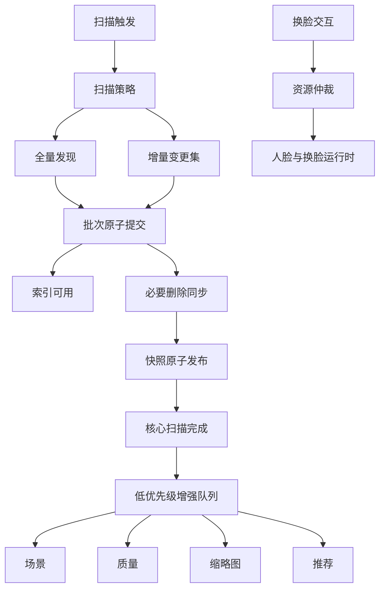

# LocalAlbum Lite 扫描优先版开发计划

> 文档状态：分阶段实施跟踪文档
> 核查基线：2026-08-13 当前工作区
> 产品目标修订：2026-08-13，以全量与增量扫描速度为第一优先级
> 阶段 9 主机与制品复核：2026-08-14
> 适用仓库：LocalAlbum 单仓库
> 本文是 Lite v1 的独立事实来源；历史决策“零大型运行时、以裁包为首要目标”全部废止，由 ADR-002、ADR-004、ADR-009 与 ADR-015 取代。

### 实施状态总览

| 阶段   | 状态                       | 当前证据                                                                                                                                                                                                                        |
| ------ | -------------------------- | ------------------------------------------------------------------------------------------------------------------------------------------------------------------------------------------------------------------------------- |
| 阶段 0 | 工程设施完成；真机基线待补 | 已加入基准配置、分位数计算、Logcat 里程碑和 Windows 夹具；本机无可用 `adb` 设备                                                                                                                                                 |
| 阶段 1 | 工程完成；设备验证待补     | Room v29 双生命周期、核心原子发布、独立 Worker/通知、取消门禁和 UI 状态消费已落地；JVM/编译/APK 通过，instrumentation 待设备执行                                                                                                |
| 阶段 2 | 工程完成                   | 策略、准入和显式 Stage 工厂已落地；Pipeline 不再遍历 registry，Full 五阶段等价与 Lite 人脸 Provider 隔离测试通过                                                                                                                |
| 阶段 3 | 工程完成；设备验证待补     | Full/Lite flavor、编译期组合根、恢复 scope、Lite 导航与专用换脸入口已落地；双变体 JVM/编译/APK 通过，真机换脸与恢复待执行                                                                                                       |
| 阶段 4 | 工程完成；设备验证待补     | changed-set journal、去重/租约/退避/过期恢复、bounded ID 查询、增量局部快照、路径迁移与恢复 Worker 三态已落地；双 flavor JVM、Kotlin/KSP、AndroidTest 编译通过，真机/Instrumentation 待执行                                     |
| 阶段 5 | 工程完成；设备验证待补     | Room v31 durable outbox、Core 后有界 handoff、逐 Stage 任务、双缩略图 lane、推荐/重复/维护资源屏障及 policy-aware restore 已落地；双 flavor JVM、Kotlin/KSP、AndroidTest 编译与 APK 通过，真机并发/TCore 待执行                 |
| 阶段 6 | 工程完成；设备验证待补     | 冷启动 native/model 零初始化、换脸按需加载、核心/增强/交互仲裁、精确模型驱逐、五点关键点门禁和可恢复错误已落地；双 flavor JVM、AndroidTest 编译、Debug/Release APK 通过，真实模型/真机并发与内存回落待补                        |
| 阶段 7 | 工程完成；设备验证待补     | Scene/Quality 自动准入均冻结为 AUTO_DISABLED，Lite policy v2、报告 SHA-256 scope、P99、≤250 行事务、旧 v1 task 收敛已落地；双 flavor JVM/AndroidTest 编译/Debug/Release/R8 通过，真机 A/B 与解码复用待补                        |
| 阶段 8 | 工程完成；设备验证待补     | Lite 路由/UI、FTS `parentPath` 与 edition 列隔离、Room v32 非破坏迁移/schema export、complete backup capability、policy seeder 及 AI inert 数据往返已落地；双 flavor JVM、AndroidTest 编译、Debug/Release/R8 通过，设备执行待补 |
| 阶段 9 | 进行中                     | 主机 JVM/AndroidTest 编译/Debug Lint/Release APK+AAB/R8、SBOM/NOTICE、资产用途与最终 DEX 守卫已通过；设备矩阵、历史 Full 签名链、Lite 签名决策、人工合规审批、冻结工作区和真实 Linux CI 仍阻断发布                              |

状态约定：`未开始`、`进行中`、`工程完成`、`工程完成；设备验证待补`、`工程设施完成；待真机/产品证据`、`阻断`。只有工程实现和可在当前环境执行的验证均通过后，才可写为“工程完成”；缺少设备时必须显式保留补测项。

---

## 1. 执行摘要

Lite v1 的第一目标是缩短“用户触发扫描”到“目录与媒体索引可用”以及“核心扫描完成”的时间，且同时覆盖首次全量扫描和日常增量扫描。包体、依赖数量、最低设备能力、冷启动 PSS 仍记录，但只是诊断与发布观测项，不能为了裁包删除换脸、复制工程、拆出复杂动态特性或延迟扫描主线交付。

不可变功能边界如下：

1. Lite 自动扫描不得执行人脸批处理：不创建 [`FaceStage`](../app/src/full/java/com/renyxin/localalbum/core/pipeline/stages/FaceStage.kt:31)，不做人脸检测批扫、特征持久化、人物增量归并、聚类维护，也不提供人物相册入口。
2. Lite 不执行语义识别：不创建 [`SemanticStage`](../app/src/full/java/com/renyxin/localalbum/core/pipeline/stages/SemanticStage.kt:31)，不生成语义向量，不提供语义搜索、语义聚类推荐或维护任务。
3. Lite 保留真实换脸。换脸所需 [`FaceProvider`](../app/src/main/java/com/renyxin/localalbum/core/plugin/capability/FaceProvider.kt:18)、[`InSwapperPlugin`](../app/src/main/java/com/renyxin/localalbum/core/plugin/extension/InSwapperPlugin.kt:62)、ONNX Runtime、OpenCV、emutls shim、模型管理和必需模型必须在 Lite 可用，但只在用户交互时按需初始化，绝不能因注册人脸 Provider 而自动进入扫描管线。
4. 场景能力与小模型保留。Lite v1 的唯一执行位置固定为“扫描后低优先级增强”，不计入 CoreScanComplete；第 10.4 节准入门只决定是否默认自动调度 [`SceneStage`](../app/src/main/java/com/renyxin/localalbum/core/pipeline/stages/SceneStage.kt:21)，不得将其提升到核心路径。
5. OCR 从 Lite 自动扫描关键路径移除。Lite v1 基线为关闭；若产品在实现前批准手动 OCR，它必须是显式用户动作或扫描后任务，不能改变核心扫描完成状态。
6. 启发式质量评分、完全重复检测、缩略图预生成、推荐刷新、备份维护都不阻塞核心扫描。质量评分固定为扫描后增强；独立成本门只决定是否默认自动调度，不得将其提升到核心路径。
7. 基础相册、时间线、查看器、收藏、回收站、目录/文件名/元数据搜索和手动备份恢复继续保留。

本计划保留最小化的 edition product flavor，主要用于不可变扫描策略、入口和测试矩阵分离，不用于排除所有大型运行时。由于 Full 与 Lite 都支持换脸，ONNX Runtime、OpenCV、shim 和换脸所需模型/实现进入共享编译与打包边界是合理结果。

---

## 2. 产品目标、KPI 与非目标

### 2.1 第一优先级 KPI

每次扫描都记录两个用户可感知终点，并分别统计 Full 与 Lite：

- **索引可用时延 TTI**：从触发扫描到至少一个已提交目录/媒体批次可被 Paging、目录树或搜索读取。无变化增量扫描以完成“无变化”判定为 TTI。
- **核心扫描完成时延 TCore**：从触发扫描到 changed/new/deleted 集合已处理、必要数据库事务提交、删除同步完成、目录快照原子发布，且核心 Worker 进入终态。

TTI 与 TCore 都必须覆盖：

- 首次 1,000 与 10,000 媒体全量扫描。
- 无变化增量扫描。
- 单张新增、单张修改、单张删除。
- 批量新增。
- 重命名或移动。
- ContentObserver 事件风暴。
- 进程中断后的任务恢复。

增强分析完成时间单独记录为 TEnhance，不得计入 TCore，也不得用“扫描完成”文案指代 TEnhance。

### 2.2 次级观测项

以下项目继续记录趋势，但不是 Lite 成败主门槛：

- APK/AAB 大小、单设备下载大小和依赖树。
- 扫描期间 PSS、Java/native heap、CPU 时间、温升、耗电。
- 冷启动和首次 fully drawn。
- 模型资产占用、模型复制/下载时间。
- 支持的最低设备档位。

只有它们导致 OOM、崩溃、ANR、扫描吞吐显著回归或换脸不可用时，才升级为发布阻断项。

### 2.3 明确非目标

1. 不以“零 ONNX/OpenCV/TFLite/ML Kit/JNI/shim”为目标。
2. 不为裁包牺牲换脸，也不为裁包引入动态特性交付、第三个应用模块或复杂原生模块拆分。
3. 不在 Lite v1 物理删除统一 Room schema 中的人脸、语义或插件表。
4. 不在增量扫描中用“重新遍历全库后只写变化项”冒充 changed-set 快路径。
5. 不把缩略图、场景、质量、OCR、推荐、重复检测或备份维护完成伪称为核心扫描完成。
6. 不复制仓库，不在共享业务代码散布 [`BuildConfig`](../app/build.gradle.kts:100) 条件。
7. 不在本计划修订任务中实施任何代码。

### 2.4 实施原则

- 先测量，再冻结数字；暂定门槛先作为优化方向和回归红线。
- 先定义完成语义和埋点，再优化实现，避免只改 UI 文案。
- 核心扫描只承担索引正确性所必需的工作。
- 增量扫描只消费持久化 changed/new/deleted 集合；无法证明为增量的任务必须升级并标记为 reconciliation/full scan。
- Provider 注册表示“能力可被交互或任务使用”，Stage 准入表示“允许进入某类扫描”，二者必须独立。
- 每个阶段小步可编译，Full 现有升级身份、数据库和 Worker 恢复链不得被顺带破坏。

---

## 3. 当前工程核查结果

### 3.1 构建与大型依赖

[`app/build.gradle.kts`](../app/build.gradle.kts:159) 当前只有一个变体族，以下依赖均在共享 `implementation`：

- [`project(:opencv)`](../app/build.gradle.kts:161)，用于换脸仿射与贴回。
- ML Kit OCR 与人脸检测，见 [`app/build.gradle.kts`](../app/build.gradle.kts:207)。
- TensorFlow Lite，见 [`app/build.gradle.kts`](../app/build.gradle.kts:214)。
- ONNX Runtime，见 [`app/build.gradle.kts`](../app/build.gradle.kts:217)。
- PyTorch Lite，见 [`app/build.gradle.kts`](../app/build.gradle.kts:220)。

模块还全局配置 [`externalNativeBuild`](../app/build.gradle.kts:119) 和 ONNX `noCompress`，并为 arm64-v8a 与 x86_64 构建。该事实说明当前包体较大，但新计划不以删除共享 ONNX/OpenCV 为前提。若 edition flavor 保留，依赖调整只做容易验证的功能边界分离：换脸与场景所需依赖共享，明确仅供 Full 的语义/OCR/可选 Provider 依赖才考虑迁到 `fullImplementation`。

[`settings.gradle.kts`](../settings.gradle.kts:21) 当前包含 `:app` 与 `:opencv`。[`app/src/main/cpp/CMakeLists.txt`](../app/src/main/cpp/CMakeLists.txt:5) 明确指出 shim 服务于 ONNX/OpenCV/TFLite/PyTorch 交替调用。既然 Lite 保留真实换脸，不能再把 OpenCV、ONNX 或 shim 列为 Lite 禁用制品。

### 3.2 组合根与五个能力槽位

[`AppContainer.capabilityRegistry`](../app/src/main/java/com/renyxin/localalbum/AppContainer.kt:111) 注册 face、scene、semantic、quality、ocr 五个槽位，并立即构造对应 Provider：

| 槽位     | 当前默认 Provider | 扫描含义             | Lite v1 结论                           |
| -------- | ----------------- | -------------------- | -------------------------------------- |
| face     | InsightFace       | 检测、嵌入、聚类     | Provider 仅为换脸保留；批处理阶段禁用  |
| scene    | MobileNet         | 逐图场景分类         | 能力保留；固定增强，准入门决定自动调度 |
| semantic | EVA02-CLIP        | 图像向量与语义索引   | Provider、Stage、入口在 Lite 禁用      |
| quality  | 启发式            | 逐图 Bitmap 质量评分 | 固定增强；成本门决定是否自动调度       |
| ocr      | PaddleOCR         | 逐图文字识别         | Lite 自动扫描禁用；v1 默认功能关闭     |

当前 [`AppContainer.init`](../app/src/main/java/com/renyxin/localalbum/AppContainer.kt:278) 会刷新模型存储、初始化 demo、批量复制/准备模型、注册 InSwapper、订阅模型状态和分析进度。这些启动行为必须按“扫描必需”“交互按需”“扫描后增强”重新拆分。

### 3.3 管线自动组装风险

[`PluginAnalysisPipeline.create()`](../app/src/main/java/com/renyxin/localalbum/core/pipeline/PluginAnalysisPipeline.kt:85) 遍历 [`CapabilityRegistryV2.slotMetadataList`](../app/src/main/java/com/renyxin/localalbum/core/plugin/capability/CapabilityRegistryV2.kt:114)，按 slotId 自动构造五个 Stage。只要 Lite 注册 face 槽位和活跃 [`FaceProvider`](../app/src/main/java/com/renyxin/localalbum/core/plugin/capability/FaceProvider.kt:18)，旧工厂就会创建 [`FaceStage`](../app/src/full/java/com/renyxin/localalbum/core/pipeline/stages/FaceStage.kt:31)。因此“保留换脸 Provider”与“禁用人脸批处理”不能靠不注册 Provider 解决，必须新增显式 Stage 准入策略。

该管线在首次构造时快照激活 Provider，形成 `pipelineScope`；[`AnalysisWorker`](../app/src/main/java/com/renyxin/localalbum/data/worker/AnalysisWorker.kt:32) 按 scope 领取持久任务，并调用 [`PluginAnalysisPipeline.runIncremental()`](../app/src/main/java/com/renyxin/localalbum/core/pipeline/PluginAnalysisPipeline.kt:460)。Lite 不能创建空任务队列，也不能让历史 Full scope 被 Lite Worker 误领。

另一个绕过点是弃用的 [`PluginAnalysisPipeline.create()`](../app/src/main/java/com/renyxin/localalbum/core/pipeline/PluginAnalysisPipeline.kt:184) 兼容重载：它硬编码创建 BuiltinFace、Quality、Scene、Semantic、OCR 五阶段，不经过 CapabilityRegistry。该重载必须删除、迁入 Full-only 边界或受同一 StageInclusionPolicy 约束；Lite 架构测试必须禁止调用此重载。

### 3.4 五个 Stage 的成本、依赖与 ID

| Stage                                                                                                   | ID              | 依赖        | 并发 | 主要工作与成本                                                                                      | Lite v1              |
| ------------------------------------------------------------------------------------------------------- | --------------- | ----------- | ---- | --------------------------------------------------------------------------------------------------- | -------------------- |
| [`FaceStage`](../app/src/full/java/com/renyxin/localalbum/core/pipeline/stages/FaceStage.kt:31)         | `core:face`     | 无          | 2    | 清旧人脸/clusterId、逐图检测和嵌入、写 faces；仅注入可选 DAO 时双写 feature_store；执行增量人物归并 | 自动扫描永不创建     |
| [`SceneStage`](../app/src/main/java/com/renyxin/localalbum/core/pipeline/stages/SceneStage.kt:21)       | `core:scene`    | 无          | 2    | 逐图解码、模型或启发式分类、逐项写 sceneType                                                        | 能力保留；固定为增强 |
| [`SemanticStage`](../app/src/full/java/com/renyxin/localalbum/core/pipeline/stages/SemanticStage.kt:31) | `core:semantic` | 无          | 1    | 逐图视觉推理、32 项批量写向量、更新空间元数据、可选双写 feature_store                               | Lite 禁用            |
| [`QualityStage`](../app/src/main/java/com/renyxin/localalbum/core/pipeline/stages/QualityStage.kt:21)   | `core:quality`  | 无          | 4    | 逐图 Bitmap 像素分析、逐项写 qualityScore                                                           | 固定为增强           |
| [`OcrStage`](../app/src/full/java/com/renyxin/localalbum/core/pipeline/stages/OcrStage.kt:21)           | `core:ocr`      | `core:face` | 1    | PaddleOCR/其他 Provider 推理、写 ocrText；当前为避免 ONNX 冲突而依赖人脸阶段                        | Lite 自动扫描禁用    |

[`AnalysisStage`](../app/src/main/java/com/renyxin/localalbum/core/pipeline/AnalysisStage.kt:35) 默认 `isCacheable=true`。当前增量管线会对缓存阶段处理传入增量路径，对非缓存阶段使用全量路径。Lite 核心与增量增强计划均禁止任何“非缓存 Stage 因一次新增而读取全库”的隐式行为；需要全局重建的推荐或聚类只能由独立维护任务显式调度。

### 3.5 换脸依赖与当前提前初始化问题

换脸当前是交互式扩展，不参与批处理管线，这一点与新目标一致。实际依赖如下：

- [`InSwapperPlugin`](../app/src/main/java/com/renyxin/localalbum/core/plugin/extension/InSwapperPlugin.kt:62) 直接依赖 ONNX Runtime、OpenCV、[`ModelManager`](../app/src/main/java/com/renyxin/localalbum/core/plugin/model/ModelManager.kt:22) 和惰性获取的 [`FaceProvider`](../app/src/main/java/com/renyxin/localalbum/core/plugin/capability/FaceProvider.kt:18)。
- 换脸需要 512 维人脸嵌入和五点关键点，见 [`PluginViewModel.performFaceSwap()`](../app/src/main/java/com/renyxin/localalbum/ui/vm/PluginViewModel.kt:692) 与 [`FaceProvider.DetectedFace`](../app/src/main/java/com/renyxin/localalbum/core/plugin/capability/FaceProvider.kt:49)。
- [`FaceSwapScreen`](../app/src/main/java/com/renyxin/localalbum/ui/screens/FaceSwapScreen.kt:93) 通过 [`PluginViewModel`](../app/src/main/java/com/renyxin/localalbum/ui/vm/PluginViewModel.kt:53) 展示模型状态并执行插件。
- 必需输入包括 InSwapper ONNX、emap、InsightFace 检测/识别模型；具体二进制属于“本地资产/构建输入需核验”，不能仅凭 Git 清单宣称已完整存在。

当前行为不符合扫描资源隔离：

1. [`InSwapperPlugin.initialize()`](../app/src/main/java/com/renyxin/localalbum/core/plugin/extension/InSwapperPlugin.kt:133) 注册后立即调用 `ensureModelReady`，初始化 OpenCV并读取 emap。
2. [`InSwapperPlugin`](../app/src/main/java/com/renyxin/localalbum/core/plugin/extension/InSwapperPlugin.kt:79) 在对象构造时取得 OrtEnvironment。
3. [`LocalAlbumApplication.onCreate()`](../app/src/main/java/com/renyxin/localalbum/LocalAlbumApplication.kt:29) 启动即加载 shim 和 OpenCV。
4. [`AppContainer`](../app/src/main/java/com/renyxin/localalbum/AppContainer.kt:291) 启动时批量复制并准备所有内置模型。

目标行为必须改为：轻量注册描述符不加载模型；用户点击开始换脸后，资源仲裁器按“shim → OpenCV → FaceProvider 模型 → InSwapper/emap”顺序获取资源；执行结束释放 consumer、session、Bitmap/Mat 并淘汰无消费者模型。

### 3.6 当前扫描完成语义

[`HybridIndexer.fullScan()`](../app/src/main/java/com/renyxin/localalbum/core/index/HybridIndexer.kt:199) 与 [`HybridIndexer.incrementalScan()`](../app/src/main/java/com/renyxin/localalbum/core/index/HybridIndexer.kt:217) 都进入同一个 [`scanViaStaging()`](../app/src/main/java/com/renyxin/localalbum/core/index/HybridIndexer.kt:235)：

1. 完整遍历 MediaStore。
2. 完整遍历所有文件系统根目录并读取媒体元数据。
3. 每个批次合并 staging、计算变化、写 media/FTS、创建分析和缩略图任务。
4. 两个来源都完成后，按 generation 查找并删除孤儿。
5. [`ScanRunDao.markCompleted()`](../app/src/main/java/com/renyxin/localalbum/data/db/dao/ScanRunDao.kt:42) 成功后清 staging，再入队 [`AnalysisWorker`](../app/src/main/java/com/renyxin/localalbum/data/worker/AnalysisWorker.kt:167)。

[`AlbumRepository.rescanLocked()`](../app/src/main/java/com/renyxin/localalbum/data/repo/AlbumRepository.kt:478) 只在 [`MediaDao.getCount()`](../app/src/main/java/com/renyxin/localalbum/data/db/dao/MediaDao.kt:149) 为零时选择 full，其余手动、Observer 和回前台路径都选择上述 incremental。因此当前所谓增量扫描仍会重新枚举全库；它只是减少正式表的变化写入，不是 changed-set 快路径。

当前消费者在每个 MediaStore 批次和文件系统批次到达时都调用 [`commitStagedBatch()`](../app/src/main/java/com/renyxin/localalbum/core/index/HybridIndexer.kt:306)。同一路径先以 MediaStore 数据提交、后以合并后的文件系统数据再次提交是需要由阶段 0 查询/事务基线验证的重复写风险；`toEntity` 还会计算头部哈希，文件系统路径会读取 EXIF/视频元数据。目标方案必须决定来源权威与富元数据层级，避免同一 sourceVersion 在核心路径重复 upsert、FTS 写入和任务 seed。

[`AnalysisWorker.enqueue()`](../app/src/main/java/com/renyxin/localalbum/data/worker/AnalysisWorker.kt:167) 在 HybridIndexer 返回前执行，而目录快照由 Repository 随后发布，因此增强分析目前可能与快照发布争用资源。Repository 发布快照后才将 [`ScanState`](../app/src/main/java/com/renyxin/localalbum/data/repo/AlbumRepository.kt:66) 置为 Done，再异步刷新统计和推荐。分析 Worker 和缩略图 Worker仍可继续运行。该顺序已部分体现“索引与分析分离”，但缺少严格调度屏障。

当前交互扫描由 [`AlbumViewModel.rescan()`](../app/src/main/java/com/renyxin/localalbum/ui/vm/AlbumViewModel.kt:156) 的 ViewModel 协程直接驱动；[`ScanWorker.schedule()`](../app/src/main/java/com/renyxin/localalbum/data/worker/ScanWorker.kt:95) 虽使用 unique work、KEEP 和重试，当前没有自动入口调用。新架构若统一迁入 WorkManager，必须把交互取消、前台进度和 durable cursor 一并迁移，不能只新增第二条并行扫描路径。

### 3.7 非关键工作是否位于关键路径

| 工作           | 当前触发位置                                                                                                                                                 | 当前是否阻塞 ScanRun 完成        | 新计划                                                                                                                        |
| -------------- | ------------------------------------------------------------------------------------------------------------------------------------------------------------ | -------------------------------- | ----------------------------------------------------------------------------------------------------------------------------- |
| 五阶段分析任务 | 每个 changed image 在 [`commitStagedBatch()`](../app/src/main/java/com/renyxin/localalbum/core/index/HybridIndexer.kt:306) 建任务，ScanRun 完成后启动 Worker | 否，但会紧接着争用资源           | 核心事务只保留 committed change set 或每批一个紧凑 outbox；Core 完成后批量 seed policy 允许的增强任务，face/semantic/ocr 为零 |
| 缩略图任务创建 | changed 媒体事务内逐项创建                                                                                                                                   | 创建会增加事务量；实际生成不阻塞 | 从核心逐媒体事务移出；Core 完成后由 committed change set 批量 seed，首屏可视项按需请求且有界并发                              |
| 缩略图生成     | [`AlbumViewModel.rescan()`](../app/src/main/java/com/renyxin/localalbum/ui/vm/AlbumViewModel.kt:156) 后入队，或 UI 请求                                      | 否                               | 独立增强队列，不影响核心完成                                                                                                  |
| 完全重复检测   | [`AlbumRepository.startDuplicateMaintenance()`](../app/src/main/java/com/renyxin/localalbum/data/repo/AlbumRepository.kt:1017) 显式入队                      | 否                               | 保持用户触发或闲时增强，绝不随增量扫描全库重算                                                                                |
| 推荐刷新       | Core Done 后 repository scope 异步执行；当前会分页加载全库候选                                                                                               | 不改变 Done，但可能抢 IO/CPU     | 延迟、可取消、增量更新；核心窗口内不启动全库刷新                                                                              |
| 质量分析       | 当前统一 AnalysisWorker Stage                                                                                                                                | 否，但扫描后立即争用             | 固定增强；成本门只控制是否默认自动调度                                                                                        |
| OCR            | 当前统一 AnalysisWorker Stage                                                                                                                                | 否，但扫描后立即争用             | Lite 不创建任务                                                                                                               |
| 人物/语义维护  | 独立 Worker/入口                                                                                                                                             | 否                               | Lite 不调度、不展示                                                                                                           |
| 备份维护       | 手动导入导出；导入会 seed 任务                                                                                                                               | 不属于普通扫描                   | 与核心扫描互斥；Lite 恢复后不得 seed face/semantic/ocr                                                                        |

---

## 4. 架构决策记录

| ADR     | 决策                                                                | 状态 | 理由与后果                                                                                                                                                            |
| ------- | ------------------------------------------------------------------- | ---- | --------------------------------------------------------------------------------------------------------------------------------------------------------------------- |
| ADR-001 | 同仓库维护 Full 与 Lite                                             | 采纳 | 共享索引、Room、备份和换脸实现，不复制项目。                                                                                                                          |
| ADR-002 | 扫描时延是 Lite 第一 KPI                                            | 采纳 | TTI/TCore 优先；包体/PSS/设备门槛降为次级观测。                                                                                                                       |
| ADR-003 | 保留最小 `edition` flavor                                           | 采纳 | 用于编译期 FeaturePolicy、入口和测试矩阵分离，不用于追求零大型运行时；若产品最终只需同一应用内模式，可删除 flavor，但策略接口保持。                                   |
| ADR-004 | Full/Lite 共享换脸所需 ONNX、OpenCV、shim、FaceProvider 与模型管理  | 采纳 | 共享大依赖是保留真实换脸的合理代价；制品守卫不得误禁。                                                                                                                |
| ADR-005 | 交互式人脸能力与批处理 FaceStage 正交                               | 采纳 | Lite 可以注册 [`FaceProvider`](../app/src/main/java/com/renyxin/localalbum/core/plugin/capability/FaceProvider.kt:18) 给换脸，同时 StagePolicy 永久排除 `core:face`。 |
| ADR-006 | Provider 注册与 Stage 组装解耦                                      | 采纳 | [`PluginAnalysisPipeline.create()`](../app/src/main/java/com/renyxin/localalbum/core/pipeline/PluginAnalysisPipeline.kt:85) 不再仅凭槽位自动创建 Stage。              |
| ADR-007 | 核心扫描完成与增强分析完成是两个持久状态                            | 采纳 | UI、通知、WorkManager、恢复和遥测都分开，不用文案掩盖后台重任务。                                                                                                     |
| ADR-008 | Lite 增量扫描只消费 changed/new/deleted 集合                        | 采纳 | 全库遍历只能标记为 Full/Reconciliation；无变化增量不得加载全库路径。                                                                                                  |
| ADR-009 | 场景代码/模型保留，固定作为扫描后增强                               | 采纳 | 小模型仍有逐图累计成本；第 10.4 节 A/B 门只控制自动调度开关，Lite v1 不得提升到核心路径。                                                                             |
| ADR-010 | OCR 不进入 Lite 自动扫描                                            | 采纳 | v1 默认关闭；若保留手动能力，使用独立显式任务并单独验收。                                                                                                             |
| ADR-011 | 质量固定作为增强任务                                                | 采纳 | Bitmap 解码和像素计算必须实测；第 10.5 节门槛只控制自动调度开关，Lite v1 不得进入核心。                                                                               |
| ADR-012 | 缩略图、重复、推荐和备份维护不构成核心完成条件                      | 采纳 | 允许首屏按需缩略图；后台预生成和全库维护可取消、可延迟。                                                                                                              |
| ADR-013 | Room v1 保留统一 schema 和 AI 空表                                  | 采纳 | Lite 不生成新的 face/semantic 批处理数据；导入数据作为 inert 数据保留并可再导出。                                                                                     |
| ADR-014 | WorkManager 分离核心扫描与增强任务                                  | 采纳 | 各自 unique work、重试、取消、进度和恢复；增强失败不回滚核心索引。                                                                                                    |
| ADR-015 | APK/AAB 与依赖树只记录，不作主 DoD                                  | 采纳 | 守卫只阻止 Lite 自动人脸批处理/语义扫描入口和不应存在的专属资产，不阻止换脸必需资产、场景模型或 TFLite。                                                              |
| ADR-016 | Full 现有 applicationId、数据库升级链和既有签名不得因 Lite 优化破坏 | 采纳 | Lite 是否独立 applicationId、可与 Full 共存仍需产品/发布决策。                                                                                                        |

### 4.1 为什么仍保留 flavor

Lite 与 Full 的差异不是简单用户偏好：Lite 必须保证人脸批处理和语义扫描在编译期组合根中不可被注册，相关入口和 Worker 创建点也不同。最小 flavor 可以让两套拟新增的不可变 `ScanFeaturePolicy` 接受独立测试，而无需把 [`BuildConfig`](../app/build.gradle.kts:100) 判断散入 Repository、Worker 或 Composable；该类型当前尚未落地，不把计划路径写成现有文件事实。

保留 flavor 不代表继续旧计划的大规模源码/依赖搬迁。换脸及场景能力所需共享代码和依赖留在 main；只有确定为 Full 独占且移动成本低的 face batch、semantic、OCR、人物 UI/Worker 才进入 full source set。任何依赖移动都必须服务于功能边界或可测试性，而不是包体数字。

---

## 5. Lite v1 功能矩阵

| 能力                       | Full       | Lite v1                  | 是否在 Lite 核心扫描路径 | 处理策略                                                        |
| -------------------------- | ---------- | ------------------------ | ------------------------ | --------------------------------------------------------------- |
| 本地图片/视频发现与索引    | 保留       | 保留                     | 是                       | 核心职责                                                        |
| 目录树、相册、时间线       | 保留       | 保留                     | 是                       | 首批提交即可浏览，最终快照原子发布                              |
| 查看器、视频播放           | 保留       | 保留                     | 否                       | 读取已提交索引                                                  |
| 收藏                       | 保留       | 保留                     | 状态保留是               | upsert 时保留用户字段                                           |
| 回收站、恢复、永久删除     | 保留       | 保留                     | 必要删除同步是           | 删除意图和孤儿清理保持事务安全                                  |
| 文件名搜索                 | 保留       | 保留                     | 是                       | 只更新 changed rows 的 FTS                                      |
| 目录路径/目录名搜索        | 保留并补齐 | 保留并补齐               | 是                       | FTS 加 parentPath 或使用显式列查询                              |
| 基础元数据搜索             | 保留       | 保留                     | 是                       | MediaStore/必要字段随核心提交；重 EXIF 回填若延后必须有独立状态 |
| 手动备份恢复               | 保留       | 保留                     | 否                       | 与扫描互斥，不属于普通扫描完成                                  |
| 按需缩略图                 | 保留       | 保留                     | 否                       | 可视项优先请求                                                  |
| 缩略图预生成               | 保留       | 保留                     | 否                       | 独立可取消增强 Worker                                           |
| 完全重复检测               | 保留       | 保留                     | 否                       | 用户触发或闲时唯一维护任务，完整 SHA-256                        |
| 推荐/精选                  | 保留       | 保留                     | 否                       | 增量更新或延迟刷新，不在增量扫描后重建全库                      |
| 启发式质量评分             | 保留       | 保留                     | 否                       | 固定增强；第 10.5 节只决定是否默认自动调度                      |
| 场景识别                   | 保留       | 保留                     | 否                       | 模型和代码保留；固定增强；第 10.4 节只决定是否默认自动调度      |
| 场景搜索/主题推荐          | 可保留     | 可基于已完成场景数据提供 | 否                       | 不得反向要求核心等待场景                                        |
| OCR 与 OCR 搜索            | 保留       | v1 默认关闭              | 否                       | 产品若批准手动 OCR，独立任务且搜索标明索引状态                  |
| 自动人脸检测/嵌入          | 保留       | 移除                     | 永不                     | Lite 不创建 FaceStage 或分析任务                                |
| 增量人物归并/聚类维护      | 保留       | 移除                     | 永不                     | Lite 不调度 Worker                                              |
| 人物相册、命名、人物入口   | 保留       | 移除                     | 不适用                   | Lite 导航与 ViewModel 不暴露                                    |
| 语义图像识别               | 保留       | 移除                     | 永不                     | 不生成 embedding                                                |
| 语义搜索                   | 保留       | 移除                     | 不适用                   | Lite 关键词/元数据搜索不读取语义表                              |
| 语义聚类推荐/维护          | 保留       | 移除                     | 永不                     | 不调度、不展示                                                  |
| 真实换脸                   | 保留       | 保留                     | 永不                     | 用户交互时按需获取资源                                          |
| 交互式 FaceProvider        | 保留       | 保留                     | 永不自动准入             | 仅供换脸流程使用                                                |
| InSwapper/ONNX/OpenCV/shim | 保留       | 保留                     | 否                       | 共享依赖，执行时加载                                            |
| 场景所需 TFLite            | 保留       | 保留                     | 否                       | 仅供增强，不因裁包删除                                          |
| 通用模型管理内核           | 保留       | 保留必需子集             | 否                       | 注册、校验、按需准备、加载、释放                                |
| 任意插件导入/模型市场      | 保留       | 非 v1 必需               | 否                       | 可为 Full-only；内置 InSwapper 扩展宿主必须保留                 |

### 5.1 人脸能力的正交模型

Lite 的能力矩阵必须分成两个维度：

- **交互能力维度**：换脸页面可以获取兼容的 [`FaceProvider`](../app/src/main/java/com/renyxin/localalbum/core/plugin/capability/FaceProvider.kt:18)，对用户选择的两张图执行检测、关键点和嵌入。
- **批处理准入维度**：Lite 的 `ScanFeaturePolicy` 对 `core:face` 永久返回 Disabled，任何 full、incremental、restore seeding 或 resume 都不能创建 [`FaceStage`](../app/src/full/java/com/renyxin/localalbum/core/pipeline/stages/FaceStage.kt:31)。

测试必须证明“Provider 存在”不会隐式推出“Stage 存在”。

### 5.2 OCR 的 v1 基线

Lite v1 默认不提供 OCR 自动或手动入口，也不读取导入备份中的 ocrText 作为 Lite 搜索命中列。产品若在实施前批准“手动 OCR”，计划只允许以下形态：

- 用户选择单图或有界集合后显式执行。
- 独立 unique work/前台交互状态，不接入 CoreScan。
- 不因备份恢复或 ContentObserver 自动 seed。
- OCR 完成后只更新对应 changed rows 的 FTS。
- 失败或取消不改变 CoreScanComplete。

### 5.3 Lite 推荐边界

Lite 推荐只允许使用日期、目录、收藏、位置和已完成的可选质量/场景结果；质量或场景尚未完成时必须降级为纯元数据推荐，不能阻塞或反向触发分析。Lite 不构造 SemanticClusterRecommender，不读取 embedding/semantic cluster，也不能直接复用当前会组合语义来源的 Full RecommendationEngine 充当 Lite 实现。推荐刷新始终属于 enhancement，并按受影响目录或时间窗口增量更新。

---

## 6. 新扫描架构



### 6.1 索引可用与核心扫描完成定义

IndexAvailable 是本次 ScanRun 的可观测事件：全量扫描在首个一致批次提交并可由目录、Paging 或搜索读取时发布；增量扫描在首个 changed/new/deleted 批次提交时发布；无变化增量在“无变化”判定持久化时发布。运行前已存在的旧 published 快照可继续浏览，但不冒充本次运行的 IndexAvailable；无变化增量允许 IndexAvailable 与 CoreScanComplete 同时发布。

只有同时满足以下条件才能发布 CoreScanComplete：

1. 本次任务类型已明确为 FULL、INCREMENTAL 或 RECONCILIATION，不能把后两者混用。
2. FULL/RECONCILIATION 的所有声明来源完整结束；INCREMENTAL 的持久 changed/new/deleted 集合已全部消费。
3. 每个 changed/new 媒体的核心字段、FTS 核心列和用户状态保留在原子事务中提交。
4. deleted/rename 的必要关联清理完成；无法证明删除时保守保留旧记录并安排 reconciliation，不得误删。
5. 受影响目录摘要或最终 generation 快照已原子发布。
6. Core Worker 状态、数据库 scan run 和 UI 状态一致进入 completed。
7. 不存在尚未提交的核心批次；允许存在 enhancement tasks。

CoreScanComplete 永远不等待场景、质量、OCR、face、semantic、缩略图预生成、完整重复哈希、推荐刷新、备份整理或缓存淘汰。Lite v1 的任何 policyVersion 都不得把这些工作标记为核心；第 10.4/10.5 节只控制场景/质量增强是否默认自动调度，不能改变完成语义。

### 6.2 增强分析完成定义

EnhancementComplete 表示当前策略允许且已调度的增强任务全部进入 done、failed、cancelled 或 skipped 终态。它具有独立的：

- 状态和每阶段进度。
- unique work 名称与任务表 scope。
- 取消、暂停、约束与重试策略。
- 完成时间 TEnhance。
- UI 文案，例如“场景增强 320/1000”，不能显示为“扫描 320/1000”。

若用户只关心相册可用性，增强可永久取消；核心索引仍保持正确。

### 6.3 全量核心路径

Lite 首次全量扫描按以下顺序执行：

1. 规范化根目录与权限，创建 durable ScanRun。
2. 以有界批次发现 MediaStore/文件系统媒体，采集核心识别字段。
3. 先确定来源权威与合并结果，再计算 sourceVersion 和 changed/new 差异；同一 sourceVersion 的核心媒体行只提交一次。
4. 每 250 至 500 项执行单个 Room 事务：upsert media、更新必要 FTS、保留 favorite/trash 等用户字段。核心事务不得逐媒体创建各 Stage/缩略图任务；如需原子交接，只写每批一个紧凑 outbox 或复用 committed change set。
5. 首批事务提交后发布 IndexAvailable；UI 可浏览但显示“仍在扫描”。若选择先发布最小元数据，后续富 EXIF 回填必须有明确层级和状态，不能造成同一核心行的无预算重复写。
6. 所有来源完整结束后才做 generation-based 删除对账，并通过 [`MediaDeletionCoordinator`](../app/src/main/java/com/renyxin/localalbum/data/repo/MediaDeletionCoordinator.kt:1) 清关联数据。
7. 原子替换目录快照/active generation，发布 CoreScanComplete。
8. 核心资源释放后，EnhancementScheduler 再从 committed change set/outbox 批量 seed 并入队允许的增强任务。

不使用一个覆盖全库的超大事务；“原子提交”指每批一致提交和最终发布指针原子切换。这样兼顾首批可见、崩溃恢复和数据库锁时长。

### 6.4 增量 changed-set 快路径

当前 [`MediaContentObserver`](../app/src/main/java/com/renyxin/localalbum/core/index/MediaContentObserver.kt:25) 只做 2 秒防抖并丢弃 URI。目标实现引入拟新增的持久 `MediaChangeJournal` 或同职责结构；该类型当前尚未落地，具体文件名由实现阶段确定：

1. 捕获 URI、volume、MediaStore ID、事件时间和可能的操作类型；集合 URI或 null URI 标记为 bounded reconciliation hint。
2. 以稳定媒体键去重，保留最新 sourceVersion；new + modify 合并，new + delete 抵消，rename 记录 old/new 关联。
3. trailing debounce 暂定 750 ms，最大聚合窗口 5 s，达到 500 个唯一键立即 flush，避免持续事件永不执行。
4. Worker 每次领取有界 change set；只查询这些 ID/URI 和受影响路径，不调用全根 [`MediaSource.enumerateMediaBatches()`](../app/src/main/java/com/renyxin/localalbum/data/source/MediaSource.kt:93)。
5. changed/new 只解析必要媒体，deleted 只清理对应记录，rename 在同一事务中迁移用户状态和引用。
6. FTS、目录摘要、缩略图/增强任务只更新受影响行与目录。
7. 幂等键至少包含 edition/profile、稳定媒体键、sourceVersion、operation；重复事件不得产生重复正式行或重复任务。
8. 无变化任务读取 delta token/空 journal 后立即完成，不加载全库路径、推荐或聚类。
9. 无法从增量证据安全确认删除时，不做全库删除；调度明确标记的 RECONCILIATION，且该任务按 full 指标统计。

Android API/ROM 无法提供可靠 generation token 时，允许用持久 MediaStore ID 快照做有界差异，但不能把全根 File API 遍历继续命名为 incremental。

### 6.5 批次、事务与恢复

- change journal 领取批次：暂定 500 个稳定键。
- 媒体解析批次：暂定 250 项，可由阶段 0 调优。
- Room 写事务：不超过 500 项或 100 ms 目标锁时长，先达到者切批。
- FTS 只 delete/insert changed rows；不在普通增量重建全表。
- 删除关联按 200 至 500 路径分批，保持 [`MediaDeletionCoordinator`](../app/src/main/java/com/renyxin/localalbum/data/repo/MediaDeletionCoordinator.kt:1) 的事务边界。
- 每批提交后推进 durable cursor；进程中断重放当前未确认批次。
- sourceVersion 不匹配的旧增强任务标记 superseded，不运行旧媒体内容。
- 同一核心扫描只能有一个 active run；Observer 新事件在 journal 聚合，由当前 Worker 完成后继续 drain，而不是并发重扫。

### 6.6 UI 状态与进度语义

建议将现有 [`ScanState`](../app/src/main/java/com/renyxin/localalbum/data/repo/AlbumRepository.kt:66) 替换为三个拟新增、当前尚未落地的正交状态类型：

- `IndexAvailability`：Empty、Partial、Published。
- `CoreScanState`：Idle、Discovering、ApplyingChanges、ReconcilingDeletes、Publishing、Completed、Paused、Cancelled、Failed。
- `EnhancementState`：NotScheduled、Queued、Running、Paused、Completed、CompletedWithFailures、Cancelled。

UI 规则：

- Partial 时显示“相册可浏览，仍在更新”，不显示完成勾选；无变化增量可不经过 Partial，直接在判定持久化后发布本次 IndexAvailable 与 CoreScanState.Completed。
- CoreScanState.Completed 时显示“相册扫描完成”。
- EnhancementState 单独显示可关闭的后台增强进度。
- 取消核心扫描显示 Paused/Cancelled 并继续展示上次 published 快照；不得在 finally 中无条件写 Done。
- 增强失败不把核心状态改成 Failed。
- 前台通知按核心与增强分开；核心完成后核心 FGS 引用必须释放，增强若需前台运行使用独立原因和状态。

---

## 7. 能力注册与 Stage 准入解耦

### 7.1 目标契约

新增共享的 `ScanFeaturePolicy` 与 `StageInclusionPolicy`（均为拟新增类型，当前无现有文件路径），至少表达：

- edition/profile identity。
- 交互能力集合。
- core full stages。
- core incremental stages。
- post-scan enhancement stages。
- disabled stages。
- 是否允许 global rebuild。
- 资源等级和与换脸的冲突组。

Lite 固定策略：

| Stage ID        | Lite FULL 扫描 core | Lite INCREMENTAL 扫描 core | Enhancement                          | 交互能力                     |
| --------------- | ------------------- | -------------------------- | ------------------------------------ | ---------------------------- |
| `core:face`     | 禁止                | 禁止                       | 禁止                                 | FaceProvider 允许给换脸      |
| `core:semantic` | 禁止                | 禁止                       | 禁止                                 | 禁止                         |
| `core:ocr`      | 禁止                | 禁止                       | 默认禁止                             | 产品批准手动模式时仅显式任务 |
| `core:scene`    | 禁止                | 禁止                       | 固定为增强；自动调度受第 10.4 节门控 | 可展示已有结果               |
| `core:quality`  | 禁止                | 禁止                       | 固定为增强；自动调度受第 10.5 节门控 | 可展示已有结果               |

现有 `core:` 前缀只是 Stage ID 的历史命名空间，不代表 CoreScan 层级。Lite v1 中 `core:scene` 与 `core:quality` 仍只能出现在 enhancement plan；任何自动 core plan 出现这两个 ID 都是架构测试失败。

### 7.2 管线工厂

将 [`PluginAnalysisPipeline`](../app/src/main/java/com/renyxin/localalbum/core/pipeline/PluginAnalysisPipeline.kt:48) 保留为执行编排器，但移除“遍历槽位即构造 Stage”的产品决策。拟新增的 `AnalysisStageFactory` 接收：

- 当前 Provider registry。
- StageInclusionPolicy。
- 扫描类型 full/incremental/enhancement/manual。
- DAO 与资源释放回调。

工厂先由 policy 产生允许的 Stage ID，再按 ID 获取 Provider。Provider 存在但 Stage 不允许时必须完全忽略；Stage 允许但 Provider 未就绪时返回明确 skipped/unavailable，不得偷偷换成其他阶段。

Lite 构建后执行启动断言：

- `core:face`、`core:semantic`、`core:ocr` 不在任何自动 plan。
- FaceProvider 与 InSwapper 交互绑定存在。
- 场景/质量只出现在 enhancement plan，自动调度开关与冻结 policyVersion 一致。
- 弃用的硬编码 Builtin 五阶段工厂在 Lite 不可调用。
- 若自动 Stage 列表为空，扫描不得创建 [`AnalysisTaskEntity`](../app/src/main/java/com/renyxin/localalbum/data/db/entity/AnalysisTaskEntity.kt:17) 或启动空 [`AnalysisWorker`](../app/src/main/java/com/renyxin/localalbum/data/worker/AnalysisWorker.kt:32)。

### 7.3 避免共享代码散布 edition 判断

- full/lite source set 各提供一个同名组合根或固定 policy provider。
- [`HybridIndexer`](../app/src/main/java/com/renyxin/localalbum/core/index/HybridIndexer.kt:47) 只依赖 CoreScanScheduler 和 EnhancementScheduler 接口。
- [`AnalysisWorker`](../app/src/main/java/com/renyxin/localalbum/data/worker/AnalysisWorker.kt:32) 从任务输入和 policy 取得 stage plan，不读取 BuildConfig 决定业务分支。
- Repository/UI 读取 FeatureSet 展示入口，不直接构造 Full 类。
- 备份恢复由拟新增的 `PostRestoreTaskSeeder` 按当前 policy 建任务，不在 importer 写死 scope。

---

## 8. 换脸资源隔离

### 8.1 初始化边界

应用启动和扫描开始前允许：

- 注册 InSwapper/FaceProvider 的轻量 descriptor、ID、可用性元数据。
- 检查模型文件是否声明存在，但不 mmap、不创建 session、不解码 emap、不初始化 OpenCV。
- 显示“需要时加载”状态。

可用性必须与内存就绪状态分离。当前 [`PluginViewModel.buildCoreFeatureStatuses()`](../app/src/main/java/com/renyxin/localalbum/ui/vm/PluginViewModel.kt:608) 只有 InSwapper `isReady` 且 face slot READY 才把换脸标为 READY，而 [`FaceSwapScreen`](../app/src/main/java/com/renyxin/localalbum/ui/screens/FaceSwapScreen.kt:193) 会据此禁用按钮；直接改成懒加载会形成“未加载所以不能点击、不能点击所以永远不加载”的死锁。目标状态至少区分 AVAILABLE_NEEDS_LOAD、LOADING、READY、ERROR，开始按钮在 AVAILABLE_NEEDS_LOAD 时可触发受仲裁的按需加载；页面文案也不得再把交互人脸能力称为“人脸聚类已加载”。

应用启动和扫描期间禁止：

- 调用 [`ModelManager.ensureModelReady()`](../app/src/main/java/com/renyxin/localalbum/core/plugin/model/ModelManager.kt:78) 加载换脸或人脸模型。
- 创建 OrtEnvironment/OrtSession。
- 调用 OpenCV init。
- 批量复制整个 assets/models 目录。
- 为换脸注册 `core:face` 分析任务。

用户点击“开始换脸”后，拟新增的专用 `InteractiveAiResourceArbiter` 才按顺序：

1. 获得互斥资源租约。
2. 加载 emutls shim，确保先于 ONNX/OpenCV。
3. 初始化 OpenCV。
4. 只准备换脸所需 FaceProvider 检测/识别模型、InSwapper 和 emap。
5. 注册 consumer，执行源图/目标图检测、推理和贴回。
6. 在 finally 中关闭中间 tensor/result、回收 Bitmap/Mat、注销 consumer。
7. 结束后调用精确 modelId 的 evict/release；不依赖下一个扫描阶段顺带释放。

### 8.2 扫描与换脸并发策略

v1 工程默认选择“核心扫描优先、互斥执行”：

- 核心扫描进行中可进入换脸页面并选图，但开始按钮不触发模型加载；请求进入队列并显示“等待相册扫描完成”。
- 产品若批准“扫描中允许换脸”，只能采用显式暂停：核心扫描在当前批次事务提交后进入 Paused，释放扫描线程/文件句柄，再授予换脸租约；换脸释放后从 durable cursor 恢复。
- 场景、质量、缩略图预生成等增强任务遇到换脸请求时立即暂停/取消当前可重试批次，交互任务优先。
- 禁止核心扫描、场景模型、FaceProvider 和 InSwapper 同时高并发运行；不得仅靠降低线程数假装隔离。
- 超时、取消、Activity 离开和进程中断都必须释放租约；下一次执行可重新按需加载。

“扫描中是否允许暂停并启动换脸”仍是产品决策项；在决策前使用更保守的排队策略。

### 8.3 换脸资产清单

制品/构建输入声明应按用途标记，而不是按扩展名一刀切：

- `interactive-face-swap`：InSwapper ONNX、emap、兼容的 InsightFace 检测/识别模型。
- `interactive-runtime`：ONNX Runtime、OpenCV、emutls shim。
- `scene`：场景 TFLite 模型与标签。
- `full-batch-only`：语义、OCR、人物批处理专属资产。

当前 Git 可见资产只有 [`MobileNet-v3-Large.tflite`](../app/src/main/assets/models/MobileNet-v3-Large.tflite)、[`ppocrv5_dict.txt`](../app/src/main/assets/ppocrv5_dict.txt)、OCR 的 [`PP-OCRv5 inference.yml`](../app/src/main/assets/models/PP-OCRv5_mobile_rec_infer/inference.yml) 与 [`PP-OCRv6 inference.yml`](../app/src/main/assets/models/PP-OCRv6_small_det_infer/inference.yml)，以及 eva02_clip 的 [`merges.txt`](../app/src/main/assets/models/eva02_clip/merges.txt)、[`tokenizer_config.json`](../app/src/main/assets/models/eva02_clip/tokenizer_config.json) 与 [`vocab.json`](../app/src/main/assets/models/eva02_clip/vocab.json)。InSwapper、emap、InsightFace 及其他未列出的模型二进制统一标记为“本地资产/构建输入需核验”，不得断言大型 ONNX 已提交；发布前核对实际路径、哈希、许可证和 ABI。Lite 守卫允许前两类及 scene，禁止最后一类的自动入口和无共享用途资产。

---

## 9. WorkManager、任务恢复与取消

### 9.1 任务分层

| 层       | 建议 unique work                      | 策略                                    | 完成语义                   |
| -------- | ------------------------------------- | --------------------------------------- | -------------------------- |
| 核心扫描 | `core_media_scan`                     | 单 active worker；DB journal 持续 drain | 只决定 CoreScanComplete    |
| 场景增强 | `enhance_scene`                       | KEEP/任务表租约                         | 只决定 Scene enhancement   |
| 质量增强 | `enhance_quality`                     | KEEP/任务表租约                         | 只决定 Quality enhancement |
| 缩略图   | 保留 `thumbnail_generation_queue`     | 可视优先、后台批量                      | 不影响核心                 |
| 完全重复 | 保留 `duplicate_exact_maintenance`    | 用户触发唯一任务                        | 不影响核心                 |
| 推荐刷新 | `recommendation_refresh`              | 延迟、按受影响目录去重                  | 不影响核心                 |
| 交互换脸 | 不作为自动 Worker；必要时前台交互会话 | 资源租约                                | 独立 UI 结果               |

具体字符串在实现前以现有 WorkManager DB 和发布身份盘点为准。Full 既有 worker FQCN/unique work 不可随意重命名；新核心名可以通过兼容调度器逐步引入。

### 9.2 重试与恢复

- 核心 Worker 只对来源查询、核心解析或事务失败重试；已经提交的 cursor 不重放为全库。
- 增强任务按 `(filePath, sourceVersion, stageId, policyVersion)` 幂等，旧版本自动 supersede。
- 进程重启先恢复 RUNNING scan 为 resumable/aborted，再从 journal/cursor 继续；不能直接重启 full scan。
- 核心取消写 Paused/Cancelled，不清除最后 published 快照，也不把未确认删除应用到正式表。
- 增强取消只取消对应 unique work/任务 scope，不取消核心扫描。
- WorkManager `setProgress` 与数据库状态由同一任务生成；UI 重建后从数据库恢复，不依赖内存 Flow 回放。
- Full/Lite 若使用独立 applicationId，WorkManager DB 自然隔离；若产品选择同 applicationId 替换安装，必须有旧 Full WorkSpec 清理/兼容映射，防止 Lite 实例化不允许的 face/semantic Worker。

---

## 10. 测试与量化验收

### 10.1 基线方法

阶段 0 使用同一版本代码、同一数据集、同一设备状态比较：

- 当前 Full：分别记录 `ScanState.Done` 与 analysis queue idle 两个终点。
- 新 Full：记录 IndexAvailable、CoreScanComplete、EnhancementComplete。
- 新 Lite：记录相同三个终点。
- 冷缓存和暖缓存至少各 5 次，报告 median、P95、min/max，不只报告单次最好值。
- 数据集固定包含图片、视频、含 EXIF/无 EXIF、损坏文件、大文件、重名、移动和删除。
- 记录媒体数、总字节、目录数、图片/视频比例和设备热状态。

最终数字在阶段 0 后冻结进基准配置。下列值是暂定工程门槛，可基于证据收紧或修订，但不得静默删除。TCore 吞吐按“本次媒体数 ÷ 本次 TCore”逐次计算；因此 TCore P95 的对偶吞吐分位数是 P5，不使用含义相反的“P95 单次吞吐”。同名指标只在本节定义，DoD 与测试矩阵均引用冻结后的这一份配置。

### 10.2 核心扫描暂定门槛

| 指标                           | 暂定门槛                                                                                |
| ------------------------------ | --------------------------------------------------------------------------------------- |
| 首次全量 1,000 媒体 TTI P95    | 不高于 3 秒                                                                             |
| 首次全量 1,000 媒体 TCore P95  | 不高于 30 秒                                                                            |
| 1,000 媒体核心吞吐             | median 不低于 40 项/秒；P5 由 TCore P95 派生为约 33.3 项/秒，仅作一致性校验，不重复判定 |
| 首次全量 10,000 媒体 TTI P95   | 不高于 5 秒                                                                             |
| 首次全量 10,000 媒体 TCore P95 | 不高于 240 秒                                                                           |
| 10,000 媒体核心吞吐            | median 不低于 50 项/秒；P5 由 TCore P95 派生为约 41.7 项/秒，仅作一致性校验，不重复判定 |
| 无变化手动增量 TCore P95       | 不高于 1 秒；数据库写事务不超过 1 个状态事务                                            |
| Observer 无变化增量            | 从最后事件计含防抖不高于 2.5 秒                                                         |
| 单张新增/修改 TCore P95        | Worker 启动后不高于 2 秒；含防抖不高于 3.5 秒                                           |
| 单张删除 TCore P95             | Worker 启动后不高于 1.5 秒                                                              |
| 100 张批量新增 TCore P95       | 不高于 10 秒                                                                            |
| 重命名/移动                    | 1 个 changed-set 批次内完成，收藏/回收站状态不丢                                        |
| 事件风暴                       | 10,000 回调合并后无重复正式行，最大 5 秒开始首批 drain，无并发全量扫描                  |
| 进程中断                       | 重启后从已提交 cursor 恢复，不重做已完成全库；最终结果与不中断一致                      |
| 数据库事务                     | 普通单图增量不执行全表查询/FTS 重建；10,000 全量无超过 500 项的写批次                   |

若参考设备证明绝对数字不现实，阶段 0 必须记录硬件、数据与瓶颈，替换为经批准的新数字；相对门槛仍保留。

### 10.3 Lite 相对 Full 与回归门槛

所有相对比较必须使用同一数据集、同一设备状态和同一计时终点，禁止拿 Full EnhancementComplete 与 Lite CoreScanComplete 直接相除制造加速。暂定门槛如下：

- **策略减法 A/B：** 在同一代码和调度框架中，以“本次 policy 默认自动工作集全部终结”为共同终点，锁定相同的场景/质量自动增强开关及其他非目标变量，仅让 Lite 排除 face/semantic/ocr；Lite P95 不高于 Full 的 60%，即至少降低 40%。
- **核心扫描相对当前基线：** Lite 10,000 全量 TCore 不高于阶段 0 当前 Full 同一 snapshot-published 终点的 80%；无变化增量不高于当前 Full 的 20%；单张新增/修改不高于当前 Full 的 50%。若阶段 0 无法取得同终点，只能先补埋点，不能替换成异义指标。
- **新架构 core-to-core：** 若 Full 与 Lite 采用完全相同的纯媒体核心 plan，Lite TCore 相对 Full 必须同时满足增幅不超过 5%且绝对增加不超过 250 ms；二者差异不宣称为“移除 AI 的收益”，AI 收益只看上一项策略减法 A/B。
- **发布回归双预算：** Lite 无变化、单增、单删 P95 相对自身上一发布必须同时满足增幅不超过 10%且绝对增加不超过 250 ms；1,000 全量必须同时满足增幅不超过 10%且绝对增加不超过 3 秒；10,000 全量必须同时满足增幅不超过 10%且绝对增加不超过 15 秒。
- 若 Full 后续也把全部 AI 移到 enhancement，分别比较 Full/Lite CoreScanComplete 和同一自动 enhancement 工作集的 terminal time，不能跨终点比较。
- 同一场景同时命中第 10.2 节绝对门槛、本节相对当前基线门槛和相对自身上一发布回归预算时必须全部通过，以更严格结果为准；三者不得互相替代或用平均值抵消。

### 10.4 场景增强自动调度 A/B 准入门

场景代码和模型无条件保留，执行位置固定为扫描后 enhancement，冻结前自动调度默认关闭。只有同一数据集 scene-auto-off 与 scene-auto-on A/B 同时满足以下条件，policy 才能默认自动调度 `core:scene` enhancement；无论结果如何都不得进入 Lite core plan：

1. 暖模型单图 stage-only P95 不高于 40 ms，P99 不高于 80 ms。
2. 场景任务只在 CoreScanComplete 后创建和启动，且不会在 changed-set 确认前加载模型。
3. 自动场景增强运行中触发下一次核心扫描时，必须在当前有界批次边界暂停并释放冲突资源；scene-auto-on 相对 scene-auto-off 的单张新增 TCore P95 增量不高于 150 ms。
4. 同一抢占场景下，1,000 与 10,000 媒体 TCore median/P95 增幅均不超过 8%；10,000 媒体绝对额外耗时不超过 30 秒，稳定吞吐下降不超过 8%。
5. 场景任务数据库写入不超过每 250 项 1 个批量事务；不得逐图独立事务。
6. PSS、heap 与温升只作诊断记录，不设数值准入门；OOM、崩溃、ANR 或无法释放冲突模型为硬失败。
7. 扫描与换脸仲裁测试通过，场景模型不会与换脸模型并发驻留。

任一门槛失败或线上回归超过上述预算：自动调度开关回退为关闭，已保留的场景代码、模型和用户已生成结果不删除。决策责任人唯一为 Lite 技术负责人，必须依据绑定设备/数据集、报告哈希与 policyVersion 的 A/B 报告批准；产品负责人可以要求继续关闭，但不能绕过门槛开启，也不能把场景改为核心工作。

### 10.5 质量增强自动调度准入门

[`QualityStage`](../app/src/main/java/com/renyxin/localalbum/core/pipeline/stages/QualityStage.kt:21) 固定在增强层，冻结前自动调度默认关闭。默认自动调度需同时满足：

- 暖单图 stage-only P95 不高于 20 ms。
- 质量增强运行中触发下一次核心扫描时，quality-auto-on 相对 quality-auto-off 的单张新增 TCore P95 增量不高于 50 ms。
- 同一抢占场景下，1,000/10,000 TCore median/P95 增幅不超过 3%，10,000 绝对额外耗时不超过 10 秒。
- 使用批量数据库更新，不逐图开启事务。
- 不与媒体元数据解析重复解码同一 Bitmap；若无法复用，自动调度保持关闭。

任一门槛失败或线上回归超过预算时只关闭质量自动增强，不得移入核心路径。决策责任人与证据要求同第 10.4 节。

### 10.6 换脸保留验收

Lite Release 必须验证：

1. 换脸入口可达，源图与目标图可选择。
2. 冷启动和核心扫描期间没有加载 InSwapper、InsightFace session、OrtEnvironment 或 OpenCV。
3. 用户执行时按需准备模型、加载顺序正确、成功输出并保存结果。
4. 执行完成、取消、页面退出和异常后 consumer/session/Mat/Bitmap 释放，内存可回落。
5. 核心扫描活跃时遵循冻结的排队或暂停策略，不发生并发高峰、OOM、SIGSEGV 或数据库损坏。
6. 资源仲裁后核心扫描/增强任务能恢复并最终收敛。
7. 模型缺失时显示可恢复状态，不在扫描前自动下载或复制。

### 10.7 功能、数据与故障矩阵

必须覆盖：

- 首次授权、拒绝通知、Android 14 部分照片权限。
- Full/Lite 各自覆盖 1,000/10,000 全量、增量无变化、单增/批增/删/改/重命名。
- ContentObserver 事件风暴、后台期间遗漏事件、前台补偿。
- 核心取消、增强取消、进程强杀、设备重启、租约过期。
- 目录/时间线/Paging/查看器、收藏、回收站、恢复和永久删除。
- 文件名、目录、相机/类型/日期等元数据搜索。
- 按需缩略图与后台预生成任务优先级。
- 完全重复维护幂等和完整 SHA-256。
- 推荐不在单图增量后全库重建。
- Lite 无 FaceStage/SemanticStage/OcrStage、人物/语义维护 Worker 和入口；FaceProvider 与 InSwapper 仍可交互使用，且不会生成 FaceStage 任务。
- IndexAvailable、CoreScanComplete、EnhancementComplete 在首批可见、无变化增量、增强失败/取消和进程恢复场景下按第 6 节语义迁移；场景、质量、OCR、缩略图、重复和推荐均不能提前或延后 CoreScanComplete。
- Full → Lite → Full 备份往返。
- Room 迁移和同版本 complete 备份自洽。

### 10.8 诊断指标

每次基准附带但不单独决定成败：

- PSS、Java heap、native heap 峰值和完成后回落。
- 总 CPU time、平均/峰值 CPU、线程数。
- 电量下降或 Perfetto energy estimate。
- MediaStore 查询数、文件 open 次数、ExifInterface/MediaMetadataRetriever 次数。
- Room 查询数、写事务数、WAL 增长、最长事务。
- WorkManager 重试/取消次数。
- 模型加载次数、session 数和 consumer 数。
- APK/AAB 分区体积、runtimeClasspath、SBOM/NOTICE。

### 10.9 构建验证命令

当前单变体基线使用 [`gradlew.bat`](../gradlew.bat) 执行：

```powershell
.\gradlew.bat :app:testDebugUnitTest :app:assembleDebug
```

引入 flavor 后先以公开任务清单核对实际名称：

```powershell
.\gradlew.bat :app:tasks --all
```

预期核心验证任务如下；若 AGP 8.13.2 生成名称不同，以任务清单为准并同步 CI，不凭文档猜测：

```powershell
.\gradlew.bat :app:testFullDebugUnitTest :app:testLiteDebugUnitTest :app:assembleFullDebug :app:assembleLiteDebug
.\gradlew.bat :app:assembleFullRelease :app:assembleLiteRelease :app:bundleFullRelease :app:bundleLiteRelease
```

---

## 11. Gradle、source set 与制品策略

### 11.1 最小 edition 变体

建议建立 `edition` 维度的 full/lite flavor，但只让差异集中在：

- 固定 FeatureSet 与 ScanFeaturePolicy。
- 自动 Stage factory/worker contribution。
- 人物、语义、OCR 等入口 contribution。
- app label、可选 applicationId 后缀和测试源集。

不把整个 Repository、UI 树、模型管理或换脸复制到两个 source set。

### 11.2 依赖规划

**共享 `implementation`：**

- AndroidX、Compose、Room、WorkManager、Paging、Coil、Media3。
- `project(:opencv)`，因为 Full/Lite 换脸都需要。
- ONNX Runtime，供共享 FaceProvider/InSwapper。
- TensorFlow Lite，供 Lite 保留的 MobileNet 场景模型使用。
- 换脸所需 shim/native 配置。
- FaceProvider 共享契约和交互实现所需依赖。

**候选 `fullImplementation`：**

- 仅供 OCR 的 ML Kit text recognition。
- 仅供 Full 人脸批处理的替代 ML Kit face Provider，前提是 Lite 换脸不依赖它。
- 仅供 Full 插件/语义实现的 PyTorch Lite。
- 明确不被 Lite 场景或换脸引用的语义/OCR专属依赖。

**`liteImplementation`：**

- 通常为空；只有 Lite 独占且确有必要的扫描测量/策略库才添加。

依赖移动不是扫描主线前置条件。若移动导致需要复杂 native 模块、任务名 hack 或共享代码复制，则延后，先完成 Stage/扫描解耦。

### 11.3 推荐 source set

当前 [`app/src`](../app/src) 只有 main、test、androidTest；下表除已存在项外均是拟新增 source set 名称，不伪称为当前可解析目录。

| source set 名称                         | 当前状态 | 内容                                                                                                                          |
| --------------------------------------- | -------- | ----------------------------------------------------------------------------------------------------------------------------- |
| [`main`](../app/src/main)               | 已存在   | 核心扫描、Room、备份、基础 UI、FaceProvider 契约、换脸交互实现、ONNX/OpenCV/shim 接入、场景能力、质量能力、通用任务与策略接口 |
| `full`                                  | 拟新增   | Full policy、FaceStage/聚类维护、SemanticStage/搜索/推荐、OCR 自动阶段、Full-only UI/Worker contribution                      |
| `lite`                                  | 拟新增   | Lite 固定 policy、Lite 导航 contribution、Stage 禁用断言                                                                      |
| [`main/assets`](../app/src/main/assets) | 已存在   | Full/Lite 共享换脸与场景资产；实际模型二进制按第 8.3 节逐项核验                                                               |
| `full/assets`                           | 拟新增   | 仅语义、OCR、Full batch 专属资产                                                                                              |
| `testFull`                              | 拟新增   | Full 五阶段与维护测试                                                                                                         |
| `testLite`                              | 拟新增   | Lite policy、changed-set、换脸不进扫描、制品用途守卫                                                                          |
| `androidTestLite`                       | 拟新增   | Lite 扫描、换脸懒加载、并发仲裁、备份与 UI                                                                                    |

[`FaceStage`](../app/src/full/java/com/renyxin/localalbum/core/pipeline/stages/FaceStage.kt:31) 已迁入 Full source set，但 [`FaceProvider`](../app/src/main/java/com/renyxin/localalbum/core/plugin/capability/FaceProvider.kt:18)、兼容的 InsightFace 实现、[`InSwapperPlugin`](../app/src/main/java/com/renyxin/localalbum/core/plugin/extension/InSwapperPlugin.kt:62) 和 [`FaceSwapScreen`](../app/src/main/java/com/renyxin/localalbum/ui/screens/FaceSwapScreen.kt:93) 必须留在 Lite 编译图。

### 11.4 制品守卫

Lite 守卫应失败于：

- 任一 Lite 自动 Stage plan 出现 `core:face`、`core:semantic` 或 `core:ocr`。
- Lite core scan plan 出现 `core:scene`、`core:quality`、缩略图、重复、推荐或其他 enhancement；场景/质量只允许出现在独立 enhancement plan。
- DEX/导航中出现人物相册、语义搜索、语义聚类推荐入口。
- WorkManager 创建 face cluster、semantic maintenance 或 OCR auto Worker。
- Lite-only policy 被 Full 默认策略覆盖。
- 语义/OCR专属资产在用途清单中无共享理由却进入 Lite。

Lite 守卫不得失败于：

- ONNX Runtime、OpenCV、emutls shim。
- [`FaceProvider`](../app/src/main/java/com/renyxin/localalbum/core/plugin/capability/FaceProvider.kt:18) 或 InsightFace 交互实现。
- InSwapper、emap 和换脸必需人脸模型。
- 场景模型/TFLite。

按 ADR-015，APK/AAB 大小和依赖树生成报告即可，不设置“必须降低 70%”“禁用 runtime 0 byte”之类已废止旧门槛。

---

## 12. Room、FTS 与备份兼容

### 12.1 统一 schema

首版继续使用统一 [`AppDatabase`](../app/src/main/java/com/renyxin/localalbum/data/db/AppDatabase.kt:63) schema。阶段 8 已从可信 v31 基线启用 schema export，并以前进式 v32 非破坏迁移补齐 FTS `parentPath`；版本化基线见 [`31.json`](../app/schemas/com.renyxin.localalbum.data.db.AppDatabase/31.json) 与 [`32.json`](../app/schemas/com.renyxin.localalbum.data.db.AppDatabase/32.json)。

- faces、embeddings、feature_store、plugin、face cluster、semantic 表继续存在。
- Lite 新扫描不写 face/semantic 批处理数据，也不调度相关维护。
- Full 备份导入 Lite 后，已有 face/semantic 数据作为 inert data 保留并可再导出；Lite UI 不展示、不维护、不把它算作当前增强完成。
- Lite 对 changed/deleted 媒体仍需清理失效关联，避免备份携带已不存在媒体的孤儿；这属于数据完整性，不等于运行 AI。
- 若产品要求导入后完全忽略显示，默认策略是“保留数据、忽略展示、不调度维护”。

### 12.2 FTS 与目录搜索

[`MediaFts`](../app/src/main/java/com/renyxin/localalbum/data/db/entity/MediaFts.kt:8) 已增加 `parentPath`；[`MIGRATION_31_32`](../app/src/main/java/com/renyxin/localalbum/data/db/AppDatabase.kt) 非破坏重建 FTS4，并从 canonical `media_items.parentPath` 回填旧行。索引器继续只更新 changed rows。

[`KeywordSearchProfile`](../app/src/main/java/com/renyxin/localalbum/core/search/FtsQueryBuilder.kt:10) 将搜索列固化为 edition capability：Full 匹配 fileName、parentPath、make、model、ocrText，Lite 只匹配前四列。用户文本只能进入受控列限定表达式，导入备份中已有 OCR 值不会暗中启用 Lite OCR 搜索；真实 Android SQLite 行为由 [`KeywordSearchProfileFtsTest`](../app/src/androidTest/java/com/renyxin/localalbum/data/db/KeywordSearchProfileFtsTest.kt:17) 覆盖，当前无设备因此仅完成双 flavor 编译。

### 12.3 备份策略

[`BackupContract.knownCapabilities`](../app/src/main/java/com/renyxin/localalbum/data/backup/BackupContract.kt:26) 已纳入 deletion intent，complete profile 与自产 manifest 自洽。[`CompleteBackupRoundTripTest`](../app/src/androidTest/java/com/renyxin/localalbum/data/db/CompleteBackupRoundTripTest.kt:33) 使用真实 `AppDatabase` 覆盖自产 complete ZIP、同 schema 覆盖恢复、Full-shaped AI inert rows、删除意图、再导出和同主键 face maintenance 快照；测试源集已编译，设备执行待补。

Lite 恢复规则：

- 恢复核心媒体、收藏、回收站、目录/FTS 和已知 Full 数据。
- 清理 transient scan/analysis/thumbnail leases 与 staging。
- [`DatabaseImporter`](../app/src/main/java/com/renyxin/localalbum/data/backup/DatabaseImporter.kt:47) 不再写死 `core:v1` 或 edition/Stage 判断，只委托显式 seeder。
- 事务提交后由 [`PostRestoreTaskSeeder`](../app/src/main/java/com/renyxin/localalbum/data/backup/PostRestoreTaskSeeder.kt:31) 按当前 flavor composition root 生成 durable reconciliation/outbox；Lite 自动计划为空，因此 face/semantic/ocr 自动任务为零，缩略图交接仍保留。
- 完全重复不因恢复自动跑全库，除非产品明确把它设为闲时维护且不影响核心完成。
- app-private thumbnail/model/plugin 路径跨 applicationId 导入时失效；外部媒体路径只作对账线索。
- 部分照片授权下不可见媒体不得被当作已删除。

### 12.4 Full/Lite 数据与任务串扰

- 独立 applicationId：Room、DataStore、WorkManager、filesDir 和模型副本独立；跨版只走手动备份。
- 相同 applicationId 替换：必须迁移 policy scope、取消/收敛旧 Full-only WorkSpec、保留可解析的旧 Worker FQCN 或显式数据库迁移。
- 同机共存时两个应用可扫描同一物理媒体；一方永久删除会影响另一方，删除确认与后续 reconciliation 必须覆盖。

---

## 13. 分阶段实施路线

每个阶段均要求小步可编译；引入 flavor 后每个生产变更至少同时编译 Full Debug 与 Lite Debug。实施前重新读取工作区，尤其 [`LocalAlbumApp.kt`](../app/src/main/java/com/renyxin/localalbum/ui/LocalAlbumApp.kt:1) 可能有用户未提交修改，只允许小 patch，禁止整文件覆盖。

### 阶段 0：建立真实扫描基线

**实施状态：工程设施完成；待真机基线数据**

已完成：

- 新增 [`ScanBenchmarkConfig.kt`](../app/src/main/java/com/renyxin/localalbum/core/index/ScanBenchmarkConfig.kt)，统一数据集、场景、暂定门槛、nearest-rank P50/P95 口径和核心/增强终点判别。
- 新增 [`ScanBenchmarkConfigTest.kt`](../app/src/test/java/com/renyxin/localalbum/core/index/ScanBenchmarkConfigTest.kt)，覆盖空样本、分位数和增强终点隔离。
- 新增 [`New-LiteScanFixture.ps1`](../scripts/New-LiteScanFixture.ps1) 与 [`lite-scan-benchmark-config.json`](../scripts/lite-scan-benchmark-config.json)，可生成 1,000/10,000 媒体夹具及变更清单。
- [`HybridIndexer.kt`](../app/src/main/java/com/renyxin/localalbum/core/index/HybridIndexer.kt) 已记录触发、首批提交、IndexAvailable、CoreScanComplete 的 Logcat 事件，事件包含 `scanId`、扫描类型、耗时和计数，不记录媒体路径。
- 修复两项 Windows 基线测试假设：架构测试统一路径分隔符，插件路径断言使用平台绝对路径。

验证：阶段 0 相关单测及修复平台假设后的全部 JVM 单测已通过，Debug APK 构建成功。当前环境未发现可用 Android 设备，因此冷/暖缓存 5 次和真实 P95 数字仍待补测，不能据此宣称性能门槛已通过。

**目标**

冻结当前 Full 的 TTI、ScanState.Done、analysis idle、查询/事务量和换脸初始化证据，为最终数字提供依据。

**主要文件影响**

- 基准/测试工具与 CI 报告。
- 只读核对 [`HybridIndexer.kt`](../app/src/main/java/com/renyxin/localalbum/core/index/HybridIndexer.kt)、[`AlbumRepository.kt`](../app/src/main/java/com/renyxin/localalbum/data/repo/AlbumRepository.kt)、[`AnalysisWorker.kt`](../app/src/main/java/com/renyxin/localalbum/data/worker/AnalysisWorker.kt)、[`app/build.gradle.kts`](../app/build.gradle.kts)。

**步骤**

1. 建立固定 1,000/10,000 媒体数据集与变更脚本夹具。
2. 埋点区分触发、首批提交、ScanRun completed、snapshot published、analysis idle。
3. 记录 Room query/transaction、文件 open、模型加载、PSS/CPU/耗电诊断。
4. 分别测量 full、无变化 incremental、单增删改、批量、事件风暴、强杀恢复。
5. 记录当前换脸在启动期发生的 shim/OpenCV/模型加载。
6. 记录 APK/AAB、依赖树和本地资产/构建输入，不把体积当主结论。

**验证**

- 同设备冷/暖各至少 5 次，报告 median/P95。
- 结果可区分核心索引与分析队列，不依赖 UI 文案推断。

**退出条件**

- 第 10 节最终阈值有可追溯基线；无法测量的指标有明确 owner 与补测门。

**回滚点**

- 仅新增测量，不改变生产策略；埋点有性能影响时关闭测量开关。

### 阶段 1：冻结完成语义与双状态

**实施状态：工程完成；设备验证待补**

已完成：

- 新增 [`ScanLifecycleState.kt`](../app/src/main/java/com/renyxin/localalbum/data/db/entity/ScanLifecycleState.kt) 和 [`ScanRunEntity.kt`](../app/src/main/java/com/renyxin/localalbum/data/db/entity/ScanRunEntity.kt) 的持久 IndexAvailability、CoreScanState、EnhancementState 及独立时间点；旧 ScanState 仅保留为兼容 UI adapter。
- [`AppDatabase.kt`](../app/src/main/java/com/renyxin/localalbum/data/db/AppDatabase.kt) 已升级到 Room v29，迁移旧 COMPLETED/FAILED/ABORTED/RUNNING 扫描状态，并为分析任务增加 nullable scanId 归属和索引；旧任务、导入任务和手动任务可继续使用无归属队列。
- [`HybridIndexer.kt`](../app/src/main/java/com/renyxin/localalbum/core/index/HybridIndexer.kt) 已将首批 PARTIAL、删除对账、PUBLISHING 和快照发布后的 PUBLISHED/COMPLETED 固化为顺序边界；快照发布失败和取消均不会写 CoreScanComplete。
- [`AnalysisWorker.kt`](../app/src/main/java/com/renyxin/localalbum/data/worker/AnalysisWorker.kt) 与 [`AnalysisTaskDao.kt`](../app/src/main/java/com/renyxin/localalbum/data/db/dao/AnalysisTaskDao.kt) 已实现扫描归属、租约恢复、独立增强终态和暂停门禁。PAUSED/终态扫描的任务不可被其他 Worker 领取，也不计入 runnable retry；无 scanId 的兼容/手动任务仍可领取。
- [`ScanServiceController.kt`](../app/src/main/java/com/renyxin/localalbum/data/worker/ScanServiceController.kt) 已分离核心与增强通知 channel/ID；增强使用 WorkManager foreground，核心 FGS 不再被增强进度复用。
- [`AlbumRepository.kt`](../app/src/main/java/com/renyxin/localalbum/data/repo/AlbumRepository.kt) 和 [`ScanWorker.kt`](../app/src/main/java/com/renyxin/localalbum/data/worker/ScanWorker.kt) 已使用明确扫描成功结果，后台失败进入既有退避/终止策略，取消继续抛出且 UI 不再误报 Done；失败后不再调度缩略图补齐。
- [`ScanLifecycleUi.kt`](../app/src/main/java/com/renyxin/localalbum/ui/ScanLifecycleUi.kt) 与 [`LocalAlbumApp.kt`](../app/src/main/java/com/renyxin/localalbum/ui/LocalAlbumApp.kt) 已分别消费 durable Core/Enhancement 状态，UI 重建不依赖内存 Done 回放。

验证证据：

- `:app:compileDebugKotlin` 通过，包含 Room/KSP 查询校验。
- `:app:testDebugUnitTest` 全部通过；新增扫描里程碑、双状态 UI、增强终态及 ScanWorker 失败决策回归测试均通过。
- `:app:compileDebugAndroidTestKotlin` 通过；[`ScanRunDaoTest.kt`](../app/src/androidTest/java/com/renyxin/localalbum/data/db/ScanRunDaoTest.kt) 覆盖核心发布、取消/失败、增强暂停/恢复、租约恢复和暂停任务领取隔离，[`Migration28To29Test.kt`](../app/src/androidTest/java/com/renyxin/localalbum/data/db/Migration28To29Test.kt) 覆盖旧状态映射及新增列/索引。
- `:app:assembleDebug` 通过；`git diff --check` 通过。
- 当前 `adb devices` 无可用设备，因此上述 instrumentation 仅完成编译，尚未执行。待设备补测：v28→v29 实际迁移、进程强杀后 RUNNING→QUEUED 恢复、用户取消后 PAUSED 不续跑、核心/增强通知分离及 UI 进程重建。

**目标**

让数据库、Worker、Repository、通知和 UI 对 CoreScanComplete/EnhancementComplete 使用同一事实。

**主要文件影响**

- [`ScanRunEntity.kt`](../app/src/main/java/com/renyxin/localalbum/data/db/entity/ScanRunEntity.kt)
- [`ScanRunDao.kt`](../app/src/main/java/com/renyxin/localalbum/data/db/dao/ScanRunDao.kt)
- [`AlbumRepository.kt`](../app/src/main/java/com/renyxin/localalbum/data/repo/AlbumRepository.kt)
- [`ScanWorker.kt`](../app/src/main/java/com/renyxin/localalbum/data/worker/ScanWorker.kt)
- [`ScanServiceController.kt`](../app/src/main/java/com/renyxin/localalbum/data/worker/ScanServiceController.kt)
- UI 状态组件与测试。

**步骤**

1. 新增 IndexAvailability、CoreScanState、EnhancementState 契约。
2. 将 first batch committed、core completed、enhancement terminal 持久化。
3. 修正取消路径，禁止 finally 无条件置 Done。
4. 分开核心/增强通知和进度。
5. 保持现有索引行为不变，仅替换语义与埋点。

**验证**

- 核心完成时增强仍可运行；取消/失败状态准确。
- UI 重建和进程重启后状态一致恢复。

**退出条件**

- 所有性能测试能以持久状态取时间点；不存在一个 Done 同时代表两种任务。

**回滚点**

- 保留旧状态 adapter 一个兼容周期；新状态异常时回退 adapter，不回退数据库已提交索引。

### 阶段 2：能力注册与 Stage 准入解耦

**实施状态：工程完成**

已完成：

- 新增 [`ScanFeaturePolicy.kt`](../app/src/main/java/com/renyxin/localalbum/core/pipeline/ScanFeaturePolicy.kt)，定义版本化 Full/Lite 产品策略以及 core/enhancement/manual 计划。Full enhancement 保持 face、scene、semantic、quality、ocr 五阶段顺序；Lite enhancement 只准入 scene、quality，core 计划不准入分析 Stage。
- 新增 [`StageInclusionPolicy.kt`](../app/src/main/java/com/renyxin/localalbum/core/pipeline/StageInclusionPolicy.kt)，集中校验允许的 Stage ID、重复项与计划身份；policyId、policyVersion 和 plan type 均进入 durable pipelineScope。
- 新增 [`AnalysisStageFactory.kt`](../app/src/main/java/com/renyxin/localalbum/core/pipeline/AnalysisStageFactory.kt)，只按策略给出的有序 Stage ID 显式读取对应 Provider 并构造 Stage，不再遍历全部 registry slot 决定产品行为；禁用 Stage 的 Provider 身份不会污染 scope。
- [`PluginAnalysisPipeline.kt`](../app/src/main/java/com/renyxin/localalbum/core/pipeline/PluginAnalysisPipeline.kt) 已退回纯执行器，只接受已解析的 AnalysisStagePlan；硬编码 Builtin 五阶段兼容工厂已删除。
- [`AppContainer.kt`](../app/src/main/java/com/renyxin/localalbum/AppContainer.kt) 生产组合根已显式使用 FullScanFeaturePolicy，阶段 2 保持现有 Full 行为；阶段 3 再按 flavor 选择 Lite 策略。
- [`AnalysisWorker.kt`](../app/src/main/java/com/renyxin/localalbum/data/worker/AnalysisWorker.kt) 只领取管线声明的 claimable scopes。仅 Full 策略声明旧 Provider/Stage scope 和迁移默认 scope 的兼容消费，Lite 策略无 Full 历史队列后门；手动重分析使用同一 scope 列表。
- [`CapabilityRegistryV2.kt`](../app/src/main/java/com/renyxin/localalbum/core/plugin/capability/CapabilityRegistryV2.kt) 新增稳定的 active Provider ID 只读查询，Stage 工厂不再反向解析 UI 元数据。

验证证据：

- [`ScanFeaturePolicyTest.kt`](../app/src/test/java/com/renyxin/localalbum/core/pipeline/ScanFeaturePolicyTest.kt) 验证 Full 五阶段顺序、Lite 阶段排除、core 空计划、policy/plan scope 版本化和 Full-only legacy scope。
- [`AnalysisStageFactoryTest.kt`](../app/src/test/java/com/renyxin/localalbum/core/pipeline/AnalysisStageFactoryTest.kt) 注册全部五类 Provider 后验证 Full 最终五阶段等价；注册 face Provider 后，Lite 最终 requiredStageIds 仍精确为 scene、quality，且 scope 不含 face Provider。
- [`BoundedDataAccessArchitectureTest.kt`](../app/src/test/java/com/renyxin/localalbum/architecture/BoundedDataAccessArchitectureTest.kt) 新增守卫，禁止 Pipeline 重新依赖 CapabilityRegistryV2、遍历 slotMetadataList 或恢复 Builtin 五阶段工厂。
- `:app:testDebugUnitTest`、`:app:compileDebugAndroidTestKotlin`、`:app:assembleDebug` 和 `git diff --check` 均通过；现有管线执行、DAG、失败隔离和资源释放测试无回归。

**目标**

允许 Lite 注册 FaceProvider 给换脸而绝不自动创建 FaceStage。

**主要文件影响**

- [`PluginAnalysisPipeline.kt`](../app/src/main/java/com/renyxin/localalbum/core/pipeline/PluginAnalysisPipeline.kt)
- [`CapabilityRegistryV2.kt`](../app/src/main/java/com/renyxin/localalbum/core/plugin/capability/CapabilityRegistryV2.kt)
- 新增 ScanFeaturePolicy、StageInclusionPolicy、AnalysisStageFactory。
- [`AppContainer.kt`](../app/src/main/java/com/renyxin/localalbum/AppContainer.kt)
- [`AnalysisWorker.kt`](../app/src/main/java/com/renyxin/localalbum/data/worker/AnalysisWorker.kt)

**步骤**

1. 先让 Full policy 返回当前五阶段，验证行为等价。
2. 将 Provider→Stage 映射移出 Pipeline 纯编排器。
3. 按 scan type 生成 core/enhancement/manual stage plan。
4. pipelineScope 纳入 policyVersion 与阶段集合，不仅纳入 Provider。
5. 删除、隔离或策略化弃用的硬编码 Builtin 五阶段兼容工厂。
6. 增加“Provider 存在但 Stage 禁止”以及“Lite 不可调用兼容工厂”的架构测试。

**验证**

- Full 阶段 ID/顺序/结果不回归。
- Lite 测试注册 face Provider 后 requiredStageIds 仍不含 `core:face`。

**退出条件**

- Pipeline 不再直接遍历所有 registry slot 决定产品行为。

**回滚点**

- Full 等价 factory 作为独立提交；若等价测试失败回滚 factory，不动数据 schema。

### 阶段 3：建立 Lite 管线与入口边界

**实施状态：工程完成；设备验证待补**

已完成：

- [`app/build.gradle.kts`](../app/build.gradle.kts) 已新增 `edition` flavor 维度。Full Release 保持原 `applicationId`，Lite 使用 `.lite` 后缀；Debug 后缀继续叠加，因此已验证的包名分别为 `com.renyxin.localalbum.debug` 与 `com.renyxin.localalbum.lite.debug`，Room、DataStore、WorkManager 和应用文件目录天然隔离。
- 新增共享 [`EditionFeatures.kt`](../app/src/main/java/com/renyxin/localalbum/edition/EditionFeatures.kt) 及 full/lite 编译期 [`EditionConfiguration.kt`](../app/src/full/java/com/renyxin/localalbum/edition/EditionConfiguration.kt)。[`AppContainer.kt`](../app/src/main/java/com/renyxin/localalbum/AppContainer.kt) 不再硬编码 Full 策略，而是按 edition 注册槽位与 Provider：Lite 只注册 face、scene、quality，并以 LiteScanFeaturePolicy 构造只含 scene、quality 的 enhancement 管线；FaceProvider 仅供交互换脸，不会准入 FaceStage。
- Lite 组合根不构造语义推荐器或语义搜索 Provider 工厂，不注册 semantic/OCR 槽位，不启动 Demo Provider 与通用动态插件加载；真实 [`InSwapperPlugin.kt`](../app/src/main/java/com/renyxin/localalbum/core/plugin/extension/InSwapperPlugin.kt) 仍通过独立内置扩展路径注册。
- 新增 [`FaceSwapViewModel.kt`](../app/src/main/java/com/renyxin/localalbum/ui/vm/FaceSwapViewModel.kt)，仅承载 InSwapper 就绪、执行和结果状态；[`FaceSwapScreen.kt`](../app/src/main/java/com/renyxin/localalbum/ui/screens/FaceSwapScreen.kt) 不再依赖通用插件管理 ViewModel。Lite 设置页提供直接换脸入口，且不会构造插件导入、模型市场和 JSON 编辑状态。
- [`LocalAlbumApp.kt`](../app/src/main/java/com/renyxin/localalbum/ui/LocalAlbumApp.kt) 已按 edition 隐藏人物、语义搜索开关、AI 识别偏好和通用插件管理入口，并以统一导航解析器将人物、插件管理、模型导入/编辑和 AI 偏好等禁止目标回退到 Main；Lite 的 FaceSwap 目标保持可达。
- [`AlbumRepository.kt`](../app/src/main/java/com/renyxin/localalbum/data/repo/AlbumRepository.kt) 对语义搜索与人物原型维护增加 edition 门禁。[`DatabaseImporter.kt`](../app/src/main/java/com/renyxin/localalbum/data/backup/DatabaseImporter.kt) 不再写死旧 `core:v1`，恢复后仅以调用方注入的当前 enhancement pipelineScope 创建自动分析任务；Lite 因此只会创建 scene/quality 管线任务。

验证证据：

- Gradle 已生成并验证 `testFullDebugUnitTest`、`testLiteDebugUnitTest`、`assembleFullDebug`、`assembleLiteDebug`、`compileFullDebugAndroidTestKotlin` 和 `compileLiteDebugAndroidTestKotlin` 六类 flavor 任务。
- `:app:testFullDebugUnitTest` 与 `:app:testLiteDebugUnitTest` 全部通过。[`EditionConfigurationContractTest.kt`](../app/src/test/java/com/renyxin/localalbum/edition/EditionConfigurationContractTest.kt) 在各自编译变体中断言 Full 五阶段/全入口等价，以及 Lite 仅 scene、quality、人物/语义/OCR 排除、受限导航回退和换脸可达。
- [`BoundedDataAccessArchitectureTest.kt`](../app/src/test/java/com/renyxin/localalbum/architecture/BoundedDataAccessArchitectureTest.kt) 已增加组合根与恢复 seeder 守卫，禁止重新硬编码 Full policy 或 `core:v1` 恢复任务。[`DatabaseImporterStagingTest.kt`](../app/src/androidTest/java/com/renyxin/localalbum/data/db/DatabaseImporterStagingTest.kt) 已增加恢复任务只写调用方 pipelineScope 的 Room 事务断言。
- `:app:compileFullDebugAndroidTestKotlin`、`:app:compileLiteDebugAndroidTestKotlin`、`:app:assembleFullDebug`、`:app:assembleLiteDebug` 和 `git diff --check` 均通过。
- 当前无可用 Android 设备，因此 instrumentation 仅完成编译。待设备补测：Full/Lite 并存安装与数据隔离、Lite 备份恢复后的任务 scope、人物/语义受限入口回退，以及 Lite 使用真实 InsightFace + InSwapper 完成换脸并保存结果。

**目标**

实现 Lite 功能矩阵：移除 face batch、semantic、OCR auto，保留换脸和场景能力。

**主要文件影响**

- [`app/build.gradle.kts`](../app/build.gradle.kts)
- full/lite edition composition root 与 policy。
- [`FaceStage.kt`](../app/src/full/java/com/renyxin/localalbum/core/pipeline/stages/FaceStage.kt)
- [`SemanticStage.kt`](../app/src/full/java/com/renyxin/localalbum/core/pipeline/stages/SemanticStage.kt)
- [`OcrStage.kt`](../app/src/full/java/com/renyxin/localalbum/core/pipeline/stages/OcrStage.kt)
- 人物/语义 UI、Repository、Worker contribution。
- [`FaceSwapScreen.kt`](../app/src/main/java/com/renyxin/localalbum/ui/screens/FaceSwapScreen.kt) 与必要 PluginViewModel 边界。

**步骤**

1. 引入最小 edition flavor，两边暂共享依赖。
2. Full policy 保持五阶段；Lite 固定禁用 face/semantic/ocr auto。
3. Lite 导航移除人物、语义、人物维护和相关设置，保留换脸。
4. Lite worker seeder 不创建人物/语义/OCR任务。
5. 通用插件管理若不保留，拆出仅换脸需要的轻量 FaceSwapViewModel/host，不能删除 InSwapper。
6. 场景与质量固定注册为 enhancement，不进入 core。

**验证**

- Full/Lite Debug 编译。
- Lite 换脸入口可达；自动 task/requiredStageIds 中 face/semantic/ocr 为零。
- 人物和语义深链回退到核心页面。

**退出条件**

- 功能矩阵有自动化断言，且 Lite 不靠运行时报 unsupported 隐藏错误 Stage。

**回滚点**

- flavor 与 Lite policy 独立提交；失败时 Lite 标记不可发布，Full 行为不变。

### 阶段 4：实现 changed-set 增量快路径

**实施状态：工程完成；设备验证待补**

**目标**

普通增量扫描只处理 changed/new/deleted，不再遍历全根或加载全库路径。

**主要文件影响**

- [`MediaContentObserver.kt`](../app/src/main/java/com/renyxin/localalbum/core/index/MediaContentObserver.kt)
- [`HybridIndexer.kt`](../app/src/main/java/com/renyxin/localalbum/core/index/HybridIndexer.kt)
- [`MediaSource.kt`](../app/src/main/java/com/renyxin/localalbum/data/source/MediaSource.kt)
- 新增 change journal entity/DAO、delta resolver 与迁移。
- 受影响目录摘要/FTS DAO。

**步骤**

1. 持久记录 URI/ID 事件与 bounded reconciliation hint。
2. 实现去重、防抖、最大窗口和批次领取。
3. 新增按 MediaStore ID/URI 查询单项或集合的 MediaSource API。
4. changed/new/deleted 在有界事务中提交并推进 cursor。
5. rename/move 保留 favorite/trash 等用户状态。
6. 将旧完整枚举路径明确命名 full/reconciliation，只作为安全兜底。
7. 增加 no-change 查询/事务断言和全库 API 禁用架构测试。

**验证**

- 第 10.2 节所有增量夹具已形成 DAO、MediaStore resolver、局部快照、导入清理和 tombstone instrumentation 覆盖。
- 无变化增量不调用全根枚举、不查询全库路径、不 rebuild recommendation；架构守卫已固定这些边界。
- 事件风暴最终集合正确且无重复任务；DAO 测试覆盖 10,000 次重复回调最终一行。
- changed-set 领取使用 bounded `_ID IN (...)` 查询，lease 续租/过期恢复/新通知覆盖旧 lease 均已覆盖。
- 持久恢复结果区分 `COMPLETED`、`DEFERRED`、`FAILED`；`DEFERRED` 不消耗有限业务失败重试次数。
- 双 flavor `:app:testFullDebugUnitTest`、`:app:testLiteDebugUnitTest`、`:app:compileFullDebugAndroidTestKotlin`、`:app:compileLiteDebugAndroidTestKotlin` 已通过。
- 当前没有可用 Android 设备；待设备执行 migration、DAO、快照、导入、tombstone 和真实 MediaStore 场景。

**退出条件**

- 工程侧 changed-set 快路径、持久恢复和边界守卫已完成；未知事件明确升级 reconciliation，不伪装 incremental。
- TCore 暂定/冻结门槛、设备进程中断恢复、多 volume/ROM 行为仍需真机证据后冻结。

**回滚点**

- delta resolver 可通过策略回退为显式 reconciliation；不得回退为仍标记 incremental 的全量遍历。
- 若设备验证发现 Provider/ROM 对稳定身份不可证明，保留 journal 并将该事件批次升级为 reconciliation，不删除未确认事件。

### 阶段 5：延迟所有非关键工作

**实施状态：工程完成；设备验证待补**

**目标**

核心扫描窗口内不被缩略图预生成、推荐、重复、质量、场景或备份维护争抢。

**主要文件影响**

- [`EnhancementOutboxEntity.kt`](../app/src/main/java/com/renyxin/localalbum/data/db/entity/EnhancementOutboxEntity.kt)、[`EnhancementOutboxDao.kt`](../app/src/main/java/com/renyxin/localalbum/data/db/dao/EnhancementOutboxDao.kt) 与 [`EnhancementHandoffWorker.kt`](../app/src/main/java/com/renyxin/localalbum/data/worker/EnhancementHandoffWorker.kt)。
- [`EnhancementResourceGate.kt`](../app/src/main/java/com/renyxin/localalbum/core/concurrent/EnhancementResourceGate.kt)、[`AlbumRepository.kt`](../app/src/main/java/com/renyxin/localalbum/data/repo/AlbumRepository.kt) 与 [`AnalysisWorker.kt`](../app/src/main/java/com/renyxin/localalbum/data/worker/AnalysisWorker.kt)。
- [`ThumbnailTaskDao.kt`](../app/src/main/java/com/renyxin/localalbum/data/db/dao/ThumbnailTaskDao.kt) 与 [`ThumbnailWorker.kt`](../app/src/main/java/com/renyxin/localalbum/data/worker/ThumbnailWorker.kt)。
- [`DuplicateMaintenanceWorker.kt`](../app/src/main/java/com/renyxin/localalbum/data/worker/DuplicateMaintenanceWorker.kt)、[`RecommendationRefreshWorker.kt`](../app/src/main/java/com/renyxin/localalbum/data/worker/RecommendationRefreshWorker.kt) 与 [`HybridIndexer.kt`](../app/src/main/java/com/renyxin/localalbum/core/index/HybridIndexer.kt)。
- [`DatabaseImporter.kt`](../app/src/main/java/com/renyxin/localalbum/data/backup/DatabaseImporter.kt)、[`ScanRunDao.kt`](../app/src/main/java/com/renyxin/localalbum/data/db/dao/ScanRunDao.kt) 与 Room v30→v31 迁移。
- [`FaceClusterMaintenanceWorker.kt`](../app/src/full/java/com/renyxin/localalbum/data/worker/FaceClusterMaintenanceWorker.kt)、[`SemanticMaintenanceWorker.kt`](../app/src/full/java/com/renyxin/localalbum/data/worker/SemanticMaintenanceWorker.kt) 与 [`SemanticClusterMaintenanceWorker.kt`](../app/src/full/java/com/renyxin/localalbum/data/worker/SemanticClusterMaintenanceWorker.kt) 的 Full 回归资源边界。

**步骤**

1. 核心任务完成后再释放 enhancement scheduling barrier，并从 committed change set/outbox 批量 seed，不在核心媒体事务逐项建 Stage/缩略图任务。
2. 缩略图可视请求保持交互优先但限制为有界低并发；预生成延迟并可取消。
3. Lite 推荐使用纯元数据加已完成的可选场景/质量结果，禁止构造语义推荐；按受影响目录/窗口更新，不在单图增量后分页加载全库。
4. 完全重复维持显式唯一任务，不自动启动。
5. 场景/质量写入独立 stage task，失败不改变 core state。
6. 备份导入导出与核心扫描互斥，普通扫描不触发备份维护。

**验证**

- 核心媒体事务只写一媒体一行的紧凑 durable outbox，不再直接创建 Stage 或缩略图任务；DAO 先整批插入新行，仅对唯一键冲突执行 ownership 合并，避免新媒体固定执行更新加插入两条语句。Core 快照发布且 CoreScanComplete 后，handoff 才有界领取并展开任务。
- Scene 与 Quality 以各自 Stage、Provider、模型和 policy 组成独立持久 scope。当前 Lite flavor 的真实 Room handoff 测试断言只生成 Scene/Quality 两类任务，Face/Semantic/OCR 持久任务为零；增强失败只影响 enhancement state，不回滚 core state。
- process-local 资源闸门在核心请求可见后拒绝新的 automatic section；Analysis、handoff、自动缩略图、推荐、重复及 Full 人物/语义维护均按有界区段持有单许可 automatic lane。备份维护关闭交互缩略图 admission，并依次排空 automatic 与已运行交互批次后才导入或导出。
- 自动与交互缩略图分别使用独立 unique work、单许可 lane 和严格按扫描归属分流的租约恢复；任一 lane 都不能重置另一 lane 的未过期实时租约。Analysis 与 handoff 也在持有 automatic lane 后立即恢复进程中断租约，用户 PAUSED 状态不被临时抢占恢复覆盖。
- Full、Reconciliation 与 Incremental 均从统一 Core 发布结果传播最多 100 个受影响目录；推荐延迟、可取消且不分页加载全库。完全重复仍为显式唯一任务，不由普通扫描自动启动。
- 覆盖式恢复在同一事务写 policy scope outbox、reconciliation hint 与 [`WAITING_FOR_CORE`](../app/src/main/java/com/renyxin/localalbum/data/db/entity/ScanLifecycleState.kt:32)；只有真实 Full/Reconciliation 成功发布后才释放 barrier，用户暂停意图可跨对账保留。
- [`EnhancementResourceGateTest.kt`](../app/src/test/java/com/renyxin/localalbum/core/concurrent/EnhancementResourceGateTest.kt)、[`BoundedDataAccessArchitectureTest.kt`](../app/src/test/java/com/renyxin/localalbum/architecture/BoundedDataAccessArchitectureTest.kt)、[`EnhancementOutboxDaoTest.kt`](../app/src/androidTest/java/com/renyxin/localalbum/data/db/EnhancementOutboxDaoTest.kt)、[`ScanRunDaoTest.kt`](../app/src/androidTest/java/com/renyxin/localalbum/data/db/ScanRunDaoTest.kt)、[`DatabaseImporterStagingTest.kt`](../app/src/androidTest/java/com/renyxin/localalbum/data/db/DatabaseImporterStagingTest.kt) 与 [`Migration30To31Test.kt`](../app/src/androidTest/java/com/renyxin/localalbum/data/db/Migration30To31Test.kt) 已覆盖资源并发、逐 Stage handoff、租约、恢复 barrier、导入和迁移契约。
- 双 flavor [`:app:testFullDebugUnitTest`](../app/build.gradle.kts:1)、[`:app:testLiteDebugUnitTest`](../app/build.gradle.kts:1)、[`:app:compileFullDebugAndroidTestKotlin`](../app/build.gradle.kts:1)、[`:app:compileLiteDebugAndroidTestKotlin`](../app/build.gradle.kts:1)、[`:app:assembleFullDebug`](../app/build.gradle.kts:1) 与 [`:app:assembleLiteDebug`](../app/build.gradle.kts:1) 全部通过；差异空白检查通过。
- ADB 可用但设备列表为空，因此 instrumentation 仅完成 Full/Lite 编译，尚未在设备执行。待真机补测：v30→v31 迁移、Core 期间 automatic worker CPU/模型零并发、Core 完成后的启动/取消/恢复、Worker 强杀后未过期 lease 接管、备份与双缩略图 lane 互斥，以及 1,000/10,000 媒体 TCore median/P95 门槛。

**退出条件**

- 工程侧每类非关键工作均已有独立任务身份、状态、资源边界和自动化契约；Lite policy、任务表、恢复 outbox 与旧 WorkSpec 入口均不会产生或运行 Face/Semantic/OCR 自动维护。
- 阶段 5 工程实现和当前环境可执行验证已完成；真实 CPU/模型互斥、进程强杀、Room 迁移执行及 TCore 预算仍需有设备后补证，不将 AndroidTest 编译误记为设备执行。

**回滚点**

- 可独立关闭 Scene、Quality、自动缩略图、推荐或显式重复维护调度；不得把任一工作移回核心路径修复功能。
- handoff 可停止领取并保留 durable outbox 待恢复；不得 destructive rollback Room v31，也不得绕过 post-core 或 restore reconciliation barrier。

### 阶段 6：换脸按需加载与资源仲裁

**实施状态：工程完成；设备验证待补**

已完成：

- 新增共享 [`NativeAiRuntime.kt`](../app/src/main/java/com/renyxin/localalbum/core/runtime/NativeAiRuntime.kt)，将 emutls shim、OpenCV 与 OrtEnvironment 收敛为唯一进程入口；构造 loader、引用类型或注册 descriptor 均不会加载 native，首次真实 TFLite、PyTorch、ONNX 或 OpenCV 对象创建前统一保证 shim-first。源码守卫确认 `System.loadLibrary("emutls_shim")`、`OpenCVLoader.initLocal()` 与 `OrtEnvironment.getEnvironment()` 均只存在于该入口。
- [`LocalAlbumApplication.kt`](../app/src/main/java/com/renyxin/localalbum/LocalAlbumApplication.kt) 已移除冷启动 shim/OpenCV 初始化，[`AppContainer.kt`](../app/src/main/java/com/renyxin/localalbum/AppContainer.kt) 已移除启动期全模型复制/准备；启动只注册能力、descriptor、modelId 与轻量状态观察，不创建 session、不读取 emap。
- [`InSwapperPlugin.kt`](../app/src/main/java/com/renyxin/localalbum/core/plugin/extension/InSwapperPlugin.kt) 的 `initialize` 现在只注册 descriptor；用户执行后才进入 interactive AI lane，按 shim → OpenCV → ONNX、目标 FaceProvider 模型 → InSwapper → emap 的边界按 modelId 准备和加载。`AVAILABLE_NEEDS_LOAD`、`WAITING_FOR_CORE`、`LOADING`、`READY`、`ERROR` 已区分 descriptor 可用性与瞬时内存驻留状态。
- [`EnhancementResourceGate.kt`](../app/src/main/java/com/renyxin/localalbum/core/concurrent/EnhancementResourceGate.kt) 已统一 core scan、automatic enhancement、interactive thumbnail、interactive AI 和 backup maintenance：尚未开始的换脸让核心优先；interactive AI waiter 立即阻止新 automatic batch；已进入的有界 native section 安全结束；maintenance 会关闭并排空 automatic、AI 与 thumbnail admission。排队取消会释放 waiter 与锁，不留下瞬时状态。
- [`ModelManager.kt`](../app/src/main/java/com/renyxin/localalbum/core/plugin/model/ModelManager.kt) 与 [`ModelManagerImpl.kt`](../app/src/main/java/com/renyxin/localalbum/core/plugin/model/ModelManagerImpl.kt) 已支持按 modelId 准备内置模型和 `evictModelIfUnused` 精确驱逐；新增 [`ModelConsumerLifecycle.kt`](../app/src/main/java/com/renyxin/localalbum/core/plugin/model/ModelConsumerLifecycle.kt)，在同一同步边界内串行化 consumer 注册/注销、状态发布、无消费者检查和 runtime close，避免新会话与旧会话清理竞态。
- [`FaceProvider.kt`](../app/src/main/java/com/renyxin/localalbum/core/plugin/capability/FaceProvider.kt) 新增默认关闭的五点关键点能力，[`InsightFaceProvider.kt`](../app/src/main/java/com/renyxin/localalbum/core/plugin/capability/builtin/InsightFaceProvider.kt) 仅在确实保证左眼、右眼、鼻尖、嘴左、嘴右顺序时声明支持；512 维但不提供五点关键点的组合 Provider 不再被误判为可换脸。
- [`FaceSwapViewModel.kt`](../app/src/main/java/com/renyxin/localalbum/ui/vm/FaceSwapViewModel.kt) 与 [`FaceSwapScreen.kt`](../app/src/main/java/com/renyxin/localalbum/ui/screens/FaceSwapScreen.kt) 已支持按需可点击状态、等待核心提示、120 秒超时、取消、页面退出和结果 Bitmap 回收；插件执行的 tensor/result、Bitmap、Mat、emap、consumer 与指定模型均在 `finally`/`NonCancellable` 清理边界释放。
- 新增 [`FaceSwapExecutionPolicy.kt`](../app/src/main/java/com/renyxin/localalbum/core/plugin/extension/FaceSwapExecutionPolicy.kt)，在不修改共享 [`PluginOutput.ImageOutput`](../app/src/main/java/com/renyxin/localalbum/core/plugin/PluginInput.kt) 构造器 ABI 的前提下，以专用异常区分 descriptor/Provider 不兼容、模型资产缺失、native 初始化和推理异常；正常“未检测到人脸”仍返回空图像。失败完成清理后 descriptor 恢复 `AVAILABLE_NEEDS_LOAD`，用户切回兼容 InsightFace Provider 或补齐模型后可重试，不会被持久 `ERROR` 锁死。

验证证据：

- [`NativeRuntimeLoaderTest.kt`](../app/src/test/java/com/renyxin/localalbum/core/runtime/NativeRuntimeLoaderTest.kt)、[`NativeRuntimeArchitectureTest.kt`](../app/src/test/java/com/renyxin/localalbum/architecture/NativeRuntimeArchitectureTest.kt)、[`EnhancementResourceGateTest.kt`](../app/src/test/java/com/renyxin/localalbum/core/concurrent/EnhancementResourceGateTest.kt) 与 [`ModelConsumerLifecycleTest.kt`](../app/src/test/java/com/renyxin/localalbum/core/plugin/model/ModelConsumerLifecycleTest.kt) 已覆盖 lazy/shim-first/重试、冷启动禁区、core/AI/maintenance 抢占与取消、consumer/close 并发和精确驱逐。
- 新增 [`FaceSwapExecutionPolicyTest.kt`](../app/src/test/java/com/renyxin/localalbum/core/plugin/extension/FaceSwapExecutionPolicyTest.kt) 与 [`InSwapperPluginStateTest.kt`](../app/src/test/java/com/renyxin/localalbum/core/plugin/extension/InSwapperPluginStateTest.kt)，验证五点关键点门禁、模型/native 错误分类、共享输出 ABI 外的明确错误传播，以及不兼容 Provider 失败后恢复可重试且不触碰模型/native 准备。
- 完整 `:app:testFullDebugUnitTest` 与 `:app:testLiteDebugUnitTest` 通过；`:app:compileFullDebugAndroidTestKotlin`、`:app:compileLiteDebugAndroidTestKotlin`、`:app:assembleFullDebug`、`:app:assembleLiteDebug`、`:app:assembleFullRelease` 与 `:app:assembleLiteRelease` 均通过，包含 Kotlin/KSP/Room、CMake、R8、资源压缩和 native 打包。`git diff --check` 通过。
- 当前 VS Code 会话持有标准 OpenCV 生成目录中的 `R.jar` 文件句柄，最终矩阵将 `:opencv` 的可再生 build directory 临时重定向到忽略的 `build/phase6` 后完整执行，未跳过任何编译、资源或测试任务；该宿主文件锁不涉及源码或制品内容。
- ADB 位于 `D:\platform-tools\adb.exe`，但 `adb devices` 列表为空；上述 AndroidTest 只完成编译，未在设备执行。
- 当前仓库按 [`.gitignore`](../.gitignore) 排除大型模型，工作区没有 `inswapper_128.onnx`、`emap_512.bin` 或 `buffalo_l.zip`；[`download_models.sh`](../scripts/download_models.sh) 已声明三项本地构建输入，[`extract_emap.py`](../scripts/extract_emap.py) 可从 InSwapper 生成 emap。因缺少这些本地模型且无设备，本轮 Release 仅完成构建烟测，未宣称真实换脸成功、内存回落或无 SIGSEGV/OOM。

**目标**

Lite 保留真实换脸，同时扫描前/中不主动加载换脸资源。

**主要文件影响**

- [`LocalAlbumApplication.kt`](../app/src/main/java/com/renyxin/localalbum/LocalAlbumApplication.kt)
- [`AppContainer.kt`](../app/src/main/java/com/renyxin/localalbum/AppContainer.kt)
- [`InSwapperPlugin.kt`](../app/src/main/java/com/renyxin/localalbum/core/plugin/extension/InSwapperPlugin.kt)
- [`InsightFaceProvider.kt`](../app/src/main/java/com/renyxin/localalbum/core/plugin/capability/builtin/InsightFaceProvider.kt)
- [`ModelManagerImpl.kt`](../app/src/main/java/com/renyxin/localalbum/core/plugin/model/ModelManagerImpl.kt)
- [`PluginViewModel.kt`](../app/src/main/java/com/renyxin/localalbum/ui/vm/PluginViewModel.kt) 或专用 FaceSwapViewModel。

**步骤**

1. 将 Application 启动期 shim/OpenCV 加载移入交互 runtime acquire。
2. InSwapper initialize 只注册 descriptor；OrtEnvironment、OpenCV、emap 与 session 延迟到 execute。
3. 模型准备改为按 feature/modelId，不扫描前批量复制 assets/models。
4. 实现核心/增强/交互资源仲裁和超时释放。
5. 执行后精确 evict InSwapper 与 FaceProvider 模型，并验证内存回落。
6. 处理模型缺失、下载/复制、取消和页面退出。

**验证**

- 冷启动和扫描日志/model state 证明 0 次换脸模型 load。
- 第 10.6 节换脸及并发矩阵通过。

**退出条件**

- 工程退出条件已满足：冷启动/扫描路径不加载换脸 runtime，交互执行具有明确准入、超时、取消、清理、错误恢复和精确驱逐契约，Full/Lite 当前环境可执行矩阵通过。
- 产品/设备退出条件待补：安装包含真实本地模型输入的 Lite Release，在 arm64-v8a 设备验证真实换脸、保存结果、shim → OpenCV → ONNX 顺序、扫描排队/恢复、取消/页面退出/超时、三模型内存回落，以及无并发资源峰值、OOM、SIGSEGV 或数据库损坏。完成前阶段 6 保持“设备验证待补”，不得作为发布验收通过。

**回滚点**

- 仲裁异常时回退到“扫描期间禁止执行换脸”，不能回退到启动预热。
- 单项 native/model 失败保持 descriptor 可重试并精确清理；不得通过恢复启动期全模型准备、跳过 shim-first 或允许换脸与核心扫描并发来掩盖错误。

### 阶段 7：场景与质量自动增强准入基准

**实施状态：工程完成；设备验证待补**

**冻结结论**

- Scene：`AUTO_DISABLED`。当前无绑定 Android 设备、数据集和完整 scene-auto-off/on A/B，任何缺失测量均按失败处理；Scene 仍只属于 ENHANCEMENT，手动计划能力保留，不存在 CORE 选项。
- Quality：`AUTO_DISABLED`。除缺少绑定设备 A/B 外，当前 Provider API 尚不能证明与媒体元数据解析复用同一 Bitmap，Stage 明确记录 `bitmapDecodeReused=false`；Quality 仍只属于 ENHANCEMENT，手动计划能力保留，不存在 CORE 选项。
- 冻结证据为 [`lite-phase7-enhancement-admission-report.json`](evidence/lite-phase7-enhancement-admission-report.json)，文件 SHA-256 为 `deb7718c2f158fc2c72d7fdde107df1657424274027370084b40eb5e78acb043`。该报告只记录“无设备、未批准、自动关闭”，没有伪造任何 P95/P99、TCore、吞吐、内存或稳定性数值。

已完成：

- 新增 [`EnhancementAdmission.kt`](../app/src/main/java/com/renyxin/localalbum/core/pipeline/EnhancementAdmission.kt)，冻结 Scene/Quality 共用的设备、数据集、样本数、post-core、抢占、换脸仲裁、稳定性、数据库批次与各自性能门槛；缺报告、缺字段、非有限数值或任一超限均返回 `AUTO_DISABLED`。
- [`LiteScanFeaturePolicy`](../app/src/main/java/com/renyxin/localalbum/core/pipeline/ScanFeaturePolicy.kt:74) 升级为 policy v2：CORE 与自动 ENHANCEMENT 的 Stage 列表均为空，MANUAL 仍保留 Scene/Quality；自动 enhancement scope 绑定 reportId 和上述文件 SHA-256，未来开启任一 Stage 必须提交审查通过的绑定设备报告、替换 hash 并再次提升 policyVersion。
- [`InferenceMetrics.kt`](../app/src/main/java/com/renyxin/localalbum/core/concurrent/InferenceMetrics.kt) 增加 nearest-rank P99；[`ParallelFileProcessor.kt`](../app/src/main/java/com/renyxin/localalbum/core/pipeline/ParallelFileProcessor.kt) 支持 Stage 专属 operation，Scene/Quality 分别记录 `pipeline:file:core:scene` 与 `pipeline:file:core:quality`，避免 stage-only 样本混合。
- [`SceneStage.kt`](../app/src/main/java/com/renyxin/localalbum/core/pipeline/stages/SceneStage.kt) 与 [`QualityStage.kt`](../app/src/main/java/com/renyxin/localalbum/core/pipeline/stages/QualityStage.kt) 已将并行计算和持久化分离；成功结果按 [`MediaDao.ENHANCEMENT_WRITE_BATCH_SIZE`](../app/src/main/java/com/renyxin/localalbum/data/db/dao/MediaDao.kt:488) 的 250 行上限写入 Room 事务，不再逐图独立提交，旧 Builtin 适配器同步受同一边界约束。Quality 因无法证明解码复用而显式 fail-closed。
- policy v2 不只阻止新任务：[`RetiredPolicyScopeSelector`](../app/src/main/java/com/renyxin/localalbum/core/pipeline/PluginAnalysisPipeline.kt:22) 和 [`AnalysisTaskDao.supersedeRetiredPolicyScopes()`](../app/src/main/java/com/renyxin/localalbum/data/db/dao/AnalysisTaskDao.kt:108) 以 delimiter-bounded plan/policy token 匹配 canonical 排序 scope，将旧 `policy=lite@1` 自动 PENDING/RUNNING/FAILED 任务转为 SUPERSEDED、清理 lease；匹配不依赖 `plan` 是第一个字段，不会误伤 Full、Manual、Lite v2 或 `lite@10`。启动恢复与 [`AnalysisWorker`](../app/src/main/java/com/renyxin/localalbum/data/worker/AnalysisWorker.kt) 均执行收敛，[`EnhancementHandoffWorker.settleEnhancementScans()`](../app/src/main/java/com/renyxin/localalbum/data/worker/EnhancementHandoffWorker.kt:136) 将失去最后活跃任务的 ScanRun 写入明确 enhancement 终态。

验证证据：

- [`EnhancementAdmissionEvaluatorTest.kt`](../app/src/test/java/com/renyxin/localalbum/core/pipeline/EnhancementAdmissionEvaluatorTest.kt)、[`InferenceMetricsTest.kt`](../app/src/test/java/com/renyxin/localalbum/core/concurrent/InferenceMetricsTest.kt)、policy/factory/edition/architecture 测试覆盖缺报告 fail-closed、门槛边界、P99、自动空计划、手动能力、报告 SHA-256 scope 和禁用 Stage 边界。
- [`ScanRunDaoTest.kt`](../app/src/androidTest/java/com/renyxin/localalbum/data/db/ScanRunDaoTest.kt) 使用真实 `buildPipelineScope()` canonical 顺序覆盖 aggregate/per-stage 旧 scope 收敛及 Full/Manual/当前/相似 policy 隔离；[`EnhancementBatchWriteDaoTest.kt`](../app/src/androidTest/java/com/renyxin/localalbum/data/db/EnhancementBatchWriteDaoTest.kt) 覆盖 251 项按 250+1 持久化、Scene/Quality 字段互不覆盖和 DAO 拒绝超限单事务。
- `:app:testFullDebugUnitTest`、`:app:testLiteDebugUnitTest`、`:app:compileFullDebugAndroidTestKotlin`、`:app:compileLiteDebugAndroidTestKotlin` 均通过；`:app:assembleFullDebug`、`:app:assembleLiteDebug`、`:app:assembleFullRelease`、`:app:assembleLiteRelease` 均通过，包含 KSP/Room、CMake、R8、lint vital、资源压缩与 native 打包。`git diff --check` 通过。
- Windows/VS Code 仍持有标准 OpenCV `R.jar`；验证将 `:opencv` 可再生 build directory 临时重定向到忽略的 `build/phase7`，未跳过编译、资源、测试或 R8 任务。
- `adb devices` 只有标题且设备列表为空；AndroidTest 本轮仅完成编译，未在设备执行。未运行 scene/quality A/B，未宣称 stage-only P95/P99、TCore、吞吐、抢占、PSS、内存回落、温升、OOM/崩溃/ANR 或换脸并发驻留通过。

**目标**

在 scene/quality 固定为增强的前提下，用数据决定是否默认自动调度，不靠模型文件大小推断成本。

**主要文件影响**

- [`SceneStage.kt`](../app/src/main/java/com/renyxin/localalbum/core/pipeline/stages/SceneStage.kt)
- [`QualityStage.kt`](../app/src/main/java/com/renyxin/localalbum/core/pipeline/stages/QualityStage.kt)
- Lite policy 配置与基准测试。

**步骤**

1. 分别运行 scene-auto-off/on、quality-auto-off/on 的全量、增量与抢占 A/B。
2. 记录 stage-only P95/P99、下一次核心扫描 TCore、吞吐、事务、模型加载和资源诊断。
3. 检查是否重复解码媒体或逐图写事务，先优化明显实现问题后再复测。
4. 由 Lite 技术负责人依据第 10.4/10.5 节报告冻结自动调度开关与 policyVersion。
5. 不达标时自动调度保持关闭；场景/质量仍保留在可手动或后续启用的 enhancement 边界。

**验证**

- CI/基准报告可复现，policy 与报告哈希/版本绑定。

**退出条件**

- 工程退出条件已满足：场景与质量位置均为 ENHANCEMENT，自动调度各有且仅有 `AUTO_DISABLED` 的冻结结论，不存在 CORE 选项；新旧 durable task 都能收敛，当前环境可执行矩阵通过。
- 产品/设备退出条件待补：在绑定 arm64 参考设备和冻结数据集执行 scene-auto-off/on、quality-auto-off/on 全量、增量与抢占 A/B，补齐 stage-only P95/P99、下一次 TCore、1,000/10,000 median/P95、吞吐、稳定性和资源仲裁；Quality 还必须先证明 Bitmap 解码复用。报告获批前自动调度保持关闭。

**回滚点**

- 当前安全回滚即维持 policy v2 的自动空计划；线上回归超过预算或报告身份不匹配时继续关闭对应自动增强，不删除场景功能/模型，也不改变 CoreScanComplete。
- 若旧任务收敛异常，只能停止领取并保留 durable 数据排查，不能恢复 v1 自动调度、扩大 SQL 匹配到 Full/Manual，或把 Scene/Quality 移回 Core。

### 阶段 8：UI、数据与备份兼容收口

**实施状态：工程完成；设备验证待补**

已完成：

- 实施前重新读取并保留用户工作区中的 [`LocalAlbumApp.kt`](../app/src/main/java/com/renyxin/localalbum/ui/LocalAlbumApp.kt:187)，仅复核现有小粒度 edition route guard：Lite 隐藏人物、插件管理和 AI 偏好，保留换脸；设置页独立展示核心扫描与后台增强状态。Manifest 不声明 VIEW/BROWSABLE 外部深链，因此本阶段深链边界以内部 `Screen` 路由矩阵为准。
- [`MediaFts`](../app/src/main/java/com/renyxin/localalbum/data/db/entity/MediaFts.kt:8)、import staging、DAO、索引器、导出器和导入器全链路加入 `parentPath`；旧备份优先从已恢复媒体行回填，最终才从文件路径兼容推断。
- 新增 [`KeywordSearchProfile`](../app/src/main/java/com/renyxin/localalbum/core/search/FtsQueryBuilder.kt:10) 并由 Full/Lite 组合根注入 Repository；Lite 普通关键词搜索不会构造 OCR、scene 或 embedding 匹配，Full 保持 OCR 搜索。
- [`AppDatabase`](../app/src/main/java/com/renyxin/localalbum/data/db/AppDatabase.kt:63) 升级 v32 并启用 schema export；提交可信 [`31.json`](../app/schemas/com.renyxin.localalbum.data.db.AppDatabase/31.json) 和 [`32.json`](../app/schemas/com.renyxin.localalbum.data.db.AppDatabase/32.json)，identity hash 分别为 `0a3dfe9c97dfc7dd0308e0ec50bd3e31`、`26783876bacbdaca1e0a17e1c46e2689`；[`Migration31To32Test`](../app/src/androidTest/java/com/renyxin/localalbum/data/db/Migration31To32Test.kt:11) 使用真实 schema assets 验证非破坏迁移。
- [`BackupContract`](../app/src/main/java/com/renyxin/localalbum/data/backup/BackupContract.kt:11) 已修复 deletion intent capability；complete 覆盖恢复在插入声明快照前整体清空 `maintenance_runs`，避免同主键 FACE_PROTOTYPES 冲突，并丢弃未声明的重复/semantic maintenance 运行态。
- 恢复任务创建已抽取为 [`PostRestoreTaskSeeder`](../app/src/main/java/com/renyxin/localalbum/data/backup/PostRestoreTaskSeeder.kt:31)：Importer 不含 flavor 或 Stage 判断，也不直接写 analysis/thumbnail task；Lite 只保留 reconciliation、缩略图 outbox，`enqueueAnalysis=0`。
- 新增 [`CompleteBackupRoundTripTest`](../app/src/androidTest/java/com/renyxin/localalbum/data/db/CompleteBackupRoundTripTest.kt:33) 与 [`KeywordSearchProfileFtsTest`](../app/src/androidTest/java/com/renyxin/localalbum/data/db/KeywordSearchProfileFtsTest.kt:17)，覆盖 complete manifest、deletion intent、Full-shaped face/embedding/plugin/cluster/OCR inert rows、Lite 自动任务为零、再导出、目录命中及 Full/Lite OCR 搜索隔离。

验证：

- Full/Lite Debug Kotlin/KSP 和全部 JVM 单测通过。
- Full/Lite AndroidTest Kotlin 编译通过，包括 v31→v32 migration、真实 SQLite FTS 和 complete backup 往返源集。
- Full/Lite Debug 与 Release APK 均已生成；Release 资源缩减/R8 完成；`git diff --check` 通过。
- v31/v32 schema JSON SHA-256 分别为 `d001e72306dd4d5adfd4e61ab907dddaf55c585a52ba5b340b8ac70abc1dd581`、`0b4e43f5e2a36a537c9cf2c268296cc1ecd06e9fe7a51502039ae247bd6bf491`。
- Android SDK 的 `adb devices` 返回空设备列表；因此上述 instrumentation 仅能写“编译通过”，真实 SQLite 执行、迁移与 complete backup 往返仍待设备执行，不能宣称已运行通过。

**目标**

完成 Lite 入口、FTS 目录搜索、统一 schema、备份 inert data 和任务 seeding。

**主要文件影响**

- [`LocalAlbumApp.kt`](../app/src/main/java/com/renyxin/localalbum/ui/LocalAlbumApp.kt)
- [`MediaFts.kt`](../app/src/main/java/com/renyxin/localalbum/data/db/entity/MediaFts.kt)
- [`AppDatabase.kt`](../app/src/main/java/com/renyxin/localalbum/data/db/AppDatabase.kt)
- [`BackupContract.kt`](../app/src/main/java/com/renyxin/localalbum/data/backup/BackupContract.kt)
- [`DatabaseImporter.kt`](../app/src/main/java/com/renyxin/localalbum/data/backup/DatabaseImporter.kt)
- 搜索/备份 UI 和测试。

**步骤**

1. 实施前重读用户版本 LocalAlbumApp，只做小 patch。
2. Lite 导航保留换脸，移除人物和语义；场景/质量显示增强状态。
3. 补 parentPath 搜索，Lite 限定 FTS 列。
4. 开启 schema export，添加非破坏迁移与 migration tests。
5. 修复 deletion intent capability，自洽 complete backup。
6. importer 移除硬编码分析 seed，交给 policy seeder。
7. Full→Lite→Full 保留 AI inert rows，不调度 Lite 维护。

**验证**

- 搜索、备份、迁移、深链和 UI 功能矩阵通过。
- Lite 恢复后 face/semantic/ocr task 数为 0。

**退出条件**

- 工程退出条件已满足：统一 v32 schema、FTS edition 列隔离、complete backup 自洽、policy-owned seeding、Lite UI/内部路由边界和 inert AI 往返测试均已实现；当前环境可执行的双 flavor JVM、编译与制品矩阵通过。
- 设备退出条件待补：在可用 Android 设备执行 [`Migration31To32Test`](../app/src/androidTest/java/com/renyxin/localalbum/data/db/Migration31To32Test.kt:11)、[`KeywordSearchProfileFtsTest`](../app/src/androidTest/java/com/renyxin/localalbum/data/db/KeywordSearchProfileFtsTest.kt:17)、[`CompleteBackupRoundTripTest`](../app/src/androidTest/java/com/renyxin/localalbum/data/db/CompleteBackupRoundTripTest.kt:33) 及现有恢复/UI instrumentation，形成真实 SQLite、迁移、Full→Lite→Full 数据往返和任务数证据。

**回滚点**

- schema 只前进修复，不 destructive downgrade；UI contribution 可独立回滚。

### 阶段 9：全矩阵测试与发布

**实施状态：进行中；主机工程与制品守卫通过，发布阻断待解除**

已完成：

- GitHub Actions 已建立 Full/Lite JVM、AndroidTest 编译、Debug APK、Debug Lint 和 Release APK/AAB/R8/证据矩阵；Release 大制品改为单 worker 顺序构建 APK、Lite AAB、Full AAB，并在 [`Generate-LiteReleaseEvidence.ps1`](../scripts/Generate-LiteReleaseEvidence.ps1:1) 中统一执行资产用途与最终 DEX 守卫。最新 workflow 仍待真实 Linux runner 执行确认。
- Face/Semantic/OCR 批处理 Stage、人物/语义维护 Worker、人物相册和 AI 识别偏好页面已迁入 Full source set；共享导航改为不透明 edition destination，共享搜索页面改为 edition-neutral 可选模式。Lite contribution 不引用语义状态、语义文案、人物入口或 Full-only Worker/Stage；Full 五阶段语义保持。
- [`lite-artifact-purpose-policy.json`](../scripts/lite-artifact-purpose-policy.json:1) 升级为 `lite-release-policy-v3`，声明 Lite Release APK 的 14 个禁止类根；名单覆盖人物/AI UI、人物/语义维护 Worker、Face/Semantic/OCR 与 Builtin 批处理 Stage、三个具体 OCR Provider，不误禁共享 `FaceProvider`、通用能力契约、InSwapper、ONNX、OpenCV、shim 或换脸模型。
- 发布脚本从 `lite/release/output-metadata.json` 定位真实 APK，提取全部 `classes*.dex`，流式调用 Android build-tools `dexdump`，读取 R8 `mapping.txt`，同时匹配原始和 residual descriptor。缺少工具/mapping/DEX、工具非零退出、descriptor 解析失败、任一 DEX 为零 descriptor 或禁止类命中都会加入统一 fail-closed 违规列表，并写入机器可读 `dexDescriptorGuard`。
- 重构前 Lite APK 作为负对照共解析 31,158 个 descriptor，守卫按 8 个禁止类根报告 100 个命中，证明不是仅检查 R8 文本或源码；当前候选共解析 30,955 个 descriptor（4 个 DEX），14 个禁止类根命中为 0。
- 当前 Full/Lite Release APK 与 AAB 已重建，R8、resource shrink、签名检查、runtimeClasspath、CycloneDX 1.5 SBOM、NOTICE、模型/native 资产用途审计均已生成。完整 [`release-evidence.json`](../build/reports/lite-release/release-evidence.json) 的资产用途守卫和 DEX descriptor 守卫均为 `passed`、违规数为 0；可提交的紧凑快照见 [`lite-phase9-host-release-evidence.json`](evidence/lite-phase9-host-release-evidence.json:1)，两者均明确 `releaseReadiness=blocked`，不构成发布批准。

当前候选制品：

| Edition | 制品 |        字节数 | SHA-256                                                            |
| ------- | ---- | ------------: | ------------------------------------------------------------------ |
| Full    | APK  | 1,615,651,400 | `142f82ed0311282bdca48bf9af47c1a785585ce71152bd8b3dd469b4adde829d` |
| Lite    | APK  | 1,130,187,192 | `2081bcb846054fdba995ffee3dcf3403dfe783a0948e4a8dfc00f64ad2180421` |
| Full    | AAB  | 1,257,528,749 | `b1fa1259c7f5905714f10f0dc912e6594041f91211f7adeb3b4e488c3a022892` |
| Lite    | AAB  |   942,491,607 | `d85a779084f89a1e3d87c98420342a00227d6216da87566e9c258d57659bffae` |

验证证据：

- Full/Lite 全量 JVM 单测与 AndroidTest Kotlin 编译矩阵通过；新增 DEX 守卫架构测试在两个 flavor 通过。AndroidTest 仍仅为编译，未在设备执行。
- Full/Lite Debug Lint 通过；Full/Lite Release APK、AAB、R8 与资源压缩通过。Windows 宿主持有标准 OpenCV `R.jar` 时仅把可再生 `:opencv` build directory 重定向到忽略的 [`build/phase9`](../build/phase9/opencv-builddir.init.gradle:1)，未跳过应用编译、Lint、R8 或打包任务。
- PowerShell 5.1 AST 与 JSON 策略解析通过；旧候选负对照预期失败，当前候选使用默认 `FailOnGuardViolation=true` 执行并通过。
- 当前 Lite APK 的 `classes.dex`、`classes2.dex`、`classes3.dex`、`classes4.dex` 分别解析 19,050、1、10,252、1,652 个 descriptor，均为 `passed`，禁止命中为 0。
- 正式证据确认 Full applicationId 为 `com.renyxin.localalbum`，Lite applicationId 为 `com.renyxin.localalbum.lite`；但没有历史正式 Full APK/可信证书摘要，因此不能宣称升级签名链已验证。

发布阻断项：

1. `adb devices` 无设备；instrumentation、真实 SQLite/migration/backup 往返、扫描/换脸/并发/恢复、TTI/TCore、PSS/CPU/耗电/温升、稳定性、ANR/OOM/SIGSEGV 仍无设备证据。
2. 缺少历史正式 Full APK或可信证书 SHA-256，Full 升级签名链状态为 `blocked_missing_historical_release_baseline`。
3. Lite 当前配置独立 applicationId，但 Lite 发布签名与共存运营决策仍待安全/运营冻结。
4. SBOM/NOTICE 已生成，第三方依赖与模型条款仍为 `pending_manual_license_and_model_terms_review`，自动清单不替代人工审批。
5. 当前工作区非冻结、非干净 release candidate；最新 GitHub Actions workflow 尚未在真实 Linux runner 验证。

**目标**

冻结性能、功能、稳定性、制品用途和发布身份证据。

**主要文件影响**

- CI workflows、基准配置、测试源集、发布脚本和报告。
- 不在此阶段引入新产品功能。

**步骤**

1. 运行 Full/Lite Debug/Release 编译、unit、instrumentation、lint、R8 smoke。
2. 运行第 10 节扫描、换脸、并发、恢复和数据库矩阵。
3. 生成 policy/stage plan、runtimeClasspath、APK/AAB、SBOM/NOTICE 和资产用途报告。
4. 校验 Full applicationId/signature/versionCode 升级链。
5. 根据产品决定配置 Lite applicationId、签名和共存测试。
6. 发布前冻结场景自动增强开关、OCR 手动能力和换脸并发三个决策；场景位置不再是待决项。

**验证**

- DoD 全部通过；任何 core 性能失败阻断 Lite，不以包体改善抵消。

**退出条件**

- 主机工程与制品退出条件已满足：当前候选可追溯到 `lite-release-policy-v3`、Room v32 schema、四制品哈希、runtimeClasspath、SBOM/NOTICE、签名检查、资产清单和最终 DEX descriptor 审计；Lite 禁止类根命中为 0，换脸必需共享 runtime/资产未被误删。
- 发布退出条件未满足：必须解除上述设备、历史 Full 签名、Lite 签名/共存决策、人工合规审批、冻结工作区和真实 CI runner 阻断，并完成第 10 节与第 16 节要求的设备矩阵。完成前阶段 9 保持“进行中”，不得写为“发布完成”。

**回滚点**

- Lite 候选停止发布，不捆绑阻断 Full；性能/数据问题回到对应阶段修复。

---

## 14. 预期文件影响清单

### 14.1 扫描与状态核心

| 路径                                                                                                        | 预期职责变化                                                               |
| ----------------------------------------------------------------------------------------------------------- | -------------------------------------------------------------------------- |
| [`HybridIndexer.kt`](../app/src/main/java/com/renyxin/localalbum/core/index/HybridIndexer.kt)               | 拆 Full/Reconciliation 与真正 changed-set incremental；不直接决定 AI stage |
| [`MediaContentObserver.kt`](../app/src/main/java/com/renyxin/localalbum/core/index/MediaContentObserver.kt) | 保留事件身份、去重、防抖最大窗口和 journal                                 |
| [`MediaSource.kt`](../app/src/main/java/com/renyxin/localalbum/data/source/MediaSource.kt)                  | 增加按 ID/URI 有界读取，full 枚举只供 full/reconciliation                  |
| [`ScanRunEntity.kt`](../app/src/main/java/com/renyxin/localalbum/data/db/entity/ScanRunEntity.kt)           | 区分 core 类型、cursor、index availability 与终态                          |
| [`AlbumRepository.kt`](../app/src/main/java/com/renyxin/localalbum/data/repo/AlbumRepository.kt)            | 发布 core 状态；推荐/统计移入增强调度                                      |
| [`ScanWorker.kt`](../app/src/main/java/com/renyxin/localalbum/data/worker/ScanWorker.kt)                    | durable changed-set drain、进度、取消与恢复                                |

### 14.2 能力、管线与换脸

| 路径                                                                                                               | 预期职责变化                                                   |
| ------------------------------------------------------------------------------------------------------------------ | -------------------------------------------------------------- |
| [`PluginAnalysisPipeline.kt`](../app/src/main/java/com/renyxin/localalbum/core/pipeline/PluginAnalysisPipeline.kt) | 纯执行器，不按 registry slot 自动决定 Stage                    |
| [`AppContainer.kt`](../app/src/main/java/com/renyxin/localalbum/AppContainer.kt)                                   | 注入 edition policy、core/enhancement scheduler 和交互资源仲裁 |
| [`AnalysisWorker.kt`](../app/src/main/java/com/renyxin/localalbum/data/worker/AnalysisWorker.kt)                   | 只执行 policy 允许的 enhancement plan                          |
| [`FaceStage.kt`](../app/src/full/java/com/renyxin/localalbum/core/pipeline/stages/FaceStage.kt)                    | Full-only batch stage；不影响共享 FaceProvider                 |
| [`SemanticStage.kt`](../app/src/full/java/com/renyxin/localalbum/core/pipeline/stages/SemanticStage.kt)            | Full-only                                                      |
| [`OcrStage.kt`](../app/src/full/java/com/renyxin/localalbum/core/pipeline/stages/OcrStage.kt)                      | Full auto；Lite 手动能力若批准则独立入口                       |
| [`SceneStage.kt`](../app/src/main/java/com/renyxin/localalbum/core/pipeline/stages/SceneStage.kt)                  | 共享增强能力；policy 只决定自动调度开关                        |
| [`QualityStage.kt`](../app/src/main/java/com/renyxin/localalbum/core/pipeline/stages/QualityStage.kt)              | 共享增强能力；policy 只决定自动调度开关                        |
| [`InSwapperPlugin.kt`](../app/src/main/java/com/renyxin/localalbum/core/plugin/extension/InSwapperPlugin.kt)       | initialize 轻量化；execute 按需加载；finally 释放              |
| [`ModelManagerImpl.kt`](../app/src/main/java/com/renyxin/localalbum/core/plugin/model/ModelManagerImpl.kt)         | 按 feature/modelId 准备、精确释放和资源租约                    |
| [`LocalAlbumApplication.kt`](../app/src/main/java/com/renyxin/localalbum/LocalAlbumApplication.kt)                 | 不在启动/扫描前加载换脸 native runtime                         |
| [`FaceSwapScreen.kt`](../app/src/main/java/com/renyxin/localalbum/ui/screens/FaceSwapScreen.kt)                    | 保留；展示按需加载与扫描仲裁状态                               |

### 14.3 数据、UI、构建与发布

| 路径                                                                                                 | 预期职责变化                                                                     |
| ---------------------------------------------------------------------------------------------------- | -------------------------------------------------------------------------------- |
| [`app/build.gradle.kts`](../app/build.gradle.kts)                                                    | 最小 edition flavor；共享换脸/场景依赖；可选 Full-only 依赖；不设零 runtime 守卫 |
| [`AppDatabase.kt`](../app/src/main/java/com/renyxin/localalbum/data/db/AppDatabase.kt)               | change journal/schema export/非破坏迁移；统一 schema                             |
| [`MediaFts.kt`](../app/src/main/java/com/renyxin/localalbum/data/db/entity/MediaFts.kt)              | parentPath 策略与 Lite 列限定                                                    |
| [`BackupContract.kt`](../app/src/main/java/com/renyxin/localalbum/data/backup/BackupContract.kt)     | capability 自洽，保留 inert AI 数据                                              |
| [`DatabaseImporter.kt`](../app/src/main/java/com/renyxin/localalbum/data/backup/DatabaseImporter.kt) | 移除硬编码 analysis seed，返回恢复摘要                                           |
| [`LocalAlbumApp.kt`](../app/src/main/java/com/renyxin/localalbum/ui/LocalAlbumApp.kt)                | 小 patch 拆 edition contribution；Lite 保留换脸，移除人物/语义                   |
| [`AlbumViewModel.kt`](../app/src/main/java/com/renyxin/localalbum/ui/vm/AlbumViewModel.kt)           | core/enhancement 分离；取消不混用                                                |
| [`.github/workflows/android.yml`](../.github/workflows/android.yml)                                  | Full/Lite 矩阵、性能基准和用途守卫                                               |
| [`scripts`](../scripts)                                                                              | 模型用途清单、哈希/许可证核验；不以删除换脸资产为目标                            |

具体新增类名可按现有命名规范调整，但职责边界不得弱化。

---

## 15. 风险登记表

| 风险                                             | 后果                                 | 预防/缓解                                                     | 回滚触发                                  |
| ------------------------------------------------ | ------------------------------------ | ------------------------------------------------------------- | ----------------------------------------- |
| 保留 FaceProvider 导致 FaceStage 被自动加入 Lite | 扫描重新做人脸检测/聚类              | StageInclusionPolicy + plan 断言 + Lite task 表测试           | 任一 Lite 自动 plan 出现 `core:face`      |
| 弃用兼容工厂硬编码五阶段                         | 绕过 policy 并恢复 face/semantic/OCR | 删除或 Full-only 隔离兼容重载 + 调用点架构测试                | Lite 可解析或调用硬编码工厂               |
| InSwapper initialize 提前加载模型/OpenCV         | 扫描期 PSS/线程被占用                | descriptor-only 初始化、交互 acquire、模型加载埋点            | 扫描前发现相关 session/native init        |
| 懒加载状态仍以 READY 控制按钮                    | 换脸入口永久不可执行                 | 区分 available/loaded，允许 AVAILABLE_NEEDS_LOAD 触发 acquire | 冷态无法点击开始换脸                      |
| 场景模型小但逐图累计成本大                       | 自动增强抢占后续核心扫描             | 固定 enhancement；第 10.4 节门控自动调度                      | 任一准入指标失败即关闭自动调度            |
| 质量重复解码 Bitmap                              | 自动增强抢占后续核心扫描             | 固定 enhancement；复用解码并由第 10.5 节门控自动调度          | 任一准入指标失败即关闭自动调度            |
| 后台增强被误报为扫描完成                         | 用户状态不可信                       | 双持久状态、双通知、UI 测试                                   | 同一 Done 同时代表 core/enhance           |
| 增量路径退化为全量                               | 日常扫描随图库线性增长               | change journal、全库 API 架构测试、query count 门槛           | 无变化增量调用 full enumeration           |
| ContentObserver 连续风暴使 debounce 永不触发     | 变更长期不入库                       | 最大 5 秒窗口与数量阈值 flush                                 | 事件持续时无首批 drain                    |
| rename 丢收藏/回收站状态                         | 用户数据损坏                         | stable media key、同事务迁移                                  | rename 后状态不一致                       |
| 推荐在每次增量后重建全库                         | Core 完成后仍抢 IO/内存              | 受影响目录增量更新、延迟 Worker                               | 单图增量出现全库推荐查询                  |
| Full/Lite WorkManager 任务串扰                   | Lite 运行 Full Worker 或重试风暴     | 独立 DB 或 scope migration、FQCN 兼容                         | Lite DB 出现 face/semantic WorkSpec       |
| 扫描中触发换脸资源争用                           | OOM、SIGSEGV、吞吐崩溃               | 互斥资源仲裁；默认扫描优先排队                                | 同时驻留/运行冲突模型                     |
| 换脸执行后不释放资源                             | 后续扫描 PSS 高、OOM                 | consumer lease、精确 evict、finally 测试                      | 完成后 session/consumer 未归零            |
| Lite 制品守卫误禁换脸资产                        | Lite 无法真实换脸                    | 资产用途清单，不按 `.onnx`/`.so` 一刀切                       | 守卫阻止 interactive-face-swap            |
| 统一 schema 导入后启动 AI 维护                   | Lite 偷跑 face/semantic              | inert data + policy seeder                                    | 恢复后出现禁用任务                        |
| 备份 capability 当前不自洽                       | 自产备份被拒绝                       | 修 knownCapabilities + 真实 DB 往返                           | 同版本 complete backup 不能导入           |
| 部分照片授权误判删除                             | 媒体记录被错误清理                   | 来源完整性门禁、不可见不等于删除                              | 未授权媒体被 purge                        |
| LocalAlbumApp 有用户修改                         | 后续 UI 拆分覆盖用户工作             | 实施前重读、小 patch、diff 审查                               | 无法无损合并时暂停 UI 阶段                |
| flavor 改造复杂度反噬扫描主线                    | 大量构建工作无 KPI 收益              | 最小 source set；依赖裁剪延后                                 | 需要复制共享 UI/Repository 或 native hack |
| Full 升级身份被改变                              | 现有用户无法升级/任务恢复            | applicationId/signature/FQCN 基线测试                         | Full 升级 smoke 失败                      |

---

## 16. Definition of Done

Lite v1 只有同时满足以下条件才完成，顺序即优先级：

1. **核心全量与增量扫描时延达到阶段 0 冻结门槛；无变化和单图增量不遍历全库。**
2. IndexAvailable、CoreScanComplete、EnhancementComplete 状态、进度、通知和 UI 语义一致，增强工作不伪装成扫描完成。
3. Lite 自动 plan、任务表、WorkManager 和恢复 seeder 均不含 FaceStage、人脸批处理/人物维护、SemanticStage/语义维护或 OCR auto。
4. Lite 基础相册、时间线、查看器、收藏、回收站、目录/文件名/元数据搜索和备份恢复完整可用。
5. Lite 真实换脸可进入、按需加载、成功执行并释放；核心扫描不会触发相关模型或 OpenCV 初始化。
6. 扫描与换脸并发遵循冻结的资源仲裁策略，无 OOM、崩溃、SIGSEGV、数据损坏或永久任务阻塞。
7. 场景代码/模型保留并固定为低优先级可取消增强；第 10.4 节只决定自动调度开关，任何结果都不改变 CoreScanComplete。
8. 质量固定为增强，第 10.5 节只决定自动调度开关；重复、缩略图预生成、推荐和备份维护同样不阻塞核心。
9. 增量 changed/new/deleted 处理幂等，事件风暴、重命名、删除、进程中断和任务恢复测试通过。
10. Full/Lite 统一 Room schema 无 destructive migration；Lite 不生成新的 face/semantic 数据，跨版导入 inert 数据不静默丢失。
11. Full 现有 applicationId、升级签名、数据库和既有 Worker 恢复链无回归。
12. Full/Lite Debug/Release 构建、单测、instrumentation、lint、R8 smoke 和发布矩阵通过。
13. 制品守卫阻止批处理人脸/语义/OCR 自动入口，但允许换脸所需 FaceProvider、ONNX、OpenCV、shim、模型资产以及场景所需 TFLite/模型资产。
14. APK/AAB 大小、依赖树、PSS/CPU/耗电已记录；它们不替代扫描 KPI，也不要求达到旧版裁包门槛。
15. 产品待决策项在发布前冻结并写入 policyVersion、发布说明和测试矩阵。

---

## 17. 待产品/发布决定

| 决策项                 | 工程默认                   | 可选结论与约束                                                                |
| ---------------------- | -------------------------- | ----------------------------------------------------------------------------- |
| 场景自动增强开关       | 关闭；位置固定 enhancement | 第 10.4 节全通过后由 Lite 技术负责人批准开启；产品可要求继续关闭，不能改 core |
| OCR 是否保留手动能力   | Lite v1 关闭               | 若保留，只允许显式单图/有界集合，不自动扫描、不影响 CoreComplete              |
| 扫描中是否允许启动换脸 | 核心扫描优先，换脸排队     | 可批准在批次边界暂停核心后执行；禁止真实并发                                  |
| Lite 是否与 Full 共存  | 待定                       | 共存则独立 applicationId/数据/WorkManager；替换安装则需任务和数据迁移         |
| Lite 发布签名          | 待安全/运营决定            | Full 签名升级链不得改变；Lite 可独立 Play App Signing key                     |
| 质量自动增强开关       | 关闭；位置固定 enhancement | 第 10.5 节全通过后由 Lite 技术负责人批准开启；不得改 core                     |
| 推荐自动刷新时机       | 核心完成后的延迟增量任务   | 可改用户手动；禁止单图增量触发全库重建                                        |
| 通用插件管理/模型市场  | Lite v1 非必需             | 不影响内置 InSwapper、FaceProvider 和必要模型管理内核                         |
| 丰富 EXIF 回填位置     | 先由阶段 0 测量            | 核心必须保证承诺的元数据搜索；重字段可增强，但 UI 要明确索引状态              |

---

## 18. 术语

- **Lite Core**：媒体发现、changed-set/差异、核心字段与 FTS 提交、必要删除同步、目录快照发布。
- **IndexAvailable**：本次运行至少一个一致提交批次可供目录、Paging 或搜索读取；无变化增量以“无变化”判定持久化为该事件，可与 CoreScanComplete 同时发生。
- **CoreScanComplete**：本次核心扫描全部必要工作完成的持久终态。
- **Enhancement**：场景、质量、缩略图预生成、推荐、重复等不影响核心索引正确性的后续工作。
- **EnhancementComplete**：当前允许增强任务全部终结，不等于 CoreScanComplete。
- **交互式人脸能力**：用户主动换脸时对选中图片执行检测、关键点和嵌入。
- **批处理 FaceStage**：自动扫描全量/增量照片并持久化人脸、人物归并和聚类的阶段；Lite 禁止。
- **Incremental scan**：只消费 changed/new/deleted 的有界任务；完整遍历必须称 Full/Reconciliation。
- **Reconciliation**：因事件证据不足而执行的明确全量对账，不得计入普通增量指标。
- **本地资产/构建输入需核验**：Git 清单不足以证明模型二进制、哈希、许可证或 CI 注入已完整。

---

## 19. 实施交接摘要

实施顺序固定为：基线测量 → 完成语义 → Provider/Stage 解耦 → Lite 管线裁剪 → changed-set 增量快路径 → 非关键任务延迟 → 换脸资源隔离 → 场景/质量准入基准 → UI/数据兼容 → 测试发布。

最关键的三个不变式：

1. Lite 可注册 FaceProvider 并支持 InSwapper，但任何自动扫描/恢复/续跑都不得产生 `core:face`。
2. CoreScanComplete 只代表索引正确性；场景、质量、缩略图、推荐、重复和其他增强有独立状态。
3. 普通增量只处理 changed/new/deleted；无法证明为增量的任务明确升级为 reconciliation，并按全量成本统计。

包体、依赖和设备门槛保持可观测，但不再驱动产品边界。共享 ONNX/OpenCV/shim 是 Lite 保留真实换脸的预期设计，不是失败。
