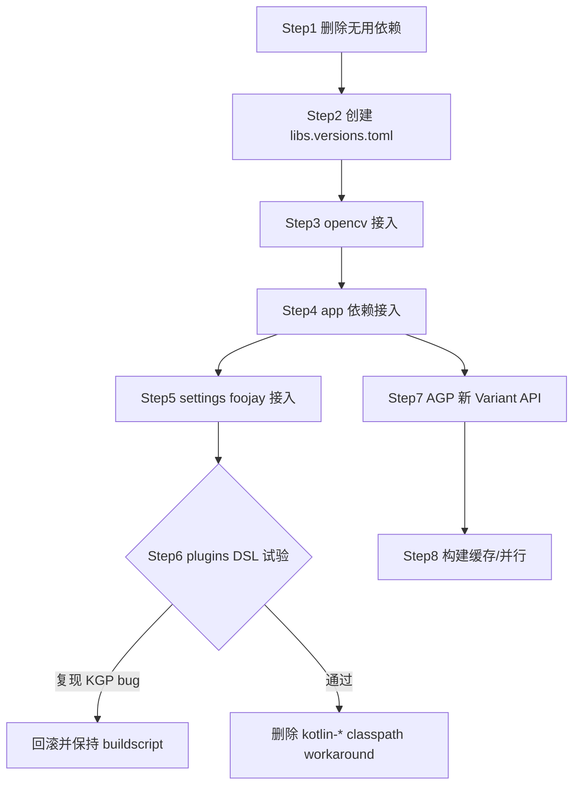

# Phase 2：依赖与构建配置精简分析报告

> 项目：Local-Album（`c:/Users/OSS/Desktop/Local-Album`）
> 基线：Gradle 8.13 + AGP 8.13.2 + Kotlin 1.9.24 + KSP 1.9.24-1.0.20，`assembleFullDebug` + `assembleLiteDebug` 绿色
> 本报告仅做分析，不修改任何构建脚本。所有"建议"均以不破坏基线为前提。
> 审计日期：2026-08-14

---

## 0. 审计范围与方法

| 文件                                       | 结论概要                                                                                                    |
| ------------------------------------------ | ----------------------------------------------------------------------------------------------------------- |
| `build.gradle.kts`（根）                   | buildscript classpath 方式引入 AGP/KGP/KSP + 显式 kotlin-stdlib/reflect/script-runtime classpath workaround |
| `app/build.gradle.kts`                     | 全部业务依赖以字符串坐标散落声明；使用 AGP 内部 API（`AppExtension`/`ApkVariantOutputImpl`）做 APK 命名     |
| `opencv/java/build.gradle.kts`             | 仅 1 条依赖（androidx.annotation），结构干净                                                                |
| `gradle.properties`                        | 仅 4 项，缺构建缓存/并行/缓存配置                                                                           |
| `gradle/wrapper/gradle-wrapper.properties` | Gradle 8.13（bin 发行版）                                                                                   |
| `settings.gradle.kts`                      | `FAIL_ON_PROJECT_REPOS` + foojay toolchains plugin 1.0.0，结构健康                                          |
| `gradle/gradle-daemon-jvm.properties`      | Daemon 工具链 JETBRAINS JDK 21（updateDaemonJvm 生成）                                                      |

方法：逐条读取依赖声明 → 用全源码树正则搜索（包名前缀、类名用法）验证真实使用 → 基于 BOM/显式版本推断版本冲突。未实际运行 `gradlew :app:dependencies`（成本高且静态推断已足够）。

---

## 1. 依赖审计总表

类型缩写：impl=implementation、fullImpl=fullImplementation、testImpl=testImplementation、androidTestImpl=androidTestImplementation、debugImpl=debugImplementation、desugar=coreLibraryDesugaring、ksp=KSP processor、classpath=buildscript classpath、project=项目模块依赖。

### 1.1 根 build.gradle.kts（buildscript classpath）

| #   | 坐标                                                                    | 类型      | 问题                                                                                                                                                                  | 证据          | 建议                                                                       | 风险 |
| --- | ----------------------------------------------------------------------- | --------- | --------------------------------------------------------------------------------------------------------------------------------------------------------------------- | ------------- | -------------------------------------------------------------------------- | ---- |
| 1   | `com.android.tools.build:gradle:8.13.2`                                 | classpath | 无问题本身，但以 classpath 方式引入属遗留风格                                                                                                                         | 根脚本 L14    | 迁移至 plugins DSL + Version Catalog（见 §4/§5，注意 KGP workaround 风险） | 中   |
| 2   | `org.jetbrains.kotlin:kotlin-gradle-plugin:1.9.24`                      | classpath | 同上；Kotlin 1.9.24 偏旧（当前稳定 2.x）                                                                                                                              | 根脚本 L15    | 升级需配合 Compose Compiler 版本，建议单独立项，不在本阶段做               | 中   |
| 3   | `com.google.devtools.ksp:symbol-processing-gradle-plugin:1.9.24-1.0.20` | classpath | 同上，版本必须与 Kotlin 严格配对                                                                                                                                      | 根脚本 L16    | 随 KGP 一起进 catalog                                                      | 中   |
| 4   | `org.jetbrains.kotlin:kotlin-stdlib:1.9.24`                             | classpath | ** workaround 依赖**：注释说明是为绕过 plugins DSL 下 KGP strictly 约束被过滤的问题                                                                                   | 根脚本 L17-21 | 保留；迁移 plugins DSL 时需重点回归（见 §3.4）                             | 高   |
| 5   | `org.jetbrains.kotlin:kotlin-reflect:1.9.24`                            | classpath | 同上 workaround；**注意 app 源码 `CapabilitySlot.kt`/`CapabilityRegistryV2.kt` 使用 `kotlin.reflect.KClass`**，运行时 kotlin-reflect 需经其他途径（KSP/KGP 传递）存在 | 根脚本 L20    | 保留；若迁移 plugins DSL 后约束过滤问题复现，此条是关键回归点              | 高   |
| 6   | `org.jetbrains.kotlin:kotlin-script-runtime:1.9.24`                     | classpath | workaround 附带                                                                                                                                                       | 根脚本 L21    | 保留                                                                       | 中   |

### 1.2 app/build.gradle.kts（implementation/api 等）

| #   | 坐标                                                       | 类型            | 问题                                                                                                                                                                                                       | 证据                                                                         | 建议                                                                            | 风险 |
| --- | ---------------------------------------------------------- | --------------- | ---------------------------------------------------------------------------------------------------------------------------------------------------------------------------------------------------------- | ---------------------------------------------------------------------------- | ------------------------------------------------------------------------------- | ---- |
| 7   | `project(":opencv")`                                       | project         | 无问题；OpenCV 换脸/对齐/运行时加载真实使用                                                                                                                                                                | `InSwapperPlugin.kt` L27-36、`FaceAligner.kt` L5-11、`NativeAiRuntime.kt` L5 | 保留                                                                            | 低   |
| 8   | `androidx.compose:compose-bom:2024.09.02`（platform）      | impl            | 无问题；BOM 管理全部 Compose 依赖版本                                                                                                                                                                      | app 脚本 L186、L194-195                                                      | 进 catalog 为 `androidx-compose-bom`                                            | 低   |
| 9   | `androidx.core:core-ktx:1.13.1`                            | impl            | 无问题                                                                                                                                                                                                     | MainActivity 等广泛使用                                                      | 保留                                                                            | 低   |
| 10  | `androidx.lifecycle:lifecycle-runtime-ktx:2.8.5`           | impl            | 无问题                                                                                                                                                                                                     | L28-30 lifecycle import 广泛                                                 | 保留                                                                            | 低   |
| 11  | `androidx.lifecycle:lifecycle-viewmodel-compose:2.8.5`     | impl            | 无问题                                                                                                                                                                                                     | viewModels 用法存在                                                          | 保留                                                                            | 低   |
| 12  | `androidx.lifecycle:lifecycle-runtime-compose:2.8.5`       | impl            | 无问题                                                                                                                                                                                                     | `collectAsStateWithLifecycle` 大量使用（MainActivity.kt L30 等）             | 保留                                                                            | 低   |
| 13  | `androidx.activity:activity-compose:1.9.2`                 | impl            | 无问题                                                                                                                                                                                                     | `setContent`/`BackHandler`/`rememberLauncherForActivityResult` 广泛使用      | 保留                                                                            | 低   |
| 14  | `androidx.compose.ui:ui`（BOM）                            | impl            | 无问题                                                                                                                                                                                                     | 全 UI 层                                                                     | 保留                                                                            | 低   |
| 15  | `androidx.compose.ui:ui-tooling-preview`（BOM）            | impl            | 无问题                                                                                                                                                                                                     | preview 使用                                                                 | 保留                                                                            | 低   |
| 16  | `androidx.compose.material:material-icons-extended`（BOM） | impl            | 体积偏大（R8 可裁剪），非问题                                                                                                                                                                              | icons 使用                                                                   | 保留；release 已开 minify                                                       | 低   |
| 17  | `androidx.compose.material3:material3:1.3.0`               | impl            | **显式版本 1.3.0**：BOM 2024.09.02 已含 material3 1.3.0，显式版本冗余但无害；显式声明会绕过 BOM 对齐                                                                                                       | app 脚本 L200                                                                | 迁 catalog 时去掉显式版本、依赖 BOM                                             | 低   |
| 18  | `com.google.android.material:material:1.14.0`              | impl            | **易误判为无用**：Kotlin 代码零 import，但 XML 主题 `Theme.Material3.DayNight.NoActionBar`（values/themes.xml L3、values-night/themes.xml L3）依赖此库                                                     | 全源码搜索无 `com.google.android.material` import；res 主题 parent 引用      | **必须保留**（或改用纯 Compose 主题，属较大改造）                               | 低   |
| 19  | `androidx.datastore:datastore-preferences:1.1.1`           | impl            | 无问题                                                                                                                                                                                                     | `SettingsStore.kt` L4-11                                                     | 保留                                                                            | 低   |
| 20  | `androidx.exifinterface:exifinterface:1.3.7`               | impl            | 无问题                                                                                                                                                                                                     | `ExifExtractor.kt` L4、`MediaSource.kt` L15                                  | 保留                                                                            | 低   |
| 21  | `org.jetbrains.kotlinx:kotlinx-coroutines-android:1.8.1`   | impl            | **重复引入（传递层面）**：compose-runtime/lifecycle 均传递 coroutines-android 1.7.3+，显式 1.8.1 会向上对齐，属"显式声明优于传递"的正常做法，非缺陷                                                        | BOM 推断                                                                     | 保留；进 catalog 后统一版本                                                     | 低   |
| 22  | `io.coil-kt:coil-compose:2.6.0`                            | impl            | 无问题                                                                                                                                                                                                     | `coil.compose.AsyncImage` 多处                                               | 保留                                                                            | 低   |
| 23  | `io.coil-kt:coil-video:2.6.0`                              | impl            | 无问题                                                                                                                                                                                                     | `LocalAlbumApplication.kt` L8 `coil.decode.VideoFrameDecoder`                | 保留                                                                            | 低   |
| 24  | `androidx.media3:media3-exoplayer:1.4.1`                   | impl            | 无问题                                                                                                                                                                                                     | `MediaViewerScreen.kt` L79                                                   | 保留                                                                            | 低   |
| 25  | `androidx.media3:media3-ui:1.4.1`                          | impl            | 无问题                                                                                                                                                                                                     | `MediaViewerScreen.kt` L782 `media3.ui.PlayerView`                           | 保留                                                                            | 低   |
| 26  | `androidx.media3:media3-common:1.4.1`                      | impl            | **冗余声明**：exoplayer/ui 均传递 common；显式声明无害但可省                                                                                                                                               | 传递依赖推断                                                                 | 可保留（若源码直接 import common 的 `MediaItem`——确实直接使用 L76，保留亦合理） | 低   |
| 27  | `androidx.room:room-runtime:2.6.1`                         | impl            | 无问题                                                                                                                                                                                                     | data/db 全层                                                                 | 保留                                                                            | 低   |
| 28  | `androidx.room:room-ktx:2.6.1`                             | impl            | 无问题                                                                                                                                                                                                     | `withTransaction` 使用                                                       | 保留                                                                            | 低   |
| 29  | `androidx.room:room-paging:2.6.1`                          | impl            | 无问题                                                                                                                                                                                                     | `PagingSource` in DAO                                                        | 保留                                                                            | 低   |
| 30  | `androidx.room:room-compiler:2.6.1`                        | ksp             | 无问题                                                                                                                                                                                                     | schemas 31/32.json 佐证 KSP 流水线                                           | 保留                                                                            | 低   |
| 31  | `androidx.room:room-testing:2.6.1`                         | androidTestImpl | 无问题                                                                                                                                                                                                     | `MigrationTestHelper`（Migration31To32Test.kt L3）                           | 保留                                                                            | 低   |
| 32  | `androidx.work:work-runtime-ktx:2.9.1`                     | impl            | 无问题                                                                                                                                                                                                     | 10+ 个 Worker 类                                                             | 保留                                                                            | 低   |
| 33  | `androidx.paging:paging-runtime-ktx:3.3.2`                 | impl            | 无问题                                                                                                                                                                                                     | `Pager`/`PagingConfig`（AlbumRepository.kt L50-55）                          | 保留                                                                            | 低   |
| 34  | `androidx.paging:paging-compose:3.3.2`                     | impl            | 无问题                                                                                                                                                                                                     | `collectAsLazyPagingItems` 广泛使用                                          | 保留                                                                            | 低   |
| 35  | `com.google.mlkit:text-recognition:16.0.1`                 | fullImpl        | 无问题；Full-only 正确隔离                                                                                                                                                                                 | `OcrProvider.kt`（full 源集）L7-9                                            | 保留                                                                            | 低   |
| 36  | `com.google.mlkit:text-recognition-chinese:16.0.1`         | fullImpl        | 无问题                                                                                                                                                                                                     | `ChineseTextRecognizerOptions`（full 源集）                                  | 保留                                                                            | 低   |
| 37  | `com.google.mlkit:face-detection:16.1.7`                   | impl            | **版本孤本**：与 OCR 的 16.0.1 版本无关联（ML Kit 各 artifact 独立版本，正常）；注意 face-detection 是 main 源集（Lite 交互式换脸需要），位置正确                                                          | `FaceDetector.kt` L8-13                                                      | 保留                                                                            | 低   |
| 38  | `org.tensorflow:tensorflow-lite:2.14.0`                    | impl            | **真实使用**：`Interpreter`、`DataType`、`NnApiDelegate`（ModelManagerImpl.kt L28-29 等 6 个文件）                                                                                                         | 搜索证据充分                                                                 | 保留                                                                            | 低   |
| 39  | `com.microsoft.onnxruntime:onnxruntime-android:1.19.2`     | impl            | **真实使用**：`ai.onnxruntime.*`（InSwapperPlugin、Eva02ClipProvider、InsightFaceProvider、PaddleOCRProvider、ArcFaceProvider、OnnxModelRuntime、TensorMetadataParser、ModelManagerImpl、NativeAiRuntime） | 搜索证据充分（Java 包名为 `ai.onnxruntime` 而非 `com.microsoft...`）         | 保留                                                                            | 低   |
| 40  | `org.pytorch:pytorch_android_lite:1.13.1`                  | impl            | **真实使用**：`org.pytorch.IValue/Module/Tensor`（PyTorchModelRuntime.kt L7-9）                                                                                                                            | 搜索证据充分                                                                 | 保留                                                                            | 低   |
| 41  | `com.android.tools:desugar_jdk_libs:2.0.4`                 | desugar         | 无问题；`isCoreLibraryDesugaringEnabled = true` 配套                                                                                                                                                       | app 脚本 L109、L248                                                          | 保留；2.0.4 偏旧（最新 2.1.x），可随 catalog 顺带升级（可选）                   | 低   |
| 42  | `androidx.compose.runtime:runtime-livedata:1.7.1`          | impl            | **无用依赖（高置信）**：全源码无 `observeAsState`、`asLiveData`、`liveData{}`、任何 LiveData import；且显式版本 1.7.1 与 BOM 2024.09.02（runtime 1.7.2）**不一致**                                         | 全源码正则搜索 0 命中                                                        | **可立即删除**（见 §2）                                                         | 低   |
| 43  | `junit:junit:4.13.2`                                       | testImpl        | 无问题                                                                                                                                                                                                     | `org.junit.Test` 大量使用                                                    | 保留                                                                            | 低   |
| 44  | `org.jetbrains.kotlin:kotlin-test:1.9.24`                  | testImpl        | 无问题                                                                                                                                                                                                     | `kotlin.test.assertEquals`（BoundedDuplicateBatchProcessorTest.kt L4-6）     | 保留                                                                            | 低   |
| 45  | `org.json:json:20240303`                                   | testImpl        | 无问题；用于本地单测模拟 Android 的 org.json                                                                                                                                                               | ScanFeaturePolicyTest.kt L4-5                                                | 保留                                                                            | 低   |
| 46  | `org.mockito:mockito-core:5.5.0`                           | testImpl        | 无问题                                                                                                                                                                                                     | `org.mockito.Mockito`（AnalysisStageFactoryTest.kt L21 等）                  | 保留                                                                            | 低   |
| 47  | `androidx.test.ext:junit:1.2.1`                            | androidTestImpl | 无问题                                                                                                                                                                                                     | `AndroidJUnit4` 大量使用                                                     | 保留                                                                            | 低   |
| 48  | `androidx.test.espresso:espresso-core:3.6.1`               | androidTestImpl | **疑似无用（中置信）**：androidTest 源码无任何 `androidx.test.espresso` import（14 个测试文件全部是 Room/DataStore instrumentation 测试）                                                                  | androidTest 全源码搜索 0 命中 espresso                                       | 删除候选（需验证 androidTest 编译，见 §2）                                      | 低   |
| 49  | `androidx.compose.ui:ui-test-junit4`（BOM）                | androidTestImpl | **疑似无用（中置信）**：无 `createAndroidComposeRule`/`createComposeRule`/`androidx.compose.ui.test` import                                                                                                | androidTest 源码搜索 0 命中                                                  | 删除候选；`debugImplementation ui-test-manifest`（#51）随之一起评估             | 低   |
| 50  | `androidx.compose.ui:ui-tooling`（BOM）                    | debugImpl       | 无问题；debug 预览必需                                                                                                                                                                                     | preview 使用                                                                 | 保留                                                                            | 低   |
| 51  | `androidx.compose.ui:ui-test-manifest`（BOM）              | debugImpl       | **与 #49 绑定**：仅当使用 Compose UI 测试时需要                                                                                                                                                            | 同 #49                                                                       | 随 #49 一起决定去留                                                             | 低   |

### 1.3 opencv/java/build.gradle.kts

| #   | 坐标                                   | 类型 | 问题                                       | 证据         | 建议             | 风险 |
| --- | -------------------------------------- | ---- | ------------------------------------------ | ------------ | ---------------- | ---- |
| 52  | `androidx.annotation:annotation:1.8.0` | impl | 无问题；OpenCV 生成代码使用 `@Keep` 等注解 | 上游生成源码 | 保留；进 catalog | 低   |

### 1.4 版本冲突与不一致清单（基于 BOM/显式版本推断）

| 冲突点                                                                                  | 详情                                                                    | 影响                           | 处置                     |
| --------------------------------------------------------------------------------------- | ----------------------------------------------------------------------- | ------------------------------ | ------------------------ |
| Compose runtime-livedata 显式 1.7.1 vs BOM 2024.09.02（runtime 1.7.2）                  | app 脚本 L249 写死 1.7.1，绕过 BOM 对齐                                 | 无运行时影响（该依赖本身无用） | 删除依赖即消除           |
| material3 显式 1.3.0 vs BOM 2024.09.02 内含 material3 1.3.0                             | 恰好同版本，当前无冲突；但显式声明在 BOM 升级时会"钉死"旧版             | 潜在                           | catalog 化时去掉显式版本 |
| kotlin-stdlib：classpath 显式 1.9.24，KGP 也会注入 1.9.24，Compose/lifecycle 传递 1.8.x | classpath 与 KGP 注入同版本无冲突；传递的旧版本被 KGP 约束对齐到 1.9.24 | 无                             | 正常                     |
| kotlinx-coroutines 1.8.1 显式 vs lifecycle/compose 传递 1.7.3                           | 显式声明向上对齐（Gradle 默认取最高），行为正确                         | 无                             | 正常，catalog 统一版本号 |

---

## 2. 无用/重复依赖删除候选清单

### 2.1 可立即删除（高置信，零代码引用）

| 候选                                              | 位置          | 证据                                                                                  | 验证方法         | 回滚                                                                                                                   |
| ------------------------------------------------- | ------------- | ------------------------------------------------------------------------------------- | ---------------- | ---------------------------------------------------------------------------------------------------------------------- | --------------- |
| `androidx.compose.runtime:runtime-livedata:1.7.1` | app 脚本 L249 | 全源码（main/full/lite/test/androidTest）正则 `observeAsState\|asLiveData\|liveData\( | LiveData` 0 命中 | 删除后 `gradlew assembleFullDebug assembleLiteDebug` + `gradlew :app:testFullDebugUnitTest :app:testLiteDebugUnitTest` | git revert 单行 |

### 2.2 删除候选（中置信，需编译+测试验证）

| 候选                                         | 位置          | 证据                                               | 验证方法                                                                                     | 回滚       |
| -------------------------------------------- | ------------- | -------------------------------------------------- | -------------------------------------------------------------------------------------------- | ---------- |
| `androidx.test.espresso:espresso-core:3.6.1` | app 脚本 L257 | androidTest 14 个文件无 espresso import            | `gradlew :app:assembleFullDebugAndroidTest :app:assembleLiteDebugAndroidTest` 编译通过即可删 | git revert |
| `androidx.compose.ui:ui-test-junit4`         | app 脚本 L258 | 无 `androidx.compose.ui.test` import               | 同上（androidTest 编译）                                                                     | git revert |
| `androidx.compose.ui:ui-test-manifest`       | app 脚本 L261 | 仅为 ui-test-junit4 提供 Activity 声明；两者共存亡 | 同上（注意：若未来添加 Compose UI 测试需恢复）                                               | git revert |

### 2.3 不可删除（曾疑似无用，已证实使用）

| 依赖                                               | 证实证据                                                                                                                                                           |
| -------------------------------------------------- | ------------------------------------------------------------------------------------------------------------------------------------------------------------------ |
| `com.google.android.material:material:1.14.0`      | `app/src/main/res/values/themes.xml` L3 与 `values-night/themes.xml` L3 的 `Theme.Material3.DayNight.NoActionBar` 主题 parent                                      |
| TFLite / ONNX Runtime / PyTorch Mobile 三运行时    | 见 §1.2 #38-40，各自有独立调用链（TFLite=插件/SAM/ArcFace 原生、ONNX=CLIP/InsightFace/PaddleOCR/InSwapper、PyTorch=.ptl 插件模型），**三者并存是设计使然，非冗余** |
| `org.jetbrains.kotlin:kotlin-reflect`（classpath） | app 源码 `CapabilitySlot.kt` L4、`CapabilityRegistryV2.kt` L10 使用 `kotlin.reflect.KClass`（运行时反射路径需 reflect 存在）                                       |
| `org.json:json:20240303`（testImpl）               | 单测本地模拟 org.json（Android 平台类），多处使用                                                                                                                  |

---

## 3. 插件与构建配置问题清单

### 3.1 插件使用情况

| 插件                                               | 声明位置                  | 实际作用               | 问题                                                                  |
| -------------------------------------------------- | ------------------------- | ---------------------- | --------------------------------------------------------------------- |
| `com.android.application`                          | app 脚本 L6（apply 方式） | Android app 模块       | 无；apply 方式与根 buildscript classpath 配套，是 workaround 的一部分 |
| `org.jetbrains.kotlin.android`                     | app 脚本 L7               | Kotlin 编译            | 无                                                                    |
| `com.google.devtools.ksp`                          | app 脚本 L8               | Room 注解处理          | 无                                                                    |
| `com.android.library`                              | opencv 脚本 L4            | Android library        | 无                                                                    |
| `org.gradle.toolchains.foojay-resolver-convention` | settings L9               | Daemon JDK 21 自动解析 | 无；与 `gradle-daemon-jvm.properties` 配套，健康                      |

**结论：无未使用插件。**

### 3.2 gradle.properties 审查

| 现有项                                               | 评价                                                     |
| ---------------------------------------------------- | -------------------------------------------------------- |
| `org.gradle.jvmargs=-Xmx4096m -Dfile.encoding=UTF-8` | 合理（含 3 个 native AI 运行时的项目，4G daemon 堆合适） |
| `android.useAndroidX=true`                           | 必须，正确                                               |
| `android.nonTransitiveRClass=true`                   | 最佳实践，正确                                           |
| `kotlin.code.style=official`                         | 正确                                                     |

**缺失项建议（低风险增量）：**

- `org.gradle.parallel=true`（多模块并行构建，本项目 2 模块收益小但无害）
- `org.gradle.caching=true`（构建缓存，切换分支/CI 复用任务输出）
- `org.gradle.configuration-cache=true`——**暂不建议**：AGP 内部 API `applicationVariants.all` + `Runtime.exec`（git hash）配置阶段副作用，配置缓存大概率不兼容，先完成内部 API 迁移再启用
- `kotlin.incremental=true`（默认已开，可显式声明）

### 3.3 AGP 内部 API 使用（高风险项）

app 脚本 L167-173：

```kotlin
the<AppExtension>().applicationVariants.all {
    outputs.all {
        (this as com.android.build.gradle.internal.api.ApkVariantOutputImpl).outputFileName = ...
    }
}
```

- **风险**：`AppExtension`（旧 Variant API）与 `ApkVariantOutputImpl`（`internal.api` 包）均为非公开 API，AGP 升级（尤其 9.x 移除 old variant API 计划）将直接编译失败。
- **替代方案**（官方新 Variant API，AGP 7+ 稳定）：

```kotlin
androidComponents {
    onVariants { variant ->
        variant.outputs.forEach { output ->
            if (output is com.android.build.api.variant.impl.BuiltArtifactImpl) { /* 同样内部 */ }
        }
    }
}
```

更稳妥的写法是 `variant.outputs.filterIsInstance<...>()`——但注意：**公开 API 中修改 outputFileName 的官方途径是 `VariantOutput.outputFileName`（AGP 8 已提供 `SingleArtifact` + `ArtifactOperations` 但文件名定制仍需 `output` 接口）**。实际推荐：

```kotlin
androidComponents.onVariants { variant ->
    variant.outputs.forEach { output ->
        output.outputFileName.set("LocalAlbum-v${variant.name}-c${...}.apk")
    }
}
```

`com.android.build.api.variant.VariantOutput.outputFileName` 是公开 DSL 属性（AGP 7.1+），可完整替代内部 cast。`versionName`/`versionCode` 在新 API 中经 `variant.outputs` 的 `versionCode()`/`versionName()` Provider 获取。

- **迁移条件**：纯重构、不改变产物语义，随时可做；做完是启用配置缓存的前置条件。注意 `BuildConfig` 里的 `Runtime.exec(git rev-parse)`（L52-57）是另一处配置阶段副作用，配置缓存启用前需改为 buildService 或接受 cache miss。

### 3.4 KSP buildscript classpath workaround 规范化评估

- 现状：根脚本以 classpath 引入 AGP/KGP/KSP，并额外显式声明 kotlin-stdlib/reflect/script-runtime classpath，注释明确说明是绕过 Gradle 8.12/8.13 下 plugins DSL 的 KGP strictly 约束被过滤 bug（stage2 脚本编译 classpath 缺失导致 `Unresolved reference`）。
- **规范化路径（plugins DSL + Version Catalog）**：
  1. `settings.gradle.kts` 的 `pluginManagement` 已具备仓库配置，无需改动；
  2. 根脚本改 `plugins { alias(libs.plugins.android.application) apply false; ... }`；
  3. KSP 版本 `1.9.24-1.0.20` 进 catalog `[plugins]`；
  4. **风险**：该 bug 与环境相关（注释提及 Arch Linux 复现）。当前环境为 Windows 11，bug 是否复现未知。
- **建议的验证驱动迁移**：单独一个提交只做"buildscript → plugins DSL"切换，立即跑 `gradlew assembleFullDebug assembleLiteDebug`；若复现 `Unresolved reference: util/text/it` 则回滚。classpath 里 3 条 kotlin-\* 显式声明在 plugins DSL 下不再需要（KGP 自带），但为稳妥可先保留观察一个阶段再删。

### 3.5 签名配置审查

app 脚本 L14-18、L63-73、L102-104：

- keystore.properties 存在于根目录（`list_files` 证实，且 `.gitignore` 排除），模板机制注释清晰。
- Release 仅在文件存在时绑定 signingConfig，无密钥环境产出未签名 APK——**CI 友好设计，正确**。
- 小问题：①根目录同时存在 `release.jks` 与 `app/release.jks`（VSCode 打开列表中可见 `app/release.jks`），若两者不同需确认 keystore.properties `storeFile` 指向哪一个，避免签名不一致；②`enableV1Signing=true` 对 minSdk 29 无必要（V1 仅 Android <7 需要），可关闭以加速签名（收益微小，可选）。
- V2/V3 开启正确。

### 3.6 其他配置观察

- `opencv/java/build.gradle.orig.bak`：模块目录内遗留 `.bak` 备份文件，建议清理（非构建脚本，git 管理范围内可直接删）。
- `lint { disable += "NewApi" }`（app L145-147）：全局关闭 NewApi 会掩盖真实 API 级别问题，建议改为精确到模块/类的 targeted disable（可选优化）。
- `testOptions.unitTests.isReturnDefaultValues = true`：测试中 Android API 返回默认值，配合 mockito 使用可接受，但会掩盖未 stub 调用，知悉即可。
- `media3-common` 显式声明：源码直接 import `androidx.media3.common.MediaItem`（MediaViewerScreen.kt L76），保留合理。
- composeOptions `kotlinCompilerExtensionVersion = "1.5.14"`：与 Kotlin 1.9.24 正确配对（Compose Compiler 1.5.14 ↔ Kotlin 1.9.24），升级 Kotlin 时必须联动，catalog 中应放同版本组。

---

## 4. Version Catalog 完整草案

以下 TOML 覆盖现有全部依赖坐标，accessor 命名遵循官方约定（`-` → `.`）。**版本策略：与现状完全一致（不借迁移夹带升级），已知无害例外见注释。**

```toml
# gradle/libs.versions.toml
[versions]
# ── 构建插件（与 Kotlin 严格配对，升级必须联动）──
agp = "8.13.2"
kotlin = "1.9.24"
ksp = "1.9.24-1.0.20"
composeCompiler = "1.5.14"          # ↔ kotlin 1.9.24
foojay-resolver = "1.0.0"

# ── AndroidX / Compose ──
composeBom = "2024.09.02"
coreKtx = "1.13.1"
lifecycle = "2.8.5"
activityCompose = "1.9.2"
material = "1.14.0"                 # com.google.android.material（XML 主题需要）
datastore = "1.1.1"
exifinterface = "1.3.7"
media3 = "1.4.1"
room = "2.6.1"
work = "2.9.1"
paging = "3.3.2"

# ── Kotlin 生态 ──
coroutines = "1.8.1"

# ── 第三方 ──
coil = "2.6.0"

# ── ML 运行时 ──
mlkitTextRecognition = "16.0.1"
mlkitFaceDetection = "16.1.7"
tensorflowLite = "2.14.0"
onnxRuntime = "1.19.2"
pytorchMobile = "1.13.1"

# ── 其他 ──
desugarJdkLibs = "2.0.4"
json = "20240303"
mockito = "5.5.0"
junit = "4.13.2"
androidxTestExtJunit = "1.2.1"
androidxTestEspresso = "3.6.1"      # 若按 §2.2 删除则移除
annotation = "1.8.0"                # opencv 模块用

[libraries]
# ── AndroidX 基础 ──
androidx-core-ktx = { group = "androidx.core", name = "core-ktx", version.ref = "coreKtx" }
androidx-lifecycle-runtime-ktx = { group = "androidx.lifecycle", name = "lifecycle-runtime-ktx", version.ref = "lifecycle" }
androidx-lifecycle-viewmodel-compose = { group = "androidx.lifecycle", name = "lifecycle-viewmodel-compose", version.ref = "lifecycle" }
androidx-lifecycle-runtime-compose = { group = "androidx.lifecycle", name = "lifecycle-runtime-compose", version.ref = "lifecycle" }
androidx-activity-compose = { group = "androidx.activity", name = "activity-compose", version.ref = "activityCompose" }

# ── Compose（BOM 管理版本，无 version 的条目即 BOM 接管）──
androidx-compose-bom = { group = "androidx.compose", name = "compose-bom", version.ref = "composeBom" }
androidx-compose-ui = { group = "androidx.compose.ui", name = "ui" }
androidx-compose-ui-tooling = { group = "androidx.compose.ui", name = "ui-tooling" }
androidx-compose-ui-tooling-preview = { group = "androidx.compose.ui", name = "ui-tooling-preview" }
androidx-compose-ui-test-junit4 = { group = "androidx.compose.ui", name = "ui-test-junit4" }
androidx-compose-ui-test-manifest = { group = "androidx.compose.ui", name = "ui-test-manifest" }
androidx-compose-material3 = { group = "androidx.compose.material3", name = "material3" }   # 版本交 BOM，去掉显式 1.3.0
androidx-compose-material-icons-extended = { group = "androidx.compose.material", name = "material-icons-extended" }
google-material = { group = "com.google.android.material", name = "material", version.ref = "material" }

# ── 数据 / 后台 ──
androidx-datastore-preferences = { group = "androidx.datastore", name = "datastore-preferences", version.ref = "datastore" }
androidx-exifinterface = { group = "androidx.exifinterface", name = "exifinterface", version.ref = "exifinterface" }
androidx-room-runtime = { group = "androidx.room", name = "room-runtime", version.ref = "room" }
androidx-room-ktx = { group = "androidx.room", name = "room-ktx", version.ref = "room" }
androidx-room-paging = { group = "androidx.room", name = "room-paging", version.ref = "room" }
androidx-room-compiler = { group = "androidx.room", name = "room-compiler", version.ref = "room" }
androidx-room-testing = { group = "androidx.room", name = "room-testing", version.ref = "room" }
androidx-work-runtime-ktx = { group = "androidx.work", name = "work-runtime-ktx", version.ref = "work" }
androidx-paging-runtime-ktx = { group = "androidx.paging", name = "paging-runtime-ktx", version.ref = "paging" }
androidx-paging-compose = { group = "androidx.paging", name = "paging-compose", version.ref = "paging" }

# ── 媒体 ──
androidx-media3-exoplayer = { group = "androidx.media3", name = "media3-exoplayer", version.ref = "media3" }
androidx-media3-ui = { group = "androidx.media3", name = "media3-ui", version.ref = "media3" }
androidx-media3-common = { group = "androidx.media3", name = "media3-common", version.ref = "media3" }

# ── Kotlin / 协程 ──
kotlinx-coroutines-android = { group = "org.jetbrains.kotlinx", name = "kotlinx-coroutines-android", version.ref = "coroutines" }
kotlin-test = { group = "org.jetbrains.kotlin", name = "kotlin-test", version.ref = "kotlin" }

# ── 第三方图像 ──
coil-compose = { group = "io.coil-kt", name = "coil-compose", version.ref = "coil" }
coil-video = { group = "io.coil-kt", name = "coil-video", version.ref = "coil" }

# ── ML Kit ──
mlkit-text-recognition = { group = "com.google.mlkit", name = "text-recognition", version.ref = "mlkitTextRecognition" }
mlkit-text-recognition-chinese = { group = "com.google.mlkit", name = "text-recognition-chinese", version.ref = "mlkitTextRecognition" }
mlkit-face-detection = { group = "com.google.mlkit", name = "face-detection", version.ref = "mlkitFaceDetection" }

# ── ML 运行时（三运行时并存是设计使然，均已证实使用）──
tensorflow-lite = { group = "org.tensorflow", name = "tensorflow-lite", version.ref = "tensorflowLite" }
onnxruntime-android = { group = "com.microsoft.onnxruntime", name = "onnxruntime-android", version.ref = "onnxRuntime" }
pytorch-android-lite = { group = "org.pytorch", name = "pytorch_android_lite", version.ref = "pytorchMobile" }

# ── desugar / opencv 模块 ──
desugar-jdk-libs = { group = "com.android.tools", name = "desugar_jdk_libs", version.ref = "desugarJdkLibs" }
androidx-annotation = { group = "androidx.annotation", name = "annotation", version.ref = "annotation" }

# ── 测试 ──
junit = { group = "junit", name = "junit", version.ref = "junit" }
json = { group = "org.json", name = "json", version.ref = "json" }
mockito-core = { group = "org.mockito", name = "mockito-core", version.ref = "mockito" }
androidx-test-ext-junit = { group = "androidx.test.ext", name = "junit", version.ref = "androidxTestExtJunit" }
androidx-test-espresso-core = { group = "androidx.test.espresso", name = "espresso-core", version.ref = "androidxTestEspresso" }  # 若删除候选落地则移除

[bundles]
compose = [
    "androidx-compose-ui",
    "androidx-compose-ui-tooling-preview",
    "androidx-compose-material3",
    "androidx-compose-material-icons-extended",
]
media3 = [
    "androidx-media3-exoplayer",
    "androidx-media3-ui",
    "androidx-media3-common",
]
room = [
    "androidx-room-runtime",
    "androidx-room-ktx",
    "androidx-room-paging",
]
paging = [
    "androidx-paging-runtime-ktx",
    "androidx-paging-compose",
]
coil = [
    "coil-compose",
    "coil-video",
]

[plugins]
android-application = { id = "com.android.application", version.ref = "agp" }
android-library = { id = "com.android.library", version.ref = "agp" }
kotlin-android = { id = "org.jetbrains.kotlin.android", version.ref = "kotlin" }
ksp = { id = "com.google.devtools.ksp", version.ref = "ksp" }
foojay-resolver-convention = { id = "org.gradle.toolchains.foojay-resolver-convention", version.ref = "foojay-resolver" }
```

**草案要点说明：**

1. Compose 系条目不带版本（BOM 接管），迁移后去掉 `material3` 显式 1.3.0 与 `runtime-livedata` 显式 1.7.1（后者直接删除）。
2. `[plugins]` 节含 foojay（settings 脚本亦可引用 catalog：`libs.plugins.foojay.resolver.convention`，需在 settings.gradle.kts 顶部声明 catalog 可见性——Gradle 8.13 默认 settings 可用 `libs`，无需额外配置）。
3. `[bundles]` 为可选便利项，不改变语义。
4. 根 buildscript 的 3 条 kotlin-\* classpath **不进 catalog**：它们是 workaround 专用的构建脚本 classpath，不是项目依赖；plugins DSL 迁移成功后整体移除。

---

## 5. 分步迁移与验证计划

**总原则：每步一个独立 git commit，每步后跑基线验证命令，失败即 `git revert` 回滚。基线命令：**

```
./gradlew assembleFullDebug assembleLiteDebug
```

（涉及测试代码依赖的步骤加跑 `./gradlew :app:testFullDebugUnitTest :app:testLiteDebugUnitTest`；涉及 androidTest 依赖的步骤加跑 `./gradlew :app:assembleFullDebugAndroidTest :app:assembleLiteDebugAndroidTest`。）

### Step 1：删除确认无用依赖（独立小步，先拿收益）

- 改动：app 脚本删除 `runtime-livedata`（高置信）；espresso/ui-test-junit4/ui-test-manifest 按 §2.2 验证后决定。
- 验证：基线命令 + unitTest + androidTest 编译。
- 回滚：git revert 该 commit。

### Step 2：创建 Version Catalog（纯新增，零风险）

- 改动：新建 `gradle/libs.versions.toml`（§4 内容），不引用任何模块。
- 验证：基线命令（catalog 未被引用，行为不变；此步验证 TOML 语法可被 Gradle 解析，IDE 无红线）。
- 回滚：删除文件。

### Step 3：opencv 模块接入 catalog（最小模块先行）

- 改动：`opencv/java/build.gradle.kts` 的 `add("implementation", "androidx.annotation:annotation:1.8.0")` → `implementation(libs.androidx.annotation)`。插件仍用 apply 方式（classpath 仍在）。
- 验证：基线命令。
- 回滚：git revert。

### Step 4：app 模块依赖接入 catalog（保持 apply 插件方式不变）

- 改动：app 脚本 dependencies 块全部字符串坐标 → `libs.*` accessors；`composeBom` platform → `implementation(platform(libs.androidx.compose.bom))`；去掉 material3 显式版本；删除的依赖不再引入。KSP/Room compiler → `add("ksp", libs.androidx.room.compiler.get().toString())` 或改用 `ksp(libs.androidx.room.compiler)`（apply 方式下 ksp 配置名存在，直接 `add("ksp", ...)` 亦可用 catalog）。
- 验证：基线命令 + unitTest。
- 回滚：git revert。

### Step 5：settings.gradle.kts 的 foojay 插件引用 catalog

- 改动：`id("org.gradle.toolchains.foojay-resolver-convention") version "1.0.0"` → `alias(libs.plugins.foojay.resolver.convention)`。
- 验证：`./gradlew help` + 基线命令（验证 toolchain 解析仍工作）。
- 回滚：git revert。

### Step 6（可选，风险最高，独立评估）：buildscript classpath → plugins DSL

- 改动：根脚本 plugins DSL（`alias(libs.plugins.android.application) apply false` 等），app/opencv 脚本 `apply(plugin=)` → `plugins { alias(...) }`；删除 3 条 kotlin-\* classpath。
- **前置**：§3.4 所述 KGP strictly 约束过滤 bug 在当前 Windows 环境是否复现未知。此步必须单独 commit，验证命令除基线外，建议先 `./gradlew help` 快速探测脚本编译，再跑完整基线。
- **若复现 bug**（症状：`Unresolved reference: util/text/it`）：立即 revert，保持 buildscript 方式，仅记录已知问题；catalog 化收益（Step 2-5）不受影响。
- 回滚：git revert。

### Step 7（可选，独立重构）：AGP 内部 API 迁移

- 改动：`the<AppExtension>().applicationVariants.all {...}` → `androidComponents.onVariants { variant -> variant.outputs.forEach { it.outputFileName.set(...) } }`（公开 VariantOutput API）。
- 验证：基线命令 + 人工核对 APK 文件名与现状一致（`LocalAlbum-v{versionName}-c{versionCode}-{variant}.apk`）。
- 收益：解除 AGP 9 升级阻塞；为配置缓存铺路。
- 回滚：git revert。

### Step 8（可选）：gradle.properties 增量优化

- 改动：追加 `org.gradle.parallel=true`、`org.gradle.caching=true`。
- 验证：连续两次基线命令，第二次 FROM-CACHE。
- 回滚：删除两行。
- 配置缓存（`org.gradle.configuration-cache=true`）**推迟**至 Step 6/7 完成后单独评估（受 git-hash exec 副作用影响）。

### 执行顺序依赖图



---

## 6. 摘要统计

- **依赖声明总数**：52 条（根 6 classpath + app 45 + opencv 1）
- **问题总数**：11 项
  - 无用依赖（高置信可删）：1（runtime-livedata）
  - 删除候选（中置信待验证）：3（espresso、ui-test-junit4、ui-test-manifest）
  - 冗余/钉死版本：2（material3 显式 1.3.0、runtime-livedata 显式 1.7.1 与 BOM 不一致）
  - 遗留风格/技术债：3（buildscript classpath、AGP 内部 API、无 Version Catalog）
  - 配置缺失：2（构建缓存/并行未启用；配置缓存被内部 API 阻塞）
- **高风险项**：1 —— plugins DSL 迁移可能复现 KGP strictly 约束过滤 bug（Step 6 需独立试验 + 快速回滚预案）；次风险为 AGP 内部 API（升级 AGP 9 前必须迁移，当前版本下暂可运行）
- **三 ML 运行时结论**：TFLite/ONNX/PyTorch 全部真实使用且调用链独立，**不建议合并或删除**
- **`com.google.android.material` 结论**：XML 主题依赖，**必须保留**
